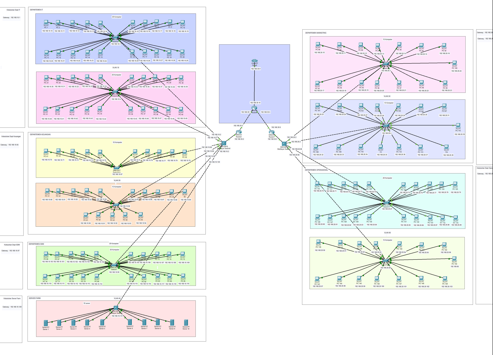

# Desain Topologi & Skema Pengalamatan - Pekan 10

## Daftar Anggota Kelompok 5 DMJK Beserta Peran
1. Ketua : Aditya Laksamana P Butar Butar_10231006 (Security & Documentation Specialist)
2. Anggota : Ilham Ahmad Fahriji_10231042 (Network Engineer)
3. Anggota : Muchlis Wahyu Saputra_10231054 (Network Service)
4. Anggota : Nazwa Amelia Zahra_10231068 (Network Architect)

## Daftar Isi
[Judul dan Identitas Kelompok](#daftar-anggota-kelompok-5-dmjk-beserta-peran)

[Daftar Isi](#daftar-isi)

[Finalisasi desain topologi jaringan](#finalisasi-desain-topologi-jaringan)

[Perencanaan skema pengalamatan](#perencanaan-skema-pengalamatan)

[Penentuan perangkat yang dibutuhkan](#penentuan-perangkat-yang-dibutuhkan)

## Finalisasi desain topologi jaringan 
#### Berikut kami lampirkan diagram topologi fisik dan logis yang telah kami rancang.

**Link Drive Topologi .pkt:** https://drive.google.com/file/d/18Q3qxJoxnuul5Qn-M0sWaVh9eqH_uI5v/view?usp=sharing 

Gambar tersebut merupakan desain topologi jaringan untuk dua gedung, yaitu Gedung A (Kantor Pusat) dan Gedung B (Kantor Cabang). Desain jaringan ini mencakup struktur topologi fisik dan topologi logis (IP Address & VLAN) untuk memastikan koneksi antar departemen berjalan efisien, aman, dan mudah dikelola.

### Topologi Fisik
Topologi yang digunakan adalah topologi hierarki (tree topology), di mana semua perangkat dari setiap departemen per ruangan dihubungkan switch per ruangan lalu ke switch utama, kemudian tersambung ke router gedung, lalu ke router pusat, hingga terkoneksi ke ISP. 

Komponen utama yang digunakan:

    - ISP → Koneksi Internet utama
    - Router Utama (Core Router) → Penghubung semua router gedung
    - Router A dan Router B → Masing-masing untuk Gedung A dan Gedung B
    - Switch Utama Gedung A & B → Distribusi ke switch departemen
    - Switch Departemen → Menghubungkan perangkat di tiap ruangan
    - End Device → PC, server

### Rincian Device 

### Ada 176 Perangkat/Device Terdiri dari :

#### WAN 
- ISP : 1 Unit
- Router Utama : 1 Unit
- Router Per Gedung (A dan B) : 2 Unit
- Switch Per Gedung (A dan B) : 2 Unit

#### GEDUNG A (Kantor Pusat)
Departemen IT 
- Ruangan A : 20 PC + 1 Switch
- Ruangan B : 20 PC + 1 Switch

Departemen Keuangan 
- Ruangan A : 10 PC + 1 Switch
- Ruangan B : 15 PC + 1 Switch

Departemen SDM
- Ruangan A (Satu ruangan saja) : 20 PC + 1 Switch

**Server Farm : 10 Server + 1 Switch**

#### GEDUNG B (Kantor Cabang)
Departemen Marketing 
- Ruangan A : 15 PC + 1 Switch
- Ruangan B : 15 PC + 1 Switch

Departemen Operasional
- Ruangan A : 20 PC + 1 Switch
- Ruangan B : 15 PC + 1 Switch

### Topologi Logis
Untuk topologi logis ini lebih ke memanfaatkan VLAN untuk memisahkan lalu lintas jaringan berdasarkan departemen. Ini akan memberikan efisiensi dan jaminan keamanan dalam pengelolaan jaringan. Untuk lebih lengkapnya ada di perencanaan skema pengalamatan IP.

### Perangkat Utama & Routingnya secara umum
| Perangkat               | Alamat IP / Keterangan           |
|-----------------------|-----------------------------------|
| ISP                   | 192.168.30.9                      |
| Router Utama (WAN)    | 192.168.30.10                     |
| Router Utama ↔ Router A  | 192.168.30.1 ↔ 192.168.30.2       |
| Router Utama ↔ Router B  | 192.168.30.5 ↔ 192.168.30.6       |
| Router A (Gedung A)      | Menghubungkan ke VLAN 10–30      |
| Router B (Gedung B)      | Menghubungkan ke VLAN 40–50      |

## Perencanaan skema pengalamatan
Berikut adalah tabel perencanaan yang telah kami buat untuk skema pengalamatan IP (subnetting).

### 1. WAN & Internet

| Link                   | Subnet         | Prefix | IP A            | IP B              | Keterangan                                 |
|------------------------|----------------|:------:|-----------------|-------------------|--------------------------------------------|
| ISP ↔ Router Utama     | 192.168.30.8   | /30    | 192.168.30.9    | 192.168.30.10     | 192.168.30.9 = ISP, 192.168.30.10 = Router Utama (WAN)             |
| Router Utama ↔ Router A   | 192.168.30.0   | /30    | 192.168.30.1    | 192.168.30.2      | 192.168.30.1 = Router Utama, 192.168.30.2 = Router Gedung A (Router A) |
| Router Utama ↔ Router B   | 192.168.30.4   | /30    | 192.168.30.5    | 192.168.30.6      | 192.168.30.5 = Router Utama, 192.168.30.6 = Router Gedung B (Router B) |

---

### 2. LAN Gedung A (Kantor Pusat – 192.168.10.0/24)

| VLAN | Departemen     | Subnet           | Prefix | Gateway         | Main​-Switch (management) | Switch Ruang A | Switch Ruang B | DHCP Pool             | Keterangan                         |
|:----:|---------------|------------------|:------:|-----------------|--------------------|----------------|----------------|-----------------------|------------------------------------|
| 10   | IT             | 192.168.10.0     | /26    | 192.168.10.1    | 192.168.10.2       | 192.168.10.3   | 192.168.10.4   | 192.168.10.10 – .62   | 40 host (2×20 PC)                  |
| 20   | Keuangan       | 192.168.10.64    | /27    | 192.168.10.65   | 192.168.10.66      | 192.168.10.67  | 192.168.10.68  | 192.168.10.70 – .94   | 25 host (10+15 PC)                 |
| 30   | SDM            | 192.168.10.96    | /27    | 192.168.10.97   | 192.168.10.98      | 192.168.10.99  | –              | 192.168.10.100 – .126 | 20 host (1 ruang: switch ruangan)  |
| 40   | Server Farm    | 192.168.10.128   | /28    | 192.168.10.129  | 192.168.10.130     | 192.168.10.131              | –              | –                     | 10 server (static .131 – .140)     |

---

### 3. LAN Gedung B (Kantor Cabang – 192.168.20.0/24)

| VLAN | Departemen     | Subnet           | Prefix | Gateway         | Main​-Switch (management) | Switch Ruang A | Switch Ruang B | DHCP Pool             | Keterangan                         |
|:----:|---------------|------------------|:------:|-----------------|--------------------|----------------|----------------|-----------------------|------------------------------------|
| 50   | Marketing      | 192.168.20.0     | /26    | 192.168.20.1    | 192.168.20.2       | 192.168.20.3   | 192.168.20.4   | 192.168.20.10 – .62   | 30 host (2×15 PC)                  |
| 60   | Operasional    | 192.168.20.64    | /26    | 192.168.20.65   | 192.168.20.66      | 192.168.20.67  | 192.168.20.68  | 192.168.20.70 – .104  | 35 host (20+15 PC)                 |

Tabel ini telah disesuaikan dengan topologi yang sudah kami rancang dengan detailnya yang telah dirincikan diatas.

## Penentuan perangkat yang dibutuhkan
Perangkat yang akan kami gunakan sesuai kebutuhan adalah sebagai berikut:

**ISP menggunakan CLOUD-PT** yang ada pada Cisco Packet Tracer. Pemilihan ISP CLOUD-PT didasarkan pada asumsi bahwa penyedia layanan ini telah dipilih berdasarkan ketersediaan, cakupan layanan, dan paket bandwidth yang sesuai dengan kebutuhan akses internet dan potensi koneksi WAN antar gedung yang telah didiskusikan, meskipun detail spesifik mengenai pemilihan ISP di luar lingkup teknis perangkat keras internal yang menjadi fokus utama perancangan jaringan ini.

**Router menggunakan Cisco ISR 4331** yang ada pada Cisco Packet Tracer. Router Cisco ISR 4331 dipilih sebagai perangkat utama penghubung jaringan internal dengan dunia luar (melalui ISP CLOUD-PT) dan sebagai inti penghubung antar gedung melalui koneksi WAN. Kemampuannya dalam melakukan Network Address Translation (NAT) memungkinkan seluruh perangkat internal berbagi satu alamat IP publik untuk akses internet. Selain itu, ISR 4331 memiliki kapasitas untuk mengimplementasikan Access Control Lists (ACL) yang kompleks, yang sangat penting untuk mengatur dan membatasi komunikasi antar VLAN yang berbeda di dalam jaringan, sesuai dengan kebijakan keamanan per departemen yang telah ditetapkan. Dukungan terhadap protokol routing dinamis Open Shortest Path First (OSPF) pada router ini juga krusial untuk manajemen rute yang efisien dan adaptif antar gedung melalui koneksi WAN dengan bandwidth terbatas, memastikan jalur komunikasi yang optimal dan redundansi jika terjadi perubahan topologi jaringan.

**Main Switch Per Gedung dan Switch di Server Farm menggunakan Cisco Catalyst 3650 (Layer 3)** karena kemampuannya dalam melakukan routing antar VLAN secara efisien di tingkat lokal gedung dan di dalam server farm. Ini akan mengurangi beban routing pada router utama, meningkatkan kinerja komunikasi antar departemen dalam satu gedung, serta memungkinkan implementasi kontrol akses (ACL) yang lebih granular di segmen-segmen penting ini, yang krusial untuk keamanan dan manajemen lalu lintas server.

**Switch Departemen (Per Ruangan) menggunakan Cisco Catalyst 2960 (Layer 2)** di tingkat departemen (per ruangan) dianggap memadai untuk menyediakan konektivitas dasar antar perangkat dalam satu segmen jaringan atau VLAN di dalam ruangan tersebut, dengan fitur keamanan dasar seperti port security dan VLAN yang cukup untuk isolasi di tingkat akses pengguna akhir, sesuai dengan kebutuhan segmentasi per departemen.

Pemilihan **SERVER-PT** dan **PC-PT** bersifat generik karena spesifikasi detail perangkat ini akan sangat bergantung pada fungsi spesifik server (misalnya, file server, aplikasi server) dan kebutuhan pengguna di setiap PC. Namun, dalam perancangan jaringan, kami mengasumsikan bahwa perangkat-perangkat ini memiliki antarmuka jaringan yang sesuai (minimal Fast Ethernet, idealnya Gigabit Ethernet untuk server) untuk terhubung ke infrastruktur switch yang telah direncanakan.

Kabel **cooper straight-through** memiliki susunan kabel yang identik di kedua ujungnya, menghubungkan pin yang sama secara langsung. Kabel ini digunakan untuk menghubungkan perangkat dengan fungsi yang berbeda dalam jaringan, seperti router ke switch atau switch ke PC, di mana satu perangkat umumnya bertindak sebagai pengirim dan yang lain sebagai penerima pada pin yang sama.

Kabel **cooper cross-over** memiliki susunan kabel yang berbeda di kedua ujungnya, dengan beberapa jalur kabel yang disilangkan secara internal. Kabel ini diperlukan untuk menghubungkan dua perangkat dengan fungsi yang sama, seperti switch ke switch atau router ke router, untuk memastikan pin pengirim satu perangkat terhubung ke pin penerima perangkat lainnya agar komunikasi dapat terjadi.

### Rencana Penerapan VLAN
Tujuan dari VLAN ini disesuaikan dengan kebutuhan khusus yang diperlukan dalam pembentukan atau perancangan jaringan.

| VLAN ID | Nama VLAN        | Tujuan                                                                  |
| :------ | :--------------- | :---------------------------------------------------------------------------------------------- |
| 10      | VLAN_IT          | **Memisahkan jaringan khusus tim IT** agar mudah diatur dan diberi aturan akses khusus IT.        |
| 20      | VLAN_KEUANGAN    | **Mengamankan data keuangan** dengan memisahkannya dari jaringan lain dan mengatur siapa saja yang boleh mengaksesnya. |
| 30      | VLAN_SDM         | **Memisahkan jaringan bagian SDM (HR)**, mengatur hak akses, dan membuatnya lebih mudah dipantau serta dikelola. |
| 40      | VLAN_SERVER      | **Mengelompokkan server-server** dalam jaringan terpisah agar lebih aman dan stabil, menggunakan alamat IP tetap. |
| 50      | VLAN_MARKETING   | **Memisahkan jaringan bagian Marketing** agar lebih teratur, menghemat penggunaan internet, dan menerapkan aturan akses khusus Marketing. |
| 60      | VLAN_OPERASIONAL | **Memisahkan jaringan bagian Operasional** agar lebih teratur, menghemat penggunaan internet, menerapkan aturan akses khusus Operasional, dan mudah dipantau. |

## Kesimpulan dan Pembelajaran
Kesimpulan yang bisa didapat dari Pekan 10 - Desain Topologi & Skema Pengalamatan ini ialah bahwa secara keseluruhan, perancangan jaringan ini mengajarkan pentingnya perencanaan alamat IP dan segmentasi VLAN sejak awal agar setiap departemen—mulai dari IT, Keuangan, SDM, hingga Server Farm—memiliki ruang alamat yang cukup, aman, dan terisolasi; penggunaan subnet /30 untuk link point‑to‑point WAN serta penerapan OSPF memastikan konektivitas antar‑gedung yang efisien; DHCP yang dipisahkan per VLAN memudahkan alokasi otomatis sementara server tetap ber-IP statis agar layanan selalu dapat diakses dengan konsisten; IP management pada switch memberi kemudahan konfigurasi jarak jauh; dan NAT pada router utama memungkinkan akses internet terkontrol tanpa mengorbankan keamanan. Desain hierarki ini sekaligus menyiapkan skalabilitas di masa depan, sehingga penambahan perangkat baru atau perluasan layanan tidak memerlukan redesain besar‑besaran.

## Link Repository Github
https://github.com/adtyabtrs22/FinalProjectDMJK_Kelompok5

