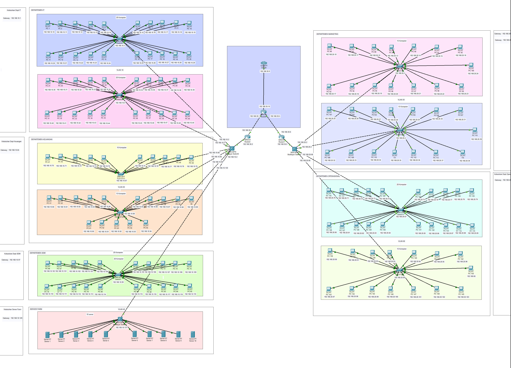
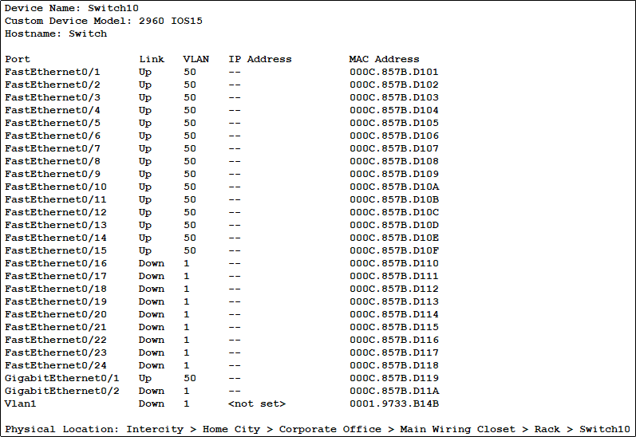
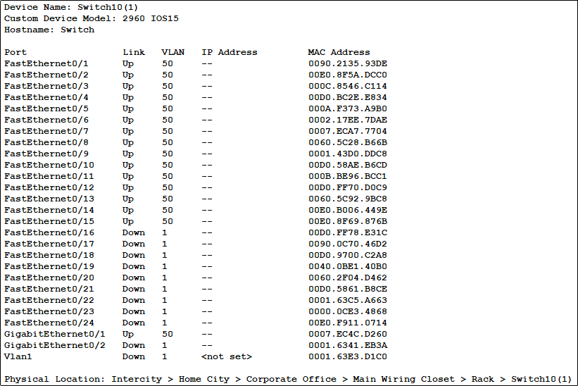
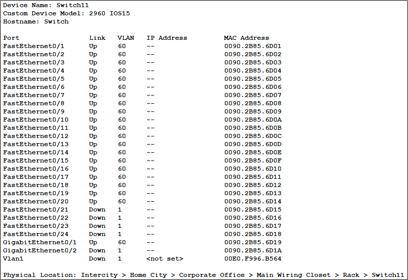
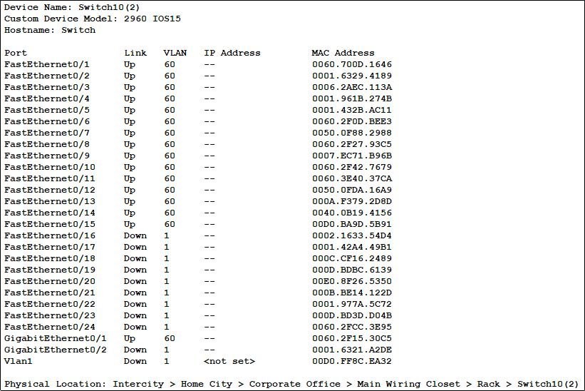

# Implementasi Topologi Dasar & VLAN - Pekan 11

## Daftar Anggota Kelompok 5 DMJK Beserta Peran

1. Ketua : Aditya Laksamana P Butar Butar_10231006 (Security & Documentation Specialist)
2. Anggota : Ilham Ahmad Fahriji_10231042 (Network Engineer)
3. Anggota : Muchlis Wahyu Saputra_10231054 (Network Service)
4. Anggota : Nazwa Amelia Zahra_10231068 (Network Architect)

## Daftar Isi

[Judul dan Identitas Kelompok](#daftar-anggota-kelompok-5-dmjk-beserta-peran)

[Daftar Isi](#daftar-isi)

[Finalisasi desain topologi jaringan](#finalisasi-desain-topologi-jaringan)

[Konfigurasi Vlan Dan Trunking](#Konfigurasi-Vlan-Trunking)

## Finalisasi desain topologi jaringan

#### Berikut kami lampirkan diagram topologi fisik dan logis yang telah kami rancang.

**Link Drive Topologi .pkt:** Topologi ada di github

Gambar tersebut merupakan desain topologi jaringan untuk dua gedung, yaitu Gedung A (Kantor Pusat) dan Gedung B (Kantor Cabang). Desain jaringan ini mencakup struktur topologi fisik dan topologi logis (IP Address & VLAN) untuk memastikan koneksi antar departemen berjalan efisien, aman, dan mudah dikelola.

### Topologi Fisik

Topologi yang digunakan adalah topologi hierarki (tree topology), di mana semua perangkat dari setiap departemen per ruangan dihubungkan switch per ruangan lalu ke switch utama, kemudian tersambung ke router gedung, lalu ke router pusat, hingga terkoneksi ke ISP.

Komponen utama yang digunakan:

    - ISP → Koneksi Internet utama
    - Router Utama (Core Router) → Penghubung semua router gedung
    - Router A dan Router B → Masing-masing untuk Gedung A dan Gedung B
    - Switch Utama Gedung A & B → Distribusi ke switch departemen
    - Switch Departemen → Menghubungkan perangkat di tiap ruangan
    - End Device → PC, server

### Rencana Penerapan VLAN

Tujuan dari VLAN ini disesuaikan dengan kebutuhan khusus yang diperlukan dalam pembentukan atau perancangan jaringan.

| VLAN ID | Nama VLAN        | Tujuan                                                                                                                                                        |
| :------ | :--------------- | :------------------------------------------------------------------------------------------------------------------------------------------------------------ |
| 10      | VLAN_IT          | **Memisahkan jaringan khusus tim IT** agar mudah diatur dan diberi aturan akses khusus IT.                                                                    |
| 20      | VLAN_KEUANGAN    | **Mengamankan data keuangan** dengan memisahkannya dari jaringan lain dan mengatur siapa saja yang boleh mengaksesnya.                                        |
| 30      | VLAN_SDM         | **Memisahkan jaringan bagian SDM (HR)**, mengatur hak akses, dan membuatnya lebih mudah dipantau serta dikelola.                                              |
| 40      | VLAN_SERVER      | **Mengelompokkan server-server** dalam jaringan terpisah agar lebih aman dan stabil, menggunakan alamat IP tetap.                                             |
| 50      | VLAN_MARKETING   | **Memisahkan jaringan bagian Marketing** agar lebih teratur, menghemat penggunaan internet, dan menerapkan aturan akses khusus Marketing.                     |
| 60      | VLAN_OPERASIONAL | **Memisahkan jaringan bagian Operasional** agar lebih teratur, menghemat penggunaan internet, menerapkan aturan akses khusus Operasional, dan mudah dipantau. |

## Konfigurasi Vlan Dan Trunking

Pada proses saat ini adalah masih proses pembuatan Vlan database sesuai dengan vlan table yang ada di atas lalu selanjutnya kami melakukan hal yang sama pada main switch Gedung A dan Gedung B untuk Membuat vlan agar dapat terhubung ke switch setiap Ruangan dengan Vlan yang berbeda.

ini adalah proses untuk penghubungan antara vlan yang sudah dibuat dihubungkan ke beberapa pc yang ada sesuai ruangan yang ada dan di gambar ini juga diberikan hasil berupa vlan yang terhubung dengan berbagai kabel fastEthernet0/1 dan lainnya yang terhubung ke masing masing pc.

untuk gambar ini adalah hasil dari command show interface trunking yang terdapat di switch utama gedung A , dimana ini adalah perintah untuk mengecek bahwa port apa saja yang sudah melakukan trunking agar dapat mengakses semua vlan yang berbeda.

ini adalah hasil konfigurasi vlan yang telah di lakukan untuk ke gedung B yang dimana memiliki dua departemen dan dua ruangan dengan vlan yang berbeda.

untuk gambar ini adalah hasil dari command show interface trunking yang terdapat di switch utama gedung B , dimana ini adalah perintah untuk mengecek bahwa port apa saja yang sudah melakukan trunking agar dapat mengakses semua vlan yang berbeda.

untuk gambar ini adalah hasil dari command show ip interface yang terdapat di router utama gedung A , dimana ini terdapat interface apa saja didalam router tersebut.

ini adalah fungsi untuk menampilkan jalur rute apa saja yang terdapat di router tersebut.

ini adalah hasil pengujian konektivitas antar vlan dengan inter vlan routing dari vlan 10 ke vlan 20 dengan melakukan ping test.

# Revisi Pekan 10

## Skema Keamanan & Konfigurasi Access Control List (ACL)

### Tujuan Keamanan

Sebagai bagian dari strategi keamanan jaringan di PT. Nusantara Network, kami menerapkan **Access Control List (ACL)** untuk membatasi dan mengatur komunikasi antar VLAN sesuai kebijakan organisasi. Hal ini untuk memastikan bahwa masing-masing departemen hanya dapat mengakses jaringan yang relevan dengan fungsinya.

---

### Kebijakan ACL yang Diberlakukan

| Akses dari VLAN     | Akses ke VLAN         | Status        | Alasan                                                  |
| ------------------- | --------------------- | ------------- | ------------------------------------------------------- |
| VLAN 30 (SDM)       | VLAN 20 (Keuangan)    | **Diblokir**  | SDM tidak boleh mengakses data keuangan                 |
| VLAN 50 (Marketing) | VLAN 40 (Server Farm) | **Diblokir**  | Marketing tidak perlu akses ke server internal          |
| VLAN 20 (Keuangan)  | VLAN 40 (Server Farm) | **Diizinkan** | Keuangan membutuhkan akses ke database/server akuntansi |
| VLAN 10 (IT)        | Semua VLAN            | **Diizinkan** | IT sebagai admin memiliki akses ke seluruh jaringan     |

---

## Kesimpulan dan Pembelajaran

## 📌 Kesimpulan Pekan 11 – Implementasi Topologi Dasar & VLAN

Pada pekan ke-11 ini, kami berhasil mengimplementasikan topologi dasar jaringan sesuai dengan rancangan pada minggu-minggu sebelumnya. Proses implementasi dilakukan menggunakan Cisco Packet Tracer, dengan fokus pada pembangunan konektivitas internal antardepartemen di masing-masing gedung melalui konfigurasi VLAN, trunking, dan routing antar-VLAN.

Beberapa pencapaian utama dalam pekan ini meliputi:

- Implementasi struktur topologi fisik dan logis di Cisco Packet Tracer, mencakup koneksi antar switch akses, switch core (Layer 3), dan router per gedung.
- Konfigurasi VLAN untuk setiap departemen berdasarkan pembagian segmentasi jaringan:
  - VLAN 10 (IT)
  - VLAN 20 (Keuangan)
  - VLAN 30 (SDM)
  - VLAN 40 (Server Farm)
  - VLAN 50 (Marketing)
  - VLAN 60 (Operasional)
- Konfigurasi **trunking antar switch** untuk memastikan semua VLAN dapat ditransmisikan dari switch core ke switch akses.
- Konfigurasi **interface VLAN (SVI)** pada switch Layer 3 di tiap gedung untuk mendukung **inter-VLAN routing**.
- Pengujian konektivitas antar VLAN berhasil dilakukan, menunjukkan bahwa setiap departemen dapat saling terhubung sesuai dengan kebijakan akses yang berlaku.

Dengan pencapaian tersebut, tahap implementasi jaringan lokal (LAN) antar departemen sudah berhasil dibangun secara fungsional dan sesuai standar enterprise network. Implementasi ini menjadi pondasi penting untuk pekan berikutnya, yang akan berfokus pada routing antar-gedung (WAN), layanan DHCP dan DNS, serta penguatan keamanan jaringan dengan NAT dan ACL.

## Link Repository Github

https://github.com/adtyabtrs22/FinalProjectDMJK_Kelompok5
