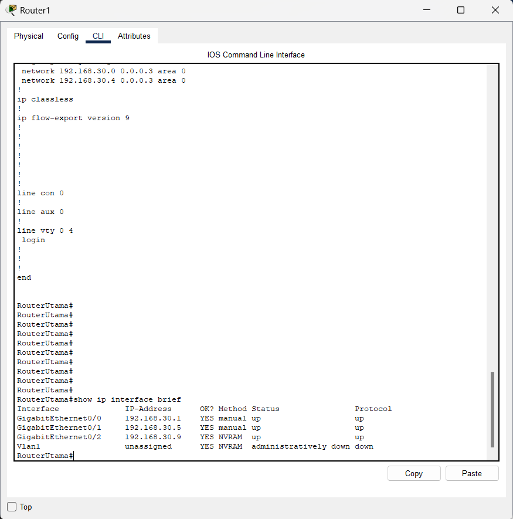
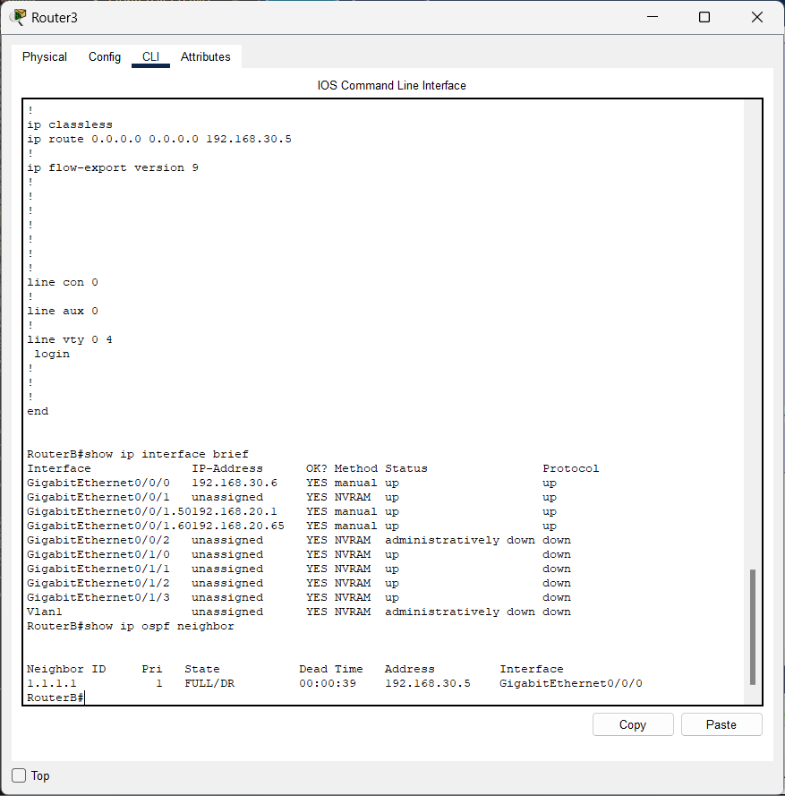

# Implementasi Routing & WAN - Pekan 12

## 👥 Daftar Anggota Kelompok 5 DMJK Beserta Peran

1.  Ketua : Aditya Laksamana P Butar Butar_10231006 (Security & Documentation Specialist)
2.  Anggota : Ilham Ahmad Fahriji_10231042 (Network Engineer)
3.  Anggota : Muchlis Wahyu Saputra_10231054 (Network Service Specialist)
4.  Anggota : Nazwa Amelia Zahra_10231068 (Network Architect)

---

## 📄 Daftar Isi

1.  [Pendahuluan](#1-pendahuluan)
2.  [Konfigurasi IP Address & Verifikasi Awal](#2-konfigurasi-ip-address--verifikasi-awal)
3.  [Konfigurasi Routing Statis (Intra-Gedung)](#3-konfigurasi-routing-statis-intra-gedung)
4.  [Implementasi Routing Dinamis (OSPF) & WAN](#4-implementasi-routing-dinamis-ospf--wan)
    *   [4.1 Konsep OSPF](#41-konsep-ospf)
    *   [4.2 Konfigurasi OSPF Router Utama](#42-konfigurasi-ospf-router-utama)
    *   [4.3 Konfigurasi OSPF Router Gedung A](#43-konfigurasi-ospf-router-gedung-a)
    *   [4.4 Konfigurasi OSPF Router Gedung B](#44-konfigurasi-ospf-router-gedung-b)
    *   [4.5 Redistribusi Rute Statis](#45-redistribusi-rute-statis)
5.  [Konfigurasi Default Route pada Switch Layer 3](#5-konfigurasi-default-route-pada-switch-layer-3)
6.  [Simulasi Koneksi WAN](#6-simulasi-koneksi-wan)
7.  [Pengujian Konektivitas Antar Gedung](#7-pengujian-konektivitas-antar-gedung)
    *   [7.1 Verifikasi Tetangga OSPF (show ip ospf neighbor)](#71-verifikasi-tetangga-ospf-show-ip-ospf-neighbor)
    *   [7.2 Verifikasi Tabel Routing (show ip route)](#72-verifikasi-tabel-routing-show-ip-route)
    *   [7.3 Uji Ping Antar Gedung](#73-uji-ping-antar-gedung)
8.  [Analisis Performa Routing](#8-analisis-performa-routing)
9.  [Kendala dan Solusi Selama Implementasi](#9-kendala-dan-solusi-selama-implementasi)
10. [Kesimpulan dan Pembelajaran](#10-kesimpulan-dan-pembelajaran)
11. [Link Repository Github](#11-link-repository-github)

---

## 1. Pendahuluan

Pada Pekan 12 ini, fokus utama adalah mengimplementasikan mekanisme routing yang menghubungkan jaringan di Gedung A (Kantor Pusat) dan Gedung B (Kantor Cabang) melalui simulasi koneksi WAN. Sesuai dengan kebutuhan studi kasus PT. Nusantara Network, kita akan menggunakan routing dinamis OSPF (Open Shortest Path First) untuk konektivitas antar gedung karena kemampuannya beradaptasi dengan perubahan topologi dan mengelola rute secara efisien, terutama pada koneksi WAN dengan bandwidth terbatas.

Tahapan implementasi meliputi konfigurasi IP Address pada link antar perangkat, penerapan routing statis untuk mengenalkan jaringan internal ke router edge, konfigurasi OSPF antar router, konfigurasi default route pada switch Layer 3, serta pengujian menyeluruh untuk memastikan konektivitas end-to-end antar gedung.

---

## 2. Konfigurasi IP Address & Verifikasi Awal

Langkah pertama adalah memastikan semua link antar perangkat inti (Router Utama, Router Gedung A, Router Gedung B, Switch L3 A, Switch L3 B) memiliki konfigurasi IP Address yang benar sesuai skema Pekan 10 dan dalam keadaan aktif (`no shutdown`).

*   **Link Router Utama <-> Router Gedung A:** `192.168.30.0/30` (IP .1 di Utama, .2 di A)
*   **Link Router Utama <-> Router Gedung B:** `192.168.30.4/30` (IP .5 di Utama, .6 di B)
*   **Link Router Gedung A <-> Switch L3 A:** `192.168.10.0/30` (IP .1 di Router A, .2 di Switch L3 A)
*   **Link Router Gedung B <-> Switch L3 B:** `192.168.20.0/30` (IP .1 di Router B, .2 di Switch L3 B)


Verifikasi dilakukan menggunakan `show ip interface brief` pada setiap perangkat untuk memastikan IP address benar dan status `up`/`up`. Pengujian `ping` antar perangkat yang terhubung langsung juga dilakukan untuk memastikan konektivitas Layer 3 dasar sebelum konfigurasi routing yang lebih kompleks.

*(Catatan: Detail konfigurasi IP Address diasumsikan sudah dilakukan sesuai panduan `to-do.md`, termasuk workaround SVI Vlan1 di Router Utama jika `no switchport` tidak berfungsi pada interface fisik ke Router Gedung B).*

---

## 3. Konfigurasi Routing Statis (Intra-Gedung)

Karena routing antar-VLAN sudah ditangani oleh Switch Layer 3 (L3) di masing-masing gedung, fungsi routing statis di sini adalah untuk memberitahu **Router Gedung A** dan **Router Gedung B** cara mencapai jaringan-jaringan internal (VLAN) di gedung mereka masing-masing. Rute ini menunjuk ke IP address Switch L3 sebagai *next-hop*.

**Konfigurasi awalan (Trunking dan Access Vlan)**

Jadi disini sebelum menghubungkan dengan router untuk bisa menghubungkan kedua gedung yaitu gedung A dan gedung B, disini kami melakukan Vlan Trunking dan Vlan Access terlebih dahulu dengan skema:

**PC masing - masing Ruangan <-> Switch Ruangan masing - masing Gedung A dan B : Dihubungkan dengan menggunakan Access disesuaikan dengan vlan nya masing masing**

**Switch masing - masing Ruangan <-> Main Switch masing - masing Gedung A dan B : Dihubungkan dengan menggunakan Trunk disesuaikan dengan vlan nya**

**Konfigurasi Rute Statis pada Router Gedung A:**
(Menunjuk ke Router Utama : `192.168.30.2`)
```bash
interface GigabitEthernet0/0/0
 # description Link Ke RouterUtama
ip address 192.168.30.2 255.255.255.252
duplex auto
speed auto
```

(Menunjuk ke Switch L3 A)
```bash
interface GigabitEthernet0/0/1.10
 description Gateway VLAN 10 IT
 encapsulation dot1Q 10
 ip address 192.168.10.1 255.255.255.192

interface GigabitEthernet0/0/1.20
 description Gateway VLAN 20 Keuangan
 encapsulation dot1Q 20
 ip address 192.168.10.65 255.255.255.224

interface GigabitEthernet0/0/1.30
 description Gateway VLAN 30 SDM
 encapsulation dot1Q 30
 ip address 192.168.10.97 255.255.255.224

interface GigabitEthernet0/0/1.40
 description Gateway VLAN 40 ServerFarm
 encapsulation dot1Q 40
 ip address 192.168.10.129 255.255.255.240
```

Hasil `show ip interface brief` dari router A

*Penjelasan Gambar: Output ini menunjukkan ringkasan konfigurasi IP pada Router Gedung A. Terlihat bahwa interface `GigabitEthernet0/0/0` (menghubungkan ke Router Utama) memiliki IP `192.168.30.2`. Selain itu, terdapat beberapa sub-interface (`GigabitEthernet0/0/1.10`, `.20`, `.30`, `.40`) yang mewakili gateway untuk masing-masing VLAN di Gedung A (VLAN 10 IT, 20 Keuangan, 30 SDM, 40 ServerFarm). Kolom 'Status' dan 'Protocol' yang menunjukkan `up` menandakan bahwa interface tersebut aktif dan dapat berkomunikasi di Layer 1 dan Layer 2.*

Hasil `show ip interface brief` dari main switch A

*Penjelasan Gambar: Output ini berasal dari Switch Layer 3 (Main Switch) di Gedung A. Terlihat beberapa interface VLAN (SVI - Switched Virtual Interface) seperti `Vlan10`, `Vlan20`, `Vlan30`, `Vlan40`. Setiap SVI memiliki IP address yang berfungsi sebagai gateway default untuk perangkat di VLAN tersebut (misal, `192.168.10.2/26` untuk Vlan10). Interface `GigabitEthernet0/0/1` (yang terhubung ke Router Gedung A) kemungkinan dikonfigurasi sebagai trunk port (tidak terlihat di output ini). Status `up`/`up` menunjukkan SVI aktif dan dapat melakukan routing antar VLAN.*

**Konfigurasi Rute Statis pada Router Gedung B:**
(Menunjuk ke Router Utama : `192.168.30.6`)
```bash
interface GigabitEthernet0/0/0
 # description Link Ke RouterUtama
 ip address 192.168.30.6 255.255.255.252
 duplex auto
 speed auto
```

(Menunjuk ke Switch L3)
```bash
interface GigabitEthernet0/0/1.50
 description Gateway VLAN 50 Marketing
 encapsulation dot1Q 50
 ip address 192.168.20.1 255.255.255.192
!
interface GigabitEthernet0/0/1.60
 description Gateway VLAN 60 Operasional
 encapsulation dot1Q 60
 ip address 192.168.20.65 255.255.255.192
```

(Ip Route Gedung B)
```bash
ip route 0.0.0.0 0.0.0.0 192.168.30.5
```

Hasil `show ip interface brief` dari router B

*Penjelasan Gambar: Output ini menampilkan ringkasan IP pada Router Gedung B. Interface `GigabitEthernet0/0/0` terhubung ke Router Utama dengan IP `192.168.30.6`. Sub-interface `GigabitEthernet0/0/1.50` dan `.60` berfungsi sebagai gateway untuk VLAN 50 (Marketing) dan VLAN 60 (Operasional) di Gedung B. Semua interface yang relevan menunjukkan status `up`/`up`, menandakan konektivitas fisik dan data link yang baik.*

Hasil `show ip interface brief` dari main switch B

*Penjelasan Gambar: Ini adalah output dari Switch Layer 3 (Main Switch) di Gedung B. Terlihat SVI `Vlan50` dan `Vlan60` dengan IP address gateway masing-masing (`192.168.20.2/26` dan `192.168.20.66/26`). Interface `GigabitEthernet0/0/1` yang terhubung ke Router Gedung B kemungkinan adalah trunk. Status `up`/`up` mengindikasikan SVI aktif dan siap untuk routing antar VLAN di Gedung B.*

**Konfigurasi Rute Statis pada Router Utama:**
(Menunjuk ke Router A : `192.168.30.1`)
```bash
interface GigabitEthernet0/0
 # description Link Ke RouterA
 ip address 192.168.30.1 255.255.255.252
 duplex auto
 speed auto
```

(Menunjuk ke Router B : `192.168.30.5`)
```bash
interface GigabitEthernet0/1
 # description Link Ke RouterB
 ip address 192.168.30.5 255.255.255.252
 duplex auto
 speed auto
```

(Menunjuk ke ISP : `192.168.30.9`)
```bash
interface GigabitEthernet0/2
 # description Link Ke ISP
 ip address 192.168.30.9 255.255.255.252
 duplex auto
 speed auto
```

Hasil `show ip interface brief` dari router Utama

*Penjelasan Gambar: Output ini berasal dari Router Utama. Interface `GigabitEthernet0/0` terhubung ke Router Gedung A dengan IP `192.168.30.1`. Interface `GigabitEthernet0/1` terhubung ke Router Gedung B dengan IP `192.168.30.5`. Interface `GigabitEthernet0/2` terhubung ke ISP (simulasi) dengan IP `192.168.30.9`. Semua interface ini aktif (`up`/`up`). Jika ada workaround SVI Vlan1 untuk koneksi ke Gedung B (seperti disebut di kendala), maka `interface Vlan1` juga akan muncul dengan IP `192.168.30.5` dan status `up`/`up`.*


Rute statis ini sangat penting karena akan diiklankan ke router lain melalui OSPF (menggunakan redistribusi) agar seluruh jaringan dapat saling mencapai.


## 4. Implementasi Routing Dinamis (OSPF) & WAN

### 4.1 Konsep OSPF

OSPF (Open Shortest Path First) dipilih sebagai protokol routing dinamis antar gedung. OSPF adalah protokol link-state yang membangun peta topologi jaringan dan menghitung jalur terbaik. Kita menggunakan OSPF Area 0 (Backbone Area) untuk kesederhanaan.

### 4.2 Konfigurasi OSPF Router Utama

Router Utama menghubungkan Gedung A, Gedung B, dan ISP. OSPF diaktifkan pada link ke Router A dan B.

```bash
router ospf 1
 router-id 3.3.3.3
 log-adjacency-changes
 network 192.168.30.0 0.0.0.3 area 0
 network 192.168.30.4 0.0.0.3 area 0
```
*Catatan Penting:* Perintah `network 192.168.30.4 0.0.0.3 area 0` akan mengaktifkan OSPF pada interface mana pun yang memiliki IP address dalam rentang tersebut, termasuk `interface Vlan1` (IP `192.168.30.5`) jika workaround SVI diterapkan karena keterbatasan `no switchport` pada interface fisik.

### 4.3 Konfigurasi OSPF Router Gedung A

Router Gedung A mengaktifkan OSPF pada link ke Router Utama dan link ke Switch L3 A, serta meredistribusi rute statis.

```bash
router ospf 1
 router-id 1.1.1.1
 log-adjacency-changes
 redistribute static subnets 
 network 192.168.30.0 0.0.0.3 area 0
 network 192.168.1.0 0.0.0.3 area 0
 network 192.168.10.0 0.0.0.63 area 0
 network 192.168.10.64 0.0.0.31 area 0
 network 192.168.10.96 0.0.0.31 area 0
 network 192.168.10.128 0.0.0.15 area 0
 network 192.168.10.0 0.0.0.255 area 0
```

### 4.4 Konfigurasi OSPF Router Gedung B

Serupa dengan Router Gedung A, OSPF diaktifkan pada link ke Router Utama dan link ke Switch L3 B, serta meredistribusi rute statis.

```bash
router ospf 1
 router-id 2.2.2.2
 log-adjacency-changes
 network 192.168.30.4 0.0.0.3 area 0
 network 192.168.20.0 0.0.0.63 area 0
 network 192.168.20.64 0.0.0.63 area 0
 network 192.168.20.0 0.0.0.255 area 0
```

### 4.5 Redistribusi Rute Statis

Perintah `redistribute static subnets` pada Router Gedung A dan B sangat krusial. Perintah ini mengambil rute statis menuju jaringan VLAN internal (yang dikonfigurasi pada langkah 3) dan mengiklankannya ke dalam OSPF. Tanpa ini, Router Utama dan router di gedung seberang tidak akan tahu cara mencapai VLAN-VLAN tersebut.

---

## 5. Konfigurasi Default Route pada Switch Layer 3

Agar perangkat di dalam VLAN dapat berkomunikasi dengan jaringan di luar gedung mereka (gedung lain atau internet), Switch L3 di setiap gedung perlu diberi tahu ke mana harus mengirimkan traffic yang tujuannya tidak diketahui secara lokal. Ini dilakukan dengan menambahkan default route yang menunjuk ke router edge gedung masing-masing.

**Konfigurasi Default Route pada Switch L3 A:**
```bash
Switch_L3_A(config)# ip routing // Pastikan IP routing global aktif
Switch_L3_A(config)# ip route 0.0.0.0 0.0.0.0 192.168.10.1 // Kirim ke Router Gedung A
```

**Konfigurasi Default Route pada Switch L3 B:**
```bash
Switch_L3_B(config)# ip routing // Pastikan IP routing global aktif
Switch_L3_B(config)# ip route 0.0.0.0 0.0.0.0 192.168.20.1 // Kirim ke Router Gedung B
```
Langkah ini sering terlewat namun sangat penting untuk konektivitas end-to-end.

---

## 6. Simulasi Koneksi WAN

Koneksi WAN antara Gedung A, Gedung B, dan Router Utama disimulasikan di Packet Tracer menggunakan:
1.  **Koneksi Fisik**: Kabel yang sesuai (Copper Straight-Through atau Serial) antar port router.
2.  **Pengalamatan IP**: Alokasi subnet `/30` (`192.168.30.0/30`, `192.168.30.4/30`).
3.  **Routing Protocol**: Penggunaan OSPF untuk pertukaran informasi routing dinamis.

---

## 7. Pengujian Konektivitas Antar Gedung

Pengujian menyeluruh dilakukan untuk memvalidasi konfigurasi.

### 7.1 Verifikasi Tetangga OSPF (`show ip ospf neighbor`)

Perintah ini dijalankan pada ketiga router untuk memastikan adjacency OSPF telah terbentuk (Status `FULL`).

**Screenshot Hasil `show ip ospf neighbor`:**

*   **Router Utama:**

    

    *Penjelasan: Output `show ip ospf neighbor` pada Router Utama ini memverifikasi bahwa proses OSPF berhasil membentuk hubungan ketetanggaan (adjacency) dengan dua router lain. Terlihat dua tetangga: Router Gedung A (dengan Router ID `1.1.1.1`, terhubung via interface `GigabitEthernet0/0` Router Utama) dan Router Gedung B (dengan Router ID `2.2.2.2`, terhubung via interface `GigabitEthernet0/1` Router Utama). Kolom 'State' menunjukkan `FULL/DROTHER`, yang berarti hubungan OSPF sudah sepenuhnya terbentuk dan siap bertukar informasi routing. `DROTHER` mengindikasikan bahwa router ini bukan Designated Router (DR) atau Backup Designated Router (BDR) pada segmen jaringan tersebut, yang normal untuk koneksi point-to-point.*

*   **(Contoh) Router Gedung A:**
    
    *Penjelasan: Output ini dari Router Gedung A. Terlihat satu tetangga OSPF, yaitu Router Utama (dengan Router ID `3.3.3.3`), yang terhubung melalui interface `GigabitEthernet0/0/0` milik Router A. Status `FULL/DROTHER` menunjukkan hubungan OSPF yang sukses terbentuk.*

     **(Contoh) Router Gedung B:**
    
    *Penjelasan: Output ini dari Router Gedung B. Sama seperti Router A, ia menunjukkan satu tetangga OSPF, yaitu Router Utama (Router ID `3.3.3.3`), terhubung melalui interface `GigabitEthernet0/0/0` milik Router B. Status `FULL/DROTHER` mengonfirmasi hubungan OSPF yang valid.*

### 7.2 Verifikasi Tabel Routing (`show ip route`)

Perintah ini dijalankan pada semua router dan L3 Switch untuk memeriksa rute yang dipelajari.

*   **Router Utama:** Harusnya melihat rute OSPF (O, O E2) ke semua subnet internal di Gedung A dan B.
    
    *Penjelasan: Tabel routing di Router Utama menunjukkan bagaimana router ini akan meneruskan paket ke berbagai tujuan. Kita melihat beberapa tipe rute:*
    *   *`C` (Connected): Jaringan yang terhubung langsung, seperti `192.168.30.0/30` (ke Router A), `192.168.30.4/30` (ke Router B), dan `192.168.30.8/30` (ke ISP).*
    *   *`L` (Local): IP address spesifik yang dikonfigurasi pada interface router itu sendiri.*
    *   *`O E2` (OSPF External Type 2): Ini adalah rute menuju jaringan internal di Gedung A (subnet `192.168.10.x`) dan Gedung B (subnet `192.168.20.x`) yang dipelajari melalui OSPF. Rute ini awalnya adalah rute statis di Router A dan B, kemudian diiklankan (redistributed) ke OSPF. Router Utama tahu bahwa untuk mencapai, misalnya, `192.168.10.0/26` (VLAN 10 IT), paket harus dikirim ke `192.168.30.2` (Router A). Demikian pula, untuk mencapai `192.168.20.0/26` (VLAN 50 Marketing), paket dikirim ke `192.168.30.6` (Router B). Ini menunjukkan OSPF dan redistribusi bekerja dengan benar.*

*   **Router Gedung A:** Harusnya melihat rute statis (S) ke VLAN internalnya, rute OSPF (O, O E2) ke subnet Gedung B, dan rute default OSPF (O*E2) jika diiklankan.
    
    *Penjelasan: Tabel routing Router Gedung A menampilkan:*
    *   *`C` dan `L`: Jaringan yang terhubung langsung (link ke Router Utama `192.168.30.0/30` dan sub-interface VLAN `192.168.10.x`).*
    *   *`O` (OSPF): Rute ke jaringan WAN lain yang dipelajari dari Router Utama, seperti `192.168.30.4/30` (link antara Router Utama dan Router B).*
    *   *`O E2` (OSPF External Type 2): Rute ke jaringan internal Gedung B (subnet `192.168.20.x`) yang dipelajari melalui OSPF dari Router Utama (via `192.168.30.1`) yang mendapatkannya dari Router B. Ini menunjukkan OSPF berhasil menyebarkan informasi rute antar gedung.*
    *   *(Catatan: Rute statis ke VLAN internal tidak muncul di sini karena router ini memiliki interface langsung (sub-interface) ke jaringan tersebut, sehingga rute 'Connected' lebih diutamakan daripada rute statis ke next-hop yang sama).*
    *   *(Jika ada default route (`0.0.0.0/0`) yang diiklankan oleh Router Utama atau ISP via OSPF, mungkin akan terlihat sebagai `O*E2`).*

*   **Router Gedung B:** Serupa dengan Router A, tetapi untuk jaringan Gedung A.
    
    *Penjelasan: Tabel routing Router Gedung B menunjukkan:*
    *   *`C` dan `L`: Jaringan terhubung langsung (link ke Router Utama `192.168.30.4/30` dan sub-interface VLAN `192.168.20.x`).*
    *   *`S*` (Static Default): Rute default `0.0.0.0/0` yang dikonfigurasi secara manual (`ip route 0.0.0.0 0.0.0.0 192.168.30.5`) untuk mengarahkan semua traffic tujuan tidak dikenal ke Router Utama.*
    *   *`O` (OSPF): Rute ke jaringan WAN lain, seperti `192.168.30.0/30` (link antara Router Utama dan Router A).*
    *   *`O E2` (OSPF External Type 2): Rute ke jaringan internal Gedung A (subnet `192.168.10.x`) yang dipelajari melalui OSPF dari Router Utama (via `192.168.30.5`).*

*   **Switch L3 A:** Harusnya melihat rute Connected (C), Local (L) untuk VLAN internal dan link ke Router A, serta rute default statis (S*).
    
    *Penjelasan: Tabel routing pada Switch Layer 3 Gedung A menunjukkan:*
    *   *`C` dan `L`: Jaringan VLAN internal (`192.168.10.0/26`, `192.168.10.64/27`, `192.168.10.96/27`, `192.168.10.128/28`) yang terhubung langsung melalui SVI (interface Vlan10, Vlan20, dst.).*
    *   *`S*` (Static Default): Rute default `0.0.0.0/0` yang menunjuk ke `192.168.10.1`. Ini adalah IP address Router Gedung A pada link yang menghubungkan switch ini. Rute ini penting agar switch tahu ke mana harus mengirim traffic yang ditujukan ke luar jaringan lokal Gedung A (misalnya ke Gedung B atau internet).*

*   **Switch L3 B:** Serupa dengan Switch L3 A.
    
    *Penjelasan: Tabel routing pada Switch Layer 3 Gedung B menunjukkan:*
    *   *`C` dan `L`: Jaringan VLAN internal (`192.168.20.0/26`, `192.168.20.64/26`) yang terhubung melalui SVI (Vlan50, Vlan60).*
    *   *`S*` (Static Default): Rute default `0.0.0.0/0` yang menunjuk ke `192.168.20.1` (IP address Router Gedung B). Fungsinya sama seperti pada Switch L3 A, yaitu mengarahkan traffic keluar Gedung B.*

### 7.3 Uji Ping Antar Gedung

Pengujian ping dari PC di satu gedung ke PC/Server di gedung lain.

*   **Ping Gedung A ke Gedung B:**
    
    *Penjelasan: Gambar ini menunjukkan hasil perintah `ping` dari sebuah PC di Gedung A (kemungkinan di VLAN IT, misal IP `192.168.10.10`) ke sebuah PC di Gedung B (kemungkinan di VLAN Marketing, misal IP `192.168.20.10`). Hasil `Reply from ...` menunjukkan bahwa ping berhasil. Ini membuktikan bahwa paket ICMP (ping) dapat berjalan dari PC A -> Switch L3 A -> Router A -> Router Utama -> Router B -> Switch L3 B -> PC B, dan balasannya kembali melalui jalur yang sama. Ini memvalidasi konektivitas end-to-end antar gedung melalui rute OSPF yang telah dikonfigurasi.*

*   **Ping Gedung B ke Gedung A (Server):**
    
    *Penjelasan: Gambar ini menunjukkan hasil `ping` dari PC di Gedung B (misal VLAN Marketing, IP `192.168.20.86`) ke sebuah Server di Gedung A (VLAN ServerFarm, IP `192.168.10.131`). Hasil `Reply from ...` menandakan ping sukses. Ini kembali mengonfirmasi bahwa routing antar gedung berfungsi dengan baik, memungkinkan komunikasi antara VLAN yang berbeda di gedung yang berbeda.*

*   **Ping Gedung B ke Gedung A (Server):**
    
    *Penjelasan: Gambar ini kemungkinan adalah hasil ping lain antar PC/Server di gedung yang berbeda, memberikan bukti tambahan bahwa konfigurasi routing OSPF dan rute default pada switch L3 telah berhasil membangun konektivitas menyeluruh antar lokasi sesuai desain jaringan. Keberhasilan ping ini adalah validasi akhir dari implementasi routing Pekan 12.*

---

## 8. Analisis Performa Routing

Perbandingan routing dinamis (OSPF) vs statis untuk koneksi antar gedung:

*   **OSPF (Dinamis):** Adaptif, mudah dikelola untuk skala besar, pemilihan jalur optimal. Membutuhkan resource, sedikit lebih kompleks.
*   **Statis:** Ringan, sederhana untuk skala kecil, aman (tidak advertise). Tidak adaptif, tidak scalable, rentan kesalahan manual.

Kesimpulan: OSPF adalah pilihan yang lebih baik untuk konektivitas antar gedung PT. Nusantara Network karena keandalannya. Kombinasi OSPF antar router dan routing statis/inter-VLAN di L3 Switch internal memberikan solusi yang seimbang.

---

## 9. Kendala dan Solusi Selama Implementasi

Selama proses implementasi Pekan 12, beberapa kendala ditemui yang memerlukan troubleshooting:

1.  **Kendala:** OSPF adjacency tidak terbentuk antar router.
    *   **Penyebab:** Terlewatnya konfigurasi IP address pada interface WAN di Router Utama.
    *   **Solusi:** Memastikan semua interface WAN antar router memiliki IP address /30 yang benar dan status `no shutdown`.
2.  **Kendala:** Error `overlaps` saat konfigurasi IP WAN di Router Gedung A dan B.
    *   **Penyebab:** Adanya konfigurasi subinterface sisa dari percobaan sebelumnya atau implementasi yang salah (inter-VLAN routing seharusnya di L3 Switch, bukan di router edge).
    *   **Solusi:** Menghapus konfigurasi subinterface yang tidak diperlukan (`no interface GigabitEthernet0/0/0.xx`) dari router edge.
3.  **Kendala:** Perintah `no switchport` gagal dengan error `incomplete command` pada salah satu interface fisik (GigabitEthernet0/1/0) di Router Utama.
    *   **Penyebab:** Kemungkinan keterbatasan simulasi Packet Tracer pada model router ISR 4331 untuk mengubah port switch bawaan menjadi routed port.
    *   **Solusi (Workaround):** Membiarkan port fisik sebagai switchport di VLAN 1, membuat SVI `interface Vlan1` di Router Utama, dan memberikan IP address WAN (`192.168.30.5/30`) pada SVI tersebut.
4.  **Kendala:** Ping antar gedung gagal meskipun OSPF antar router sudah `FULL`; `show ip route` kosong di Switch L3.
    *   **Penyebab:** Fitur routing global (`ip routing`) belum diaktifkan pada Switch L3, konfigurasi IP address SVI hilang atau belum disimpan, dan default route (`ip route 0.0.0.0 ...`) belum ditambahkan untuk mengarahkan traffic keluar gedung.
    *   **Solusi:** Mengaktifkan `ip routing`, mengkonfigurasi ulang/memastikan IP address SVI sudah benar, dan menambahkan default route pada kedua Switch L3 yang menunjuk ke router edge gedung masing-masing.

Penyelesaian kendala ini menekankan pentingnya verifikasi konfigurasi langkah demi langkah, pemahaman interaksi antar protokol/fitur (routing statis, OSPF, SVI), dan pengecekan konfigurasi dasar seperti IP addressing dan status interface.

---

## 10. Kesimpulan dan Pembelajaran

Pada Pekan 12, konektivitas antar Gedung A dan Gedung B berhasil diimplementasikan menggunakan routing dinamis OSPF. Proses ini melibatkan konfigurasi OSPF pada ketiga router (Utama, A, B), penambahan rute statis di router edge (A dan B) untuk mengenalkan jaringan internal, redistribusi rute statis tersebut ke OSPF, dan penambahan default route pada Switch L3 internal.

Pengujian `show ip ospf neighbor`, `show ip route`, dan `ping` antar gedung memvalidasi keberhasilan konfigurasi. Pembelajaran utama meliputi pentingnya:
*   Memastikan konektivitas Layer 3 dasar sebelum implementasi routing.
*   Memahami mekanisme redistribusi rute antara protokol routing.
*   Mengaktifkan fitur routing (`ip routing`) pada perangkat Layer 3.
*   Menambahkan default route pada perangkat internal (L3 Switch) agar dapat mengirim traffic keluar segmen lokalnya.
*   Melakukan troubleshooting secara sistematis saat menghadapi kendala.

Konektivitas antar gedung yang stabil ini menjadi fondasi untuk implementasi layanan jaringan (DHCP, DNS, NAT) pada pekan berikutnya.

---

## 11. Link Repository Github

Link Github: https://github.com/adtyabtrs22/FinalProjectDMJK_Kelompok5

## Topologi Week - 12

Link Topologi Week - 12: 
