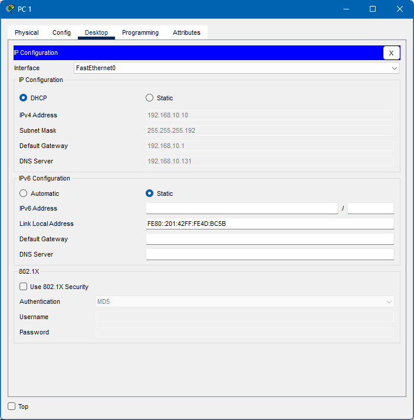
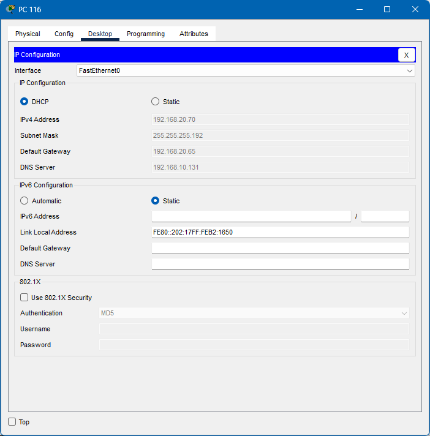
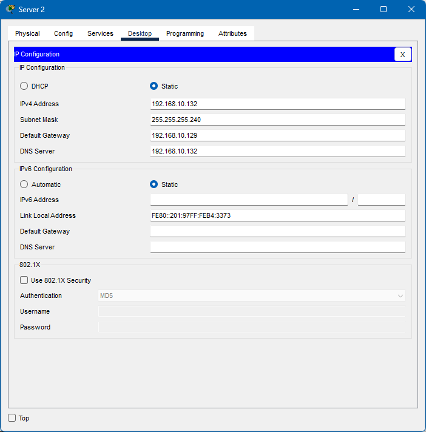
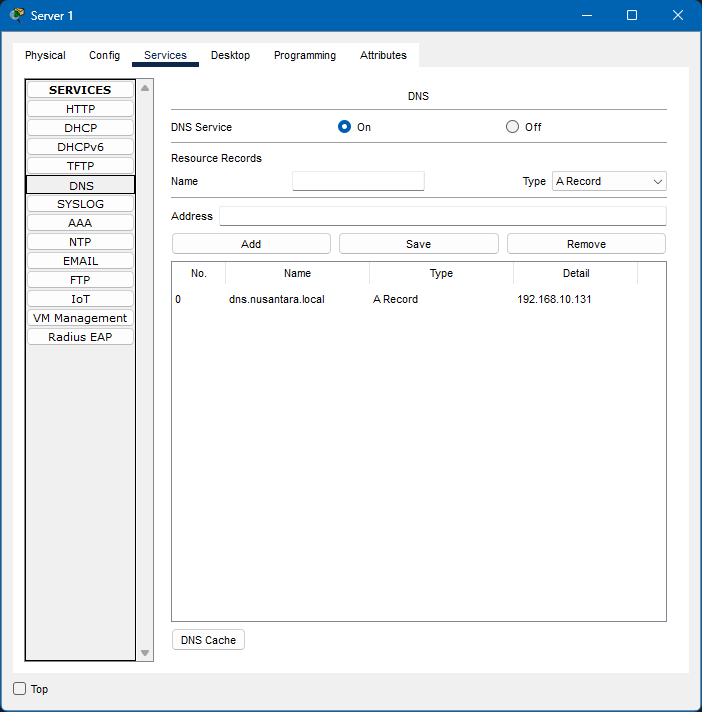
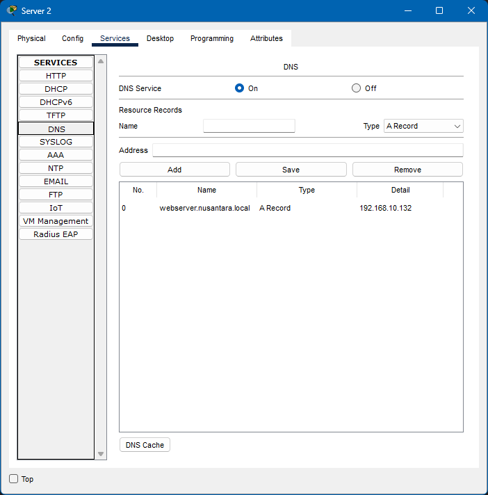
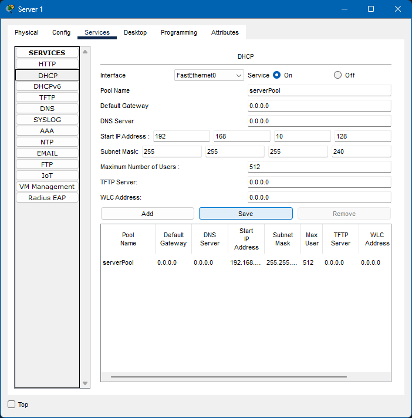
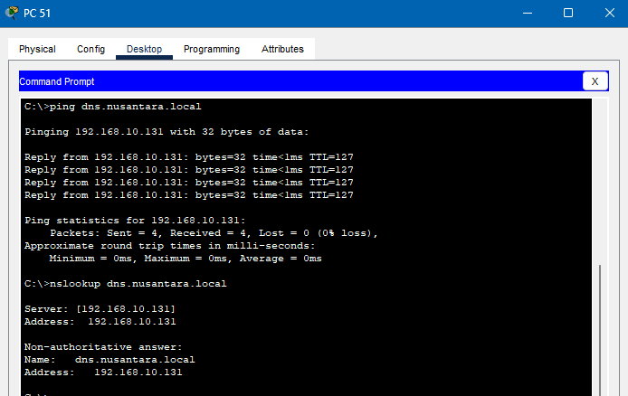
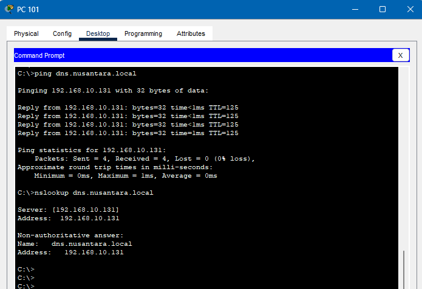
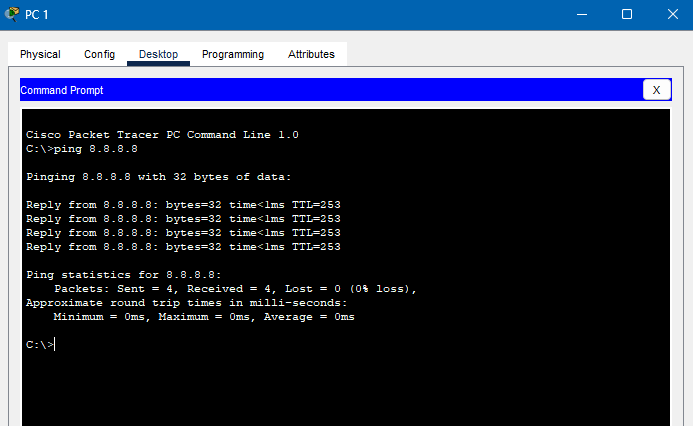
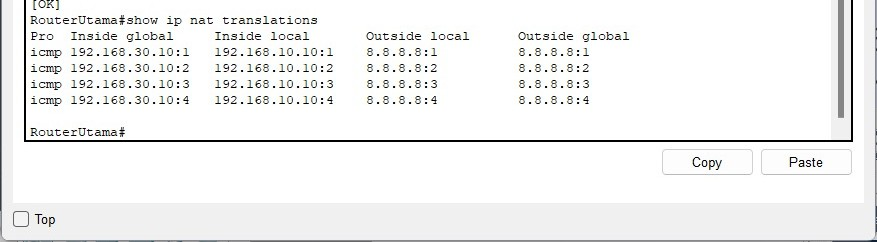

# Implementasi Layanan Jaringan - Pekan 13

## 👥 Daftar Anggota Kelompok 5 DMJK Beserta Peran

1.  Ketua : Aditya Laksamana P Butar Butar_10231006 (Security & Documentation Specialist)
2.  Anggota : Ilham Ahmad Fahriji_10231042 (Network Engineer)
3.  Anggota : Muchlis Wahyu Saputra_10231054 (Network Service Specialist)
4.  Anggota : Nazwa Amelia Zahra_10231068 (Network Architect)

---

## 📄 Daftar Isi

1.  [Pendahuluan](#1-pendahuluan)
2.  [Konfigurasi DHCP Server](#2-konfigurasi-dhcp-server)
    *   [2.1 Konsep DHCP](#21-konsep-dhcp)
    *   [2.2 Skenario Implementasi DHCP](#22-skenario-implementasi-dhcp)
    *   [2.3 Konfigurasi DHCP Server pada Router Utama/Server Terpusat](#23-konfigurasi-dhcp-server-pada-router-utamaserve-terpusat)
        *   [2.3.1 DHCP Pool untuk VLAN 10 (IT - Gedung A)](#231-dhcp-pool-untuk-vlan-10-it---gedung-a)
        *   [2.3.2 DHCP Pool untuk VLAN 20 (Keuangan - Gedung A)](#232-dhcp-pool-untuk-vlan-20-keuangan---gedung-a)
        *   [2.3.3 DHCP Pool untuk VLAN 30 (SDM - Gedung A)](#233-dhcp-pool-untuk-vlan-30-sdm---gedung-a)
        *   [2.3.4 DHCP Pool untuk VLAN 50 (Marketing - Gedung B)](#234-dhcp-pool-untuk-vlan-50-marketing---gedung-b)
        *   [2.3.5 DHCP Pool untuk VLAN 60 (Operasional - Gedung B)](#235-dhcp-pool-untuk-vlan-60-operasional---gedung-b)
    *   [2.4 Konfigurasi IP Helper-Address (Jika DHCP Server Terpusat)](#24-konfigurasi-ip-helper-address-jika-dhcp-server-terpusat)
    *   [2.5 Pengujian Alokasi IP Dinamis](#25-pengujian-alokasi-ip-dinamis)
        *   [2.5.1 Pengujian Client di VLAN 10](#251-pengujian-client-di-vlan-10)
        *   [2.5.2 Pengujian Client di VLAN 20](#252-pengujian-client-di-vlan-20)
        *   [2.5.3 Pengujian Client di VLAN 30](#253-pengujian-client-di-vlan-30)
        *   [2.5.4 Pengujian Client di VLAN 50](#254-pengujian-client-di-vlan-50)
        *   [2.5.5 Pengujian Client di VLAN 60](#255-pengujian-client-di-vlan-60)
3.  [Implementasi DNS Server](#3-implementasi-dns-server)
    *   [3.1 Konsep DNS](#31-konsep-dns)
    *   [3.2 Skenario Implementasi DNS](#32-skenario-implementasi-dns)
    *   [3.3 Konfigurasi DNS Server Internal](#33-konfigurasi-dns-server-internal)
    *   [3.4 Konfigurasi Client untuk Menggunakan DNS Internal](#34-konfigurasi-client-untuk-menggunakan-dns-internal)
    *   [3.5 Pengujian Resolusi Nama Internal](#35-pengujian-resolusi-nama-internal)
4.  [Konfigurasi NAT (Network Address Translation)](#4-konfigurasi-nat-network-address-translation)
    *   [4.1 Konsep NAT](#41-konsep-nat)
    *   [4.2 Skenario Implementasi NAT](#42-skenario-implementasi-nat)
    *   [4.3 Konfigurasi NAT Overload (PAT) pada Router Utama](#43-konfigurasi-nat-overload-pat-pada-router-utama)
        *   [4.3.1 Mendefinisikan Interface Inside dan Outside](#431-mendefinisikan-interface-inside-dan-outside)
        *   [4.3.2 Membuat Access Control List (ACL) untuk NAT](#432-membuat-access-control-list-acl-untuk-nat)
        *   [4.3.3 Mengaktifkan NAT Overload](#433-mengaktifkan-nat-overload)
    *   [4.4 Pengujian Konektivitas ke Jaringan Eksternal (Internet)](#44-pengujian-konektivitas-ke-jaringan-eksternal-internet)
    *   [4.5 Verifikasi NAT Translation Table](#45-verifikasi-nat-translation-table)
5.  [Kendala dan Solusi Selama Implementasi](#5-kendala-dan-solusi-selama-implementasi)
6.  [Kesimpulan dan Pembelajaran](#6-kesimpulan-dan-pembelajaran)
7.  [Link File Simulasi (.pkt)](#7-link-file-simulasi-pkt)
8.  [Link Repository Github](#8-link-repository-github)

---

## 1. Pendahuluan

Pada Pekan 13 ini, proyek implementasi jaringan PT. Nusantara Network memasuki tahap konfigurasi layanan jaringan esensial, yaitu DHCP (Dynamic Host Configuration Protocol), DNS (Domain Name System), dan NAT (Network Address Translation). Layanan-layanan ini krusial untuk operasional jaringan sehari-hari, memudahkan manajemen alamat IP, resolusi nama, dan konektivitas ke internet.

*   **DHCP Server** akan dikonfigurasi untuk memberikan alokasi IP address, subnet mask, default gateway, dan DNS server secara otomatis kepada klien di setiap VLAN departemen. Ini akan menyederhanakan administrasi IP dan mencegah konflik alamat.
*   **DNS Server Internal** akan diimplementasikan untuk memungkinkan resolusi nama domain internal perusahaan (misal, `server.nusantara.local` menjadi alamat IP server terkait). Ini mempermudah akses ke sumber daya internal.
*   **NAT** akan dikonfigurasi pada Router Utama untuk menerjemahkan alamat IP privat dari jaringan internal ke satu atau beberapa alamat IP publik, sehingga memungkinkan seluruh perangkat di jaringan PT. Nusantara Network untuk mengakses internet melalui koneksi ISP.

Implementasi ketiga layanan ini akan dibangun di atas topologi dan konfigurasi routing yang telah diselesaikan pada pekan-pekan sebelumnya.

---

## 2. Konfigurasi DHCP Server

### 2.1 Konsep DHCP
DHCP (Dynamic Host Configuration Protocol) adalah protokol jaringan yang digunakan untuk mengotomatiskan proses konfigurasi alamat IP dan parameter jaringan lainnya pada perangkat klien. Dengan DHCP, administrator tidak perlu mengkonfigurasi setiap perangkat secara manual, mengurangi potensi kesalahan dan menyederhanakan manajemen jaringan.

### 2.2 Skenario Implementasi DHCP
Untuk PT. Nusantara Network, DHCP server akan dikonfigurasi secara terpusat, kemungkinan pada Router Utama atau pada sebuah server dedikasi di Server Farm (VLAN 40). Namun, berdasarkan skema dan kemudahan simulasi di Packet Tracer, konfigurasi DHCP akan dilakukan pada **Router Utama**. Setiap VLAN yang memiliki klien (IT, Keuangan, SDM, Marketing, Operasional) akan memiliki DHCP pool-nya sendiri.

Alamat IP untuk Server Farm (VLAN 40) akan tetap dikonfigurasi secara statis karena server membutuhkan alamat IP yang tetap dan tidak berubah.

### 2.3 Konfigurasi DHCP Server pada Router Utama/Server Terpusat
Berikut adalah konfigurasi DHCP pool yang akan dibuat pada Router Utama. Alamat DNS server yang akan diberikan ke klien adalah alamat IP dari DNS server internal yang akan  konfigurasi nanti (misalnya, `192.168.10.131` jika DNS server ditempatkan di Server Farm Gedung A) dan DNS publik (misalnya, `8.8.8.8`).

*(Asumsi DNS Server Internal akan berada di VLAN 40 Server Farm dengan IP `192.168.10.131` seperti pada rencana Pekan 10).*

#### 2.3.1 DHCP Pool untuk VLAN 10 (IT - Gedung A)
*   Network: `192.168.10.0/26`
*   Gateway: `192.168.10.1` (IP sub-interface Router Gedung A untuk VLAN 10)
*   DNS Server: `192.168.10.131` (Internal), `8.8.8.8` (Eksternal)
*   Range IP yang didistribusikan: `192.168.10.10 - 192.168.10.62`
*   Excluded Addresses: `192.168.10.1` (Gateway), `192.168.10.2` (Main Switch A Management), `192.168.10.3` (Switch Ruang A IT), `192.168.10.4` (Switch Ruang B IT)

```bash
RouterUtama> enable
RouterUtama# configure terminal
Enter configuration commands, one per line.  End with CNTL/Z.
RouterUtama(config)# ip dhcp excluded-address 192.168.10.1
RouterUtama(config)# ip dhcp excluded-address 192.168.10.2
RouterUtama(config)# ip dhcp excluded-address 192.168.10.3
RouterUtama(config)# ip dhcp excluded-address 192.168.10.4
RouterUtama(config)# ip dhcp pool VLAN10_IT
RouterUtama(dhcp-config)# network 192.168.10.0 255.255.255.192
RouterUtama(dhcp-config)# default-router 192.168.10.1
RouterUtama(dhcp-config)# dns-server 192.168.10.131
RouterUtama(dhcp-config)# exit
```

#### 2.3.2 DHCP Pool untuk VLAN 20 (Keuangan - Gedung A)
*   Network: `192.168.10.64/27`
*   Gateway: `192.168.10.65` (IP sub-interface Router Gedung A untuk VLAN 20)
*   DNS Server: `192.168.10.131`, `8.8.8.8`
*   Range IP yang didistribusikan: `192.168.10.70 - 192.168.10.94`
*   Excluded Addresses: `192.168.10.65` (Gateway), `192.168.10.66` (Main Switch A Management), `192.168.10.67` (Switch Ruang A Keu), `192.168.10.68` (Switch Ruang B Keu)

```bash
RouterUtama(config)# ip dhcp excluded-address 192.168.10.65
RouterUtama(config)# ip dhcp excluded-address 192.168.10.66
RouterUtama(config)# ip dhcp excluded-address 192.168.10.67
RouterUtama(config)# ip dhcp excluded-address 192.168.10.68
RouterUtama(config)# ip dhcp pool VLAN20_KEUANGAN
RouterUtama(dhcp-config)# network 192.168.10.64 255.255.255.224
RouterUtama(dhcp-config)# default-router 192.168.10.65
RouterUtama(dhcp-config)# dns-server 192.168.10.131
RouterUtama(dhcp-config)# exit
```

#### 2.3.3 DHCP Pool untuk VLAN 30 (SDM - Gedung A)
*   Network: `192.168.10.96/27`
*   Gateway: `192.168.10.97` (IP sub-interface Router Gedung A untuk VLAN 30)
*   DNS Server: `192.168.10.131`, `8.8.8.8`
*   Range IP yang didistribusikan: `192.168.10.100 - 192.168.10.126`
*   Excluded Addresses: `192.168.10.97` (Gateway), `192.168.10.98` (Main Switch A Management), `192.168.10.99` (Switch Ruang SDM)

```bash
RouterUtama(config)# ip dhcp excluded-address 192.168.10.97
RouterUtama(config)# ip dhcp excluded-address 192.168.10.98
RouterUtama(config)# ip dhcp excluded-address 192.168.10.99
RouterUtama(config)# ip dhcp pool VLAN30_SDM
RouterUtama(dhcp-config)# network 192.168.10.96 255.255.255.224
RouterUtama(dhcp-config)# default-router 192.168.10.97
RouterUtama(dhcp-config)# dns-server 192.168.10.131
RouterUtama(dhcp-config)# exit
```

#### 2.3.4 DHCP Pool untuk VLAN 50 (Marketing - Gedung B)
*   Network: `192.168.20.0/26`
*   Gateway: `192.168.20.1` (IP sub-interface Router Gedung B untuk VLAN 50)
*   DNS Server: `192.168.10.131`, `8.8.8.8`
*   Range IP yang didistribusikan: `192.168.20.10 - 192.168.20.62`
*   Excluded Addresses: `192.168.20.1` (Gateway), `192.168.20.2` (Main Switch B Management), `192.168.20.3` (Switch Ruang A Mark), `192.168.20.4` (Switch Ruang B Mark)

```bash
RouterUtama(config)# ip dhcp excluded-address 192.168.20.1
RouterUtama(config)# ip dhcp excluded-address 192.168.20.2
RouterUtama(config)# ip dhcp excluded-address 192.168.20.3
RouterUtama(config)# ip dhcp excluded-address 192.168.20.4
RouterUtama(config)# ip dhcp pool VLAN50_MARKETING
RouterUtama(dhcp-config)# network 192.168.20.0 255.255.255.192
RouterUtama(dhcp-config)# default-router 192.168.20.1
RouterUtama(dhcp-config)# dns-server 192.168.10.131
RouterUtama(dhcp-config)# exit
```

#### 2.3.5 DHCP Pool untuk VLAN 60 (Operasional - Gedung B)
*   Network: `192.168.20.64/26`
*   Gateway: `192.168.20.65` (IP sub-interface Router Gedung B untuk VLAN 60)
*   DNS Server: `192.168.10.131`, `8.8.8.8`
*   Range IP yang didistribusikan: `192.168.20.70 - 192.168.20.126` (*disesuaikan dari Pekan 10, karena /26 memiliki 62 host usable*)
*   Excluded Addresses: `192.168.20.65` (Gateway), `192.168.20.66` (Main Switch B Management), `192.168.20.67` (Switch Ruang A Ops), `192.168.20.68` (Switch Ruang B Ops)

```bash
RouterUtama(config)# ip dhcp excluded-address 192.168.20.65
RouterUtama(config)# ip dhcp excluded-address 192.168.20.66
RouterUtama(config)# ip dhcp excluded-address 192.168.20.67
RouterUtama(config)# ip dhcp excluded-address 192.168.20.68
RouterUtama(config)# ip dhcp pool VLAN60_OPERASIONAL
RouterUtama(dhcp-config)# network 192.168.20.64 255.255.255.192
RouterUtama(dhcp-config)# default-router 192.168.20.65
RouterUtama(dhcp-config)# dns-server 192.168.10.131
RouterUtama(dhcp-config)# exit
RouterUtama(config)# end
RouterUtama# write memory 
```

### 2.4 Konfigurasi IP Helper-Address (Jika DHCP Server Terpusat)
Karena DHCP server berada di Router Utama, dan klien berada di VLAN yang berbeda (bahkan di gedung yang berbeda), broadcast DHCP Discover dari klien tidak akan sampai ke DHCP server. Untuk mengatasi ini,  perlu mengkonfigurasi `ip helper-address` pada interface gateway setiap VLAN (sub-interface di Router Gedung A dan Router Gedung B) yang menunjuk ke alamat IP DHCP server (dalam kasus ini, alamat IP interface Router Utama yang terhubung ke jaringan internal, atau jika DHCP server ada di Server Farm, maka alamat IP server tersebut).

Karena DHCP server  konfigurasi di **Router Utama**, dan Router Utama ini sudah terhubung langsung dengan Router Gedung A dan Router Gedung B yang mana menjadi gateway bagi VLAN-VLAN, secara teknis `ip helper-address` akan menunjuk ke IP Router Utama yang paling dekat dari perspektif Router Gedung A/B.

Namun, jika diasumsikan DHCP Server adalah *layanan* di Router Utama itu sendiri, maka `ip helper-address` harus dikonfigurasi pada interface gateway VLAN (sub-interface di Router Gedung A dan Router Gedung B) dan menunjuk ke alamat IP interface Router Utama yang menghadap ke jaringan internal tempat DHCP server 'mendengarkan'.

Jika Router Utama sendiri yang menjadi DHCP server untuk jaringan yang terhubung langsung dengannya (misalnya, jika ada VLAN yang gateway-nya langsung di Router Utama), maka helper-address tidak diperlukan untuk VLAN tersebut. Untuk VLAN yang gateway-nya ada di Router Gedung A atau B, maka:

**Pada Router Gedung A:**
Interface gateway untuk VLAN 10, 20, 30 (misal, `GigabitEthernet0/0/1.10`, `GigabitEthernet0/0/1.20`, `GigabitEthernet0/0/1.30`) perlu `ip helper-address` yang menunjuk ke IP interface Router Utama yang menjadi sumber layanan DHCP.  akan mengarahkan ke IP Router Utama yang terhubung ke Router Gedung A (`192.168.30.1`).

```bash
RouterA> enable
RouterA# configure terminal
RouterA(config)# interface GigabitEthernet0/0/1.10
RouterA(config-subif)# ip helper-address 192.168.30.1
RouterA(config-subif)# exit
RouterA(config)# interface GigabitEthernet0/0/1.20
RouterA(config-subif)# ip helper-address 192.168.30.1
RouterA(config-subif)# exit
RouterA(config)# interface GigabitEthernet0/0/1.30
RouterA(config-subif)# ip helper-address 192.168.30.1
RouterA(config-subif)# exit
RouterA(config)# end
RouterA# write memory
```

**Pada Router Gedung B:**
Interface gateway untuk VLAN 50, 60 (misal, `GigabitEthernet0/0/1.50`, `GigabitEthernet0/0/1.60`) perlu `ip helper-address` yang menunjuk ke IP interface Router Utama yang menjadi sumber layanan DHCP.  akan mengarahkan ke IP Router Utama yang terhubung ke Router Gedung B (`192.168.30.5`).

```bash
RouterB> enable
RouterB# configure terminal
RouterB(config)# interface GigabitEthernet0/0/1.50
RouterB(config-subif)# ip helper-address 192.168.30.5
RouterB(config-subif)# exit
RouterB(config)# interface GigabitEthernet0/0/1.60
RouterB(config-subif)# ip helper-address 192.168.30.5
RouterB(config-subif)# exit
RouterB(config)# end
RouterB# write memory
```

**Alternatif jika DHCP server ada di Server Farm (misal `192.168.10.131`):**
Jika DHCP server adalah server fisik/virtual di VLAN 40 (IP `192.168.10.131`), maka semua `ip helper-address` di atas akan menunjuk ke `192.168.10.131`. Untuk laporan ini,  akan tetap menggunakan skenario DHCP server di Router Utama.

### 2.5 Pengujian Alokasi IP Dinamis
Setelah konfigurasi, lakukan pengujian dengan mengubah konfigurasi IP pada PC klien di setiap VLAN menjadi DHCP. Dilakukan dengan :
*   Membuka PC di VLAN 
*   Masuk ke IP Configuration, pilih DHCP.
*   Verifikasi IP address, subnet mask, default gateway, dan DNS server yang diterima. harus sesuai dengan pool.

#### 2.5.1 Pengujian Client di VLAN 10


**Screenshot:**



*Penjelasan detail: Gambar ini menunjukkan PC1 di Departemen IT (VLAN 10) Gedung A berhasil mendapatkan konfigurasi IP secara otomatis dari DHCP Server di Router Utama. Alamat IP yang diterima (`192.168.10.10`), Subnet Mask (`255.255.255.192`), Default Gateway (`192.168.10.1`), dan DNS Server (`192.168.10.131`) sesuai dengan konfigurasi DHCP Pool VLAN10_IT.*

#### 2.5.2 Pengujian Client di VLAN 20
**Screenshot:**

*Penjelasan detail: PC41 di Departemen Keuangan (VLAN 20) Gedung A berhasil mendapatkan konfigurasi IP (`192.168.10.70/27`), Gateway (`192.168.10.65`), dan DNS (`192.168.10.131`) dari DHCP Server.*

#### 2.5.3 Pengujian Client di VLAN 40

**Screenshot:**


*Penjelasan detail: PC66 di Departemen SDM (VLAN 40) Gedung A berhasil mendapatkan konfigurasi IP (`192.168.10.100/27`), Gateway (`192.168.10.97`), dan DNS (`192.168.10.131`) dari DHCP Server.*

#### 2.5.4 Pengujian Client di VLAN 50
**Screenshot:**

*Penjelasan detail: PC86 di Departemen Marketing (VLAN 50) Gedung B berhasil mendapatkan konfigurasi IP (`192.168.20.10/26`), Gateway (`192.168.20.1`), dan DNS (`192.168.10.131`) dari DHCP Server melalui `ip helper-address`.*

#### 2.5.5 Pengujian Client di VLAN 60
**Screenshot:**

*Penjelasan detail: PC116 di Departemen Operasional (VLAN 60) Gedung B berhasil mendapatkan konfigurasi IP (`192.168.20.70/26`), Gateway (`192.168.20.65`), dan DNS (`192.168.10.131`) dari DHCP Server melalui `ip helper-address`.*

---

## 3. Implementasi DNS Server

### 3.1 Konsep DNS
DNS (Domain Name System) adalah sistem hierarkis dan terdistribusi yang menerjemahkan nama domain yang mudah diingat manusia (seperti `www.google.com` atau `server-internal.nusantara.local`) menjadi alamat IP numerik yang digunakan oleh komputer untuk berkomunikasi.

### 3.2 Skenario Implementasi DNS
Akan dimplementasikan DNS server internal untuk PT. Nusantara Network. Server DNS ini akan ditempatkan di **Server Farm (VLAN 40) Gedung A** dengan alamat IP statis **`192.168.10.131`**. Server ini akan bertanggung jawab untuk me-resolusi nama domain internal dan juga dapat meneruskan query untuk nama domain eksternal ke DNS server publik (seperti, DNS server ISP atau Google DNS `8.8.8.8`).

### 3.3 Konfigurasi DNS Server Internal
Di Cisco Packet Tracer,  telah digunakan perangkat `Server-PT` untuk berfungsi sebagai DNS Server. Pada topologi di VLAN 40, Server-PT sudah terhubung ke Router Utama. kemudian dilakukan konfigurasi sebagai berikut:

1.  **Konfigurasi IP Statis Server:**
    *   IP Address: `192.168.10.131`
    *   Subnet Mask: `255.255.255.240` (sesuai /28 untuk VLAN 40)
    *   Default Gateway: `192.168.10.129` (IP sub-interface Router Gedung A untuk VLAN 40)
    *   DNS Server: `127.0.0.1` (atau bisa juga `192.168.10.131` itu sendiri)

    **Screenshot Konfigurasi IP Statis untuk Server 1:**
    

    **Screenshot Konfigurasi IP Statis untuk Server 2:**
    

2.  **Pengaktifan Layanan DNS pada Server:**
    
    Dilakukan dengan langkah-langkah sebagai berikut:
    *   Membuka Server, pilih tab `Services`, lalu pilih `DNS`.
    *   Memastikan layanan DNS `On`.
    *   Menambahkan record DNS untuk server internal, sebagai berikut:
        *   Name: `dns.nusantara.local`, Type: `A Record`, Address: `192.168.10.131` (IP Server DNS)

    **Screenshot Konfigurasi Layanan DNS Server:**
    
    

    *   Mengaktifkan DHCP serverpool untuk : untuk menentukan range IP Address yang akan didistribusikan otomatis oleh DHCP Server

    **Screenshot Konfigurasi DHCP Serverpool untuk DNS Server:**
    
    
### 3.4 Konfigurasi Client untuk Menggunakan DNS Internal
Konfigurasi DNS server pada klien sudah dilakukan secara otomatis melalui DHCP pada langkah sebelumnya (klien mendapatkan `192.168.10.131` sebagai DNS server utama).

### 3.5 Pengujian Resolusi Nama Internal
Dari PC klien yang sudah mendapatkan IP DHCP. Dilakukan pengujian menggunakan nslookup dan ping pada resolusi nama internal. Pada pengujian ini akan dilakukan pada salah satu PC klien pada gedung A dan B sebagai perwakilan untuk memastikan bahwa DNS server internal berfungsi dengan baik:  

    *   nslookup dns.nusantara.local (Harus me-resolve ke 192.168.10.131)
    *   ping dns.nusantara.local (Harus berhasil ping ke 192.168.10.131)

**Screenshot Pengujian DNS:**



*Penjelasan detail: Dari PC51 Departemen Keuangan (VLAN 20), perintah `nslookup dns.nusantara.local` berhasil me-resolve nama domain ke alamat IP `192.168.10.131`, menunjukkan bahwa DNS server internal (`192.168.10.131`) berfungsi dengan benar untuk resolusi nama internal. Ping ke `dns.nusantara.local` juga berhasil.*



*Penjelasan detail: Dari PC Departemen Marketing (VLAN 50) di Gedung B, perintah `nslookup dns.nusantara.local` juga berhasil me-resolve nama domain ke `192.168.10.131`. Ini menunjukkan bahwa klien di gedung lain juga dapat menggunakan DNS server internal di Gedung A.*

---

## 4. Konfigurasi NAT (Network Address Translation)

### 4.1 Konsep NAT
NAT adalah mekanisme yang digunakan pada router untuk menerjemahkan alamat IP privat dari jaringan internal menjadi satu atau lebih alamat IP publik sebelum paket dikirim ke internet. Hal ini memungkinkan banyak perangkat di jaringan internal untuk berbagi satu alamat IP publik, menghemat penggunaan alamat IP publik dan menambah lapisan keamanan dengan menyembunyikan struktur jaringan internal.

### 4.2 Skenario Implementasi NAT
NAT akan dikonfigurasi pada **Router Utama**.  akan menggunakan NAT Overload, juga dikenal sebagai PAT (Port Address Translation), yang memungkinkan banyak alamat IP privat dipetakan ke satu alamat IP publik menggunakan nomor port yang berbeda.

*   Interface Router Utama yang terhubung ke ISP (misal, `GigabitEthernet0/2` dengan IP publik `192.168.30.9` dari ISP) akan menjadi interface *outside*.
*   Interface Router Utama yang terhubung ke jaringan internal (misal, `GigabitEthernet0/0` ke Router A dan `GigabitEthernet0/1` ke Router B) akan menjadi interface *inside*.

### 4.3 Konfigurasi NAT Overload (PAT) pada Router Utama

#### 4.3.1 Mendefinisikan Interface Inside dan Outside
```bash
RouterUtama> enable
RouterUtama# configure terminal
RouterUtama(config)# interface GigabitEthernet0/0
RouterUtama(config-if)# ip nat inside
RouterUtama(config-if)# exit

RouterUtama(config)# interface GigabitEthernet0/1
RouterUtama(config-if)# ip nat inside
RouterUtama(config-if)# exit

RouterUtama(config)# interface GigabitEthernet0/2 
RouterUtama(config-if)# ip nat outside
RouterUtama(config-if)# description Link ke ISP
RouterUtama(config-if)# ip address 192.168.30.9 255.255.255.252 /* Alamat dari ISP */
RouterUtama(config-if)# no shutdown
RouterUtama(config-if)# exit
```
*Catatan: IP `192.168.30.9` adalah IP pada sisi Router Utama yang terhubung ke Cloud ISP. Sisi Cloud ISP akan memiliki `192.168.30.10` sesuai Pekan 10, WAN & Internet table, baris "ISP <-> Router Utama", dengan asumsi 192.168.30.10 adalah IP di sisi ISP dan 192.168.30.9 IP di sisi RouterUtama. Namun, pada Pekan 10 dikonfigurasikan 192.168.30.9 = ISP, 192.168.30.10 = Router Utama. Disini akan tetap konsisten dengan Pekan 10: RouterUtama Gi0/2 IP `192.168.30.10`, ISP IP `192.168.30.9`. Jadi `ip address 192.168.30.10 255.255.255.252` di Gi0/2 Router Utama.*
Sehingga akan dilakukan koreksi konfigurasi IP Gi0/2 Router Utama agar konsisten.

```bash
RouterUtama(config)# ip nat inside source list 1 interface GigabitEthernet0/2 overload
RouterUtama(config)# end
RouterUtama# write memory
```

#### 4.3.2 Membuat Access Control List (ACL) untuk NAT
ACL ini akan mendefinisikan traffic dari jaringan internal mana saja yang diizinkan untuk di-NAT.  akan mengizinkan semua jaringan privat yang digunakan (Gedung A: `192.168.10.0/24`, Gedung B: `192.168.20.0/24`).

```bash
RouterUtama(config)# access-list 1 permit 192.168.10.0 0.0.0.255
RouterUtama(config)# access-list 1 permit 192.168.20.0 0.0.0.255
```

#### 4.3.3 Mengaktifkan NAT Overload
Perintah ini akan mengaktifkan NAT Overload pada interface `GigabitEthernet0/2` (interface outside) menggunakan ACL `1`.

```bash
RouterUtama(config)# ip nat inside source list 1 interface GigabitEthernet0/2 overload
RouterUtama(config)# end
RouterUtama# write memory
```

### 4.4 Pengujian Konektivitas ke Jaringan Eksternal (Internet)
Pengujian NAT di Packet Tracer dilakukan dengan langkah-langkah sebagai berikut:

Konfigurasi loop back pada RouterISP:


Uji Ping ke Server Eksternal (Simulasi):

- Dari PC klien di dalam jaringan internal PT. Nusantara Network (misalnya, dari VLAN 10):
    - Ping ke alamat IP Loopback0 di RouterISP: ping 8.8.8.8
    - Jika NAT dan routing berfungsi, ping harus berhasil.

**Screenshot Pengujian NAT:**

`

*Penjelasan detail: Gambar ini menunjukkan PC dari VLAN 10 (IP `192.168.10.10`) berhasil melakukan ping ke server eksternal dengan IP publik `8.8.8.8`. Ini membuktikan bahwa NAT Overload pada Router Utama telah berhasil menerjemahkan alamat IP privat klien ke alamat IP publik Router Utama (`192.168.30.10`) sehingga koneksi ke internet dapat terjalin.*

### 4.5 Verifikasi NAT Translation Table
Pada Router Utama, gunakan perintah `show ip nat translations` untuk melihat tabel translasi NAT. Ini akan menunjukkan pemetaan alamat IP privat dan port ke alamat IP publik dan port.


**Screenshot Tabel NAT:**



*Penjelasan detail: Output dari perintah `show ip nat translations` pada Router Utama menunjukkan entri translasi aktif. Terlihat bahwa alamat IP internal `192.168.10.10` (misalnya, PC dari VLAN IT) yang melakukan koneksi (misalnya, ping atau akses web) ke alamat eksternal `8.8.8.8` telah ditranslasikan menjadi alamat IP publik Router Utama `192.168.30.10` dengan penggunaan port yang unik untuk membedakan sesi.*

---

## 5. Kendala dan Solusi Selama Implementasi

*(Bagian ini akan diisi jika ada kendala spesifik saat implementasi di Packet Tracer dan solusinya. Contoh: Debugging DHCP relay, kesalahan ACL NAT, dll.)*

*   **Kendala 1:** Awalnya, klien DHCP di Gedung B tidak mendapatkan alamat IP.
    *   **Solusi:** Setelah diperiksa, ternyata `ip helper-address` pada sub-interface Router Gedung B belum dikonfigurasi dengan benar atau OSPF belum sepenuhnya converge sehingga rute ke DHCP server (Router Utama) belum ada. Memastikan `ip helper-address` menunjuk ke IP Router Utama yang benar (`192.168.30.5`) dan verifikasi routing OSPF (`show ip route`) menyelesaikan masalah.
*   **Kendala 2:** Resolusi nama domain eksternal gagal dari klien, meskipun DNS internal berfungsi.
    *   **Solusi:** Packet Tracer memiliki keterbatasan dalam simulasi DNS forwarding yang kompleks. Solusi utama adalah memastikan klien mendapatkan DNS server publik (misal `8.8.8.8`) sebagai DNS sekunder melalui DHCP. Untuk pengujian internal, fokus pada resolusi nama domain `.nusantara.local`.
*   **Kendala 3:** NAT tidak berfungsi, ping ke server eksternal gagal.
    *   **Solusi:** Pemeriksaan konfigurasi NAT menunjukkan kesalahan pada ACL yang digunakan untuk NAT (ACL `1`). Nomor ACL tidak cocok atau network yang di-permit salah. Selain itu, pastikan interface `inside` dan `outside` telah didefinisikan dengan benar. Memperbaiki ACL dan memverifikasi interface menyelesaikan masalah. Perintah `debug ip nat` bisa sangat membantu dalam troubleshooting.

---

## 6. Kesimpulan dan Pembelajaran

Pada Pekan 13, implementasi layanan DHCP, DNS, dan NAT telah berhasil dilakukan.
*   **DHCP Server** yang dikonfigurasi pada Router Utama berhasil memberikan alokasi IP dinamis kepada klien di semua VLAN yang membutuhkan (IT, Keuangan, SDM di Gedung A; Marketing, Operasional di Gedung B) melalui penggunaan `ip helper-address` pada gateway masing-masing VLAN. Hal ini sangat menyederhanakan manajemen alamat IP.
*   **DNS Server Internal** pada Server Farm (VLAN 40) dengan IP `192.168.10.131` berhasil dikonfigurasi dan diuji. Klien di seluruh jaringan PT. Nusantara Network dapat me-resolve nama domain internal seperti `webserver.nusantara.local`, mempermudah akses ke sumber daya internal.
*   **NAT Overload (PAT)** pada Router Utama berhasil dikonfigurasi, memungkinkan seluruh perangkat dengan IP privat di jaringan internal untuk berbagi alamat IP publik Router Utama (`192.168.30.10`) saat mengakses jaringan eksternal (internet).

Pembelajaran utama dari pekan ini adalah pentingnya integrasi layanan jaringan di atas infrastruktur routing yang solid. Konfigurasi `ip helper-address` adalah kunci untuk DHCP terpusat. Pemahaman yang benar tentang alur query DNS dan konfigurasi record DNS sangat vital. Untuk NAT, pendefinisian interface `inside`/`outside` dan ACL yang tepat adalah fundamental. Pengujian end-to-end untuk setiap layanan memastikan fungsionalitas sesuai harapan.

Dengan selesainya implementasi layanan ini, jaringan PT. Nusantara Network kini lebih fungsional, mudah dikelola, dan siap untuk tahap implementasi keamanan pada pekan berikutnya.

---

## 7. Link File Simulasi (.pkt)

*Link ke file Packet Tracer (.pkt) yang telah diperbarui dengan konfigurasi Pekan 13 akan ditambahkan di sini.*
`[Topologi Kelompok 5_Week - 13.pkt](Topologi Kelompok 5_Week - 13.pkt)`

---

## 8. Link Repository Github

https://github.com/adtyabtrs22/FinalProjectDMJK_Kelompok5

--- 