# Implementasi Keamanan & Pengujian - Pekan 14

## 👥 Daftar Anggota Kelompok 5 DMJK Beserta Peran

1.  Ketua : Aditya Laksamana P Butar Butar_10231006 (Security & Documentation Specialist)
2.  Anggota : Ilham Ahmad Fahriji_10231042 (Network Engineer)
3.  Anggota : Muchlis Wahyu Saputra_10231054 (Network Service Specialist)
4.  Anggota : Nazwa Amelia Zahra_10231068 (Network Architect)

---

## 📄 Daftar Isi
1. [Pendahuluan](#pendahuluan)
2. [Konfigurasi ACL](#konfigurasi-acl)
   - [Rancangan Umum Kebijakan ACL](#rancangan-umum-kebijakan-acl)
   - [Konfigurasi ACL di Router Gedung A (RouterA)](#1-konfigurasi-acl-di-router-gedung-a-routera)
   - [Konfigurasi ACL di Router Gedung B (RouterB)](#2-konfigurasi-acl-di-router-gedung-b-routerb---untuk-blokir-marketing-ke-server-farm)
   - [Konfigurasi ACL di Router Utama (RouterUtama)](#3-konfigurasi-acl-di-router-utama-routerutama---alternatif-blokir-marketing-ke-server-farm)
   - [Screenshot Konfigurasi ACL di RouterA, RouterB, dan RouterUtama](#screenshot-konfigurasi-acl-di-routera-routerb-dan-routerutama)
   - [Screenshot Hasil Pengujian ACL](#screenshot-hasil-pengujian-acl)
3. [Matriks Pengujian Fitur Jaringan](#matriks-pengujian-fitur-jaringan)
4. [Hasil Troubleshooting](#hasil-troubleshooting)
5. [Analisis Keamanan Jaringan](#analisis-keamanan-jaringan)
6. [Ringkasan Kendala dan Solusi Proyek (Pekan 12-14)](#ringkasan-kendala-dan-solusi-proyek-pekan-12-14)
7. [Kesimpulan](#kesimpulan)


## Pendahuluan
Laporan Proyek Akhir Jaringan Enterprise Pekan 14 ini bertujuan untuk mendokumentasikan secara rinci implementasi keamanan jaringan menggunakan Access Control List (ACL). Setelah pada Pekan 13 berhasil mengkonfigurasi layanan-layanan jaringan fundamental seperti DHCP untuk alokasi IP dinamis, DNS untuk resolusi nama domain internal, dan NAT untuk konektivitas internet, fokus pada Pekan 14 adalah meningkatkan postur keamanan jaringan PT. Nusantara Network. Implementasi ACL menjadi langkah krusial untuk mengontrol aliran trafik antar VLAN, melindungi aset-aset penting perusahaan, dan memastikan bahwa setiap departemen hanya memiliki akses ke sumber daya yang relevan dengan tugasnya. Hasil pengujian menyeluruh terhadap fitur-fitur jaringan yang telah dikonfigurasi, termasuk layanan dari Pekan 13, juga akan dipaparkan. Fokus utama pada pekan ini adalah memastikan bahwa jaringan PT. Nusantara Network beroperasi secara aman dan sesuai dengan kebijakan yang telah ditetapkan, termasuk penanganan masalah (troubleshooting) yang mungkin timbul. Seluruh implementasi didasarkan pada skema pengalamatan IP dan layanan jaringan yang telah dirancang dan dikonfigurasi pada pekan-pekan sebelumnya.

## Konfigurasi ACL 
**Rancangan Umum Kebijakan ACL:**
Kebijakan ACL ini dirancang untuk memenuhi kebutuhan keamanan spesifik PT. Nusantara Network, dengan mempertimbangkan struktur departemen dan sensitivitas data pada masing-masing VLAN yang telah didefinisikan (misalnya, VLAN untuk IT, Keuangan, SDM, Marketing, Operasional, dan Server Farm yang juga menjadi lokasi DNS server internal `192.168.10.131` seperti yang dikonfigurasi pada Pekan 13).
*(ACL `BLOCK_ACCESS` berikut ini merepresentasikan gabungan dari tujuan kebijakan yang kemudian diimplementasikan secara spesifik pada masing-masing router untuk efisiensi dan relevansi penempatan)*
```bash
conf t
!
! Buat Extended ACL dengan nama BLOCK_ACCESS (Contoh Kebijakan Umum)
ip access-list extended BLOCK_ACCESS
 ! Kebijakan 1: Blokir SDM ke Keuangan
 ! Rasional: Departemen Keuangan (VLAN 20: 192.168.10.64/27) menyimpan data finansial sensitif.
 ! Akses dari Departemen SDM (VLAN 30: 192.168.10.96/27) harus dibatasi untuk mencegah akses tidak sah
 ! atau tidak sengaja ke informasi keuangan, gaji, dan anggaran perusahaan. Ini sejalan dengan prinsip least privilege.
 deny ip 192.168.10.96 0.0.0.31 192.168.10.64 0.0.0.31

 ! Kebijakan 2: Blokir Marketing ke Server Farm
 ! Rasional: Server Farm (VLAN 40: 192.168.10.128/28) berisi server-server krusial, termasuk DNS server internal.
 ! Departemen Marketing (VLAN 50: 192.168.20.0/26) umumnya tidak memerlukan akses langsung ke infrastruktur server inti.
 ! Pemblokan ini mengurangi attack surface ke server dan melindungi integritas data serta layanan dari potensi ancaman
 ! yang mungkin berasal dari segmen Marketing yang lebih sering berinteraksi dengan pihak eksternal.
 deny ip 192.168.20.0 0.0.0.63 192.168.10.128 0.0.0.15

 ! Kebijakan 3: Izinkan Keuangan ke Server Farm
 ! Rasional: Departemen Keuangan mungkin memerlukan akses ke server tertentu di Server Farm (misalnya, aplikasi akuntansi atau database keuangan).
 ! Akses ini diberikan secara spesifik dan terkontrol.
 permit ip 192.168.10.64 0.0.0.31 192.168.10.128 0.0.0.15

 ! Kebijakan 4: Izinkan IT ke semua
 ! Rasional: Departemen IT (VLAN 10: 192.168.10.0/26) bertanggung jawab atas pengelolaan dan pemeliharaan seluruh infrastruktur.
 ! Akses luas diperlukan, namun aktivitas akun IT harus tetap diaudit dan dipantau.
 permit ip 192.168.10.0 0.0.0.63 any

 ! Pernyataan Default Permit: Penting untuk Komunikasi Lain
 ! Rasional: Setelah aturan spesifik di atas, pernyataan ini memastikan bahwa trafik lain yang sah
 ! (misalnya, akses klien ke gateway mereka untuk DHCP relay, query DNS ke server DNS, akses ke internet via NAT)
 ! tidak terblokir secara tidak sengaja. Tanpa ini, implicit deny di akhir ACL akan memblokir semua trafik lain.
 permit ip any any
!
exit
```

**1. Konfigurasi ACL di Router Gedung A (RouterA)**
Router Gedung A (RouterA) bertanggung jawab untuk routing antar VLAN di Gedung A (IT, Keuangan, SDM, Server Farm) dan koneksi ke Router Utama. Penempatan ACL di RouterA efektif untuk mengontrol trafik internal Gedung A dan trafik yang menuju atau berasal dari Server Farm yang berlokasi di Gedung A.

```bash
RouterA# conf t
RouterA(config)# ip access-list extended ACL_GEDUNG_A_INTERNAL
RouterA(config-ext-nacl)# remark == Kebijakan: Blokir SDM (VLAN30) ke Keuangan (VLAN20) ==
RouterA(config-ext-nacl)# remark Sumber: Jaringan SDM (192.168.10.96/27)
RouterA(config-ext-nacl)# remark Tujuan: Jaringan Keuangan (192.168.10.64/27)
RouterA(config-ext-nacl)# remark Alasan: Melindungi data sensitif keuangan dari akses tidak sah oleh SDM.
RouterA(config-ext-nacl)# deny ip 192.168.10.96 0.0.0.31 192.168.10.64 0.0.0.31
RouterA(config-ext-nacl)#
RouterA(config-ext-nacl)# remark == Kebijakan: Izinkan Keuangan (VLAN20) ke Server Farm (VLAN40) ==
RouterA(config-ext-nacl)# remark Sumber: Jaringan Keuangan (192.168.10.64/27)
RouterA(config-ext-nacl)# remark Tujuan: Jaringan Server Farm (192.168.10.128/28), termasuk DNS Server 192.168.10.131
RouterA(config-ext-nacl)# remark Alasan: Keuangan memerlukan akses ke aplikasi/data di Server Farm.
RouterA(config-ext-nacl)# permit ip 192.168.10.64 0.0.0.31 192.168.10.128 0.0.0.15
RouterA(config-ext-nacl)#
RouterA(config-ext-nacl)# remark == Kebijakan: Izinkan IT (VLAN10) ke Semua Jaringan ==
RouterA(config-ext-nacl)# remark Sumber: Jaringan IT (192.168.10.0/26)
RouterA(config-ext-nacl)# remark Tujuan: Semua jaringan (any)
RouterA(config-ext-nacl)# remark Alasan: IT memerlukan akses penuh untuk pengelolaan dan troubleshooting jaringan.
RouterA(config-ext-nacl)# permit ip 192.168.10.0 0.0.0.63 any
RouterA(config-ext-nacl)#
RouterA(config-ext-nacl)# remark == Pernyataan Permit Any-Any (WAJIB ADA di akhir jika tidak ingin memblokir trafik lain) ==
RouterA(config-ext-nacl)# remark Alasan: Mengizinkan semua trafik lain yang tidak cocok dengan aturan spesifik di atas.
RouterA(config-ext-nacl)# remark Ini penting untuk layanan dasar seperti DHCP, DNS (jika tidak tercakup spesifik),
RouterA(config-ext-nacl)# remark dan komunikasi antar VLAN lain yang diizinkan secara default.
RouterA(config-ext-nacl)# permit ip any any
RouterA(config-ext-nacl)# exit

! Penerapan ACL untuk Kebijakan Internal Gedung A:
! Aturan "Blokir SDM ke Keuangan" paling efektif diterapkan pada interface gateway VLAN SDM arah keluar (out),
! atau pada interface gateway VLAN Keuangan arah masuk (in).
! Pilihan 1: Menerapkan pada interface gateway VLAN SDM (misal, GigabitEthernet0/0/1.30)
! Ini akan memfilter trafik dari SDM sebelum keluar dari segmen jaringannya menuju VLAN lain.
RouterA(config)# interface GigabitEthernet0/0/1.30 
RouterA(config-if)# remark Interface Subinterface untuk VLAN 30 - SDM
RouterA(config-if)# ip access-group ACL_GEDUNG_A_INTERNAL out
RouterA(config-if)# exit

! Pilihan 2 (Alternatif): Menerapkan pada interface gateway VLAN Keuangan (misal, GigabitEthernet0/0/1.20)
! RouterA(config)# interface GigabitEthernet0/0/1.20 
! RouterA(config-if)# remark Interface Subinterface untuk VLAN 20 - Keuangan
! RouterA(config-if)# ip access-group ACL_GEDUNG_A_INTERNAL in
! RouterA(config-if)# exit
! Untuk contoh ini, kita memilih Pilihan 1.

! ACL Tambahan Khusus untuk Blokir Marketing (dari Gedung B) ke Server Farm (di Gedung A)
! Kebijakan ini melibatkan trafik antar gedung. ACL ini ditempatkan di RouterA karena Server Farm berada di Gedung A.
! Ini akan memfilter trafik yang masuk ke RouterA dari Router Utama yang berasal dari Gedung B (Marketing).
RouterA(config)# ip access-list extended BLOCK_MARKETING_TO_SERVERFARM_AT_A
RouterA(config-ext-nacl)# remark == Kebijakan: Blokir Marketing (VLAN50 Gedung B) ke Server Farm (VLAN40 Gedung A) ==
RouterA(config-ext-nacl)# remark Sumber: Jaringan Marketing (192.168.20.0/26)
RouterA(config-ext-nacl)# remark Tujuan: Jaringan Server Farm (192.168.10.128/28)
RouterA(config-ext-nacl)# remark Alasan: Melindungi Server Farm dari akses tidak sah oleh Marketing.
RouterA(config-ext-nacl)# deny ip 192.168.20.0 0.0.0.63 192.168.10.128 0.0.0.15
RouterA(config-ext-nacl)# remark Izinkan trafik lainnya
RouterA(config-ext-nacl)# permit ip any any
RouterA(config-ext-nacl)# exit

! Terapkan pada interface yang menerima traffic dari Router Utama menuju Server Farm di Gedung A.
! Ini adalah interface RouterA yang terhubung ke RouterUtama (misal, GigabitEthernet0/0/0).
RouterA(config)# interface GigabitEthernet0/0/0 
RouterA(config-if)# remark Interface RouterA yang terhubung ke RouterUtama
RouterA(config-if)# ip access-group BLOCK_MARKETING_TO_SERVERFARM_AT_A in
RouterA(config-if)# exit
RouterA(config)# exit
```

**2. Konfigurasi ACL di Router Gedung B (RouterB) - Untuk Blokir Marketing ke Server Farm**

```bash
RouterB# conf t
RouterB(config)# ip access-list extended BLOCK_MARKETING_TO_SERVERFARM_AT_B
RouterB(config-ext-nacl)# remark Blokir Marketing (VLAN50) ke Server Farm (VLAN40)
RouterB(config-ext-nacl)# deny ip 192.168.20.0 0.0.0.63 192.168.10.128 0.0.0.15
RouterB(config-ext-nacl)# permit ip any any
RouterB(config-ext-nacl)# exit

! Terapkan ACL ke interface yang mengarah ke Router Utama/WAN
RouterB(config)# interface [Interface_RouterB_Menuju_RouterUtama]
RouterB(config-if)# ip access-group BLOCK_MARKETING_TO_SERVERFARM_AT_B out
RouterB(config-if)# exit
RouterB(config)# exit
```

**3. Konfigurasi ACL di Router Utama (RouterUtama) - Alternatif Blokir Marketing ke Server Farm**
```bash
RouterUtama# conf t
RouterUtama(config)# ip access-list extended BLOCK_MARKETING_TO_SERVERFARM_AT_UTAMA
RouterUtama(config-ext-nacl)# remark Blokir Marketing (dari Gedung B) ke Server Farm (di Gedung A)
RouterUtama(config-ext-nacl)# deny ip 192.168.20.0 0.0.0.63 192.168.10.128 0.0.0.15
RouterUtama(config-ext-nacl)# permit ip any any
RouterUtama(config-ext-nacl)# exit

! Terapkan ACL pada interface yang menerima trafik dari RouterB
RouterUtama(config)# interface [Interface_RouterUtama_Menerima_Dari_RouterB]
RouterUtama(config-if)# ip access-group BLOCK_MARKETING_TO_SERVERFARM_AT_UTAMA in
RouterUtama(config-if)# exit
RouterUtama(config)# exit
```
**Screenshot Konfigurasi ACL di RouterA, RouterB, dan RouterUtama:**

Router Gedung A dengan ACL untuk blokir SDM ke Keuangan:
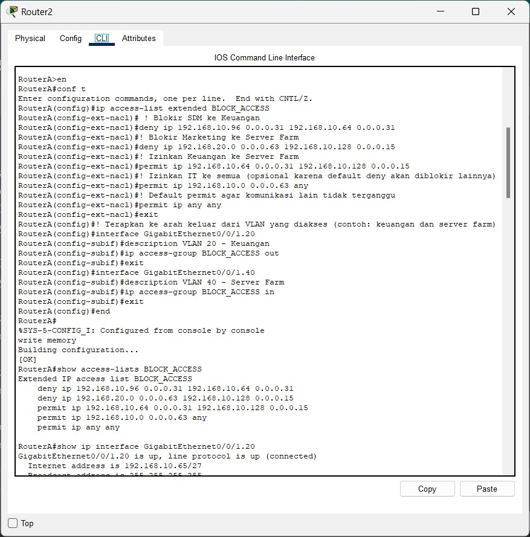
*Penjelasan: Screenshot ini menampilkan konfigurasi Command Line Interface (CLI) pada Router Gedung A. Ini menunjukkan perintah-perintah yang digunakan untuk membuat dan menerapkan Access Control List (ACL) yang bertujuan memblokir akses dari VLAN SDM (subnet 192.168.10.96/27) ke VLAN Keuangan (subnet 192.168.10.64/27).*

Router Gedung B dengan ACL untuk blokir Marketing ke Server Farm:
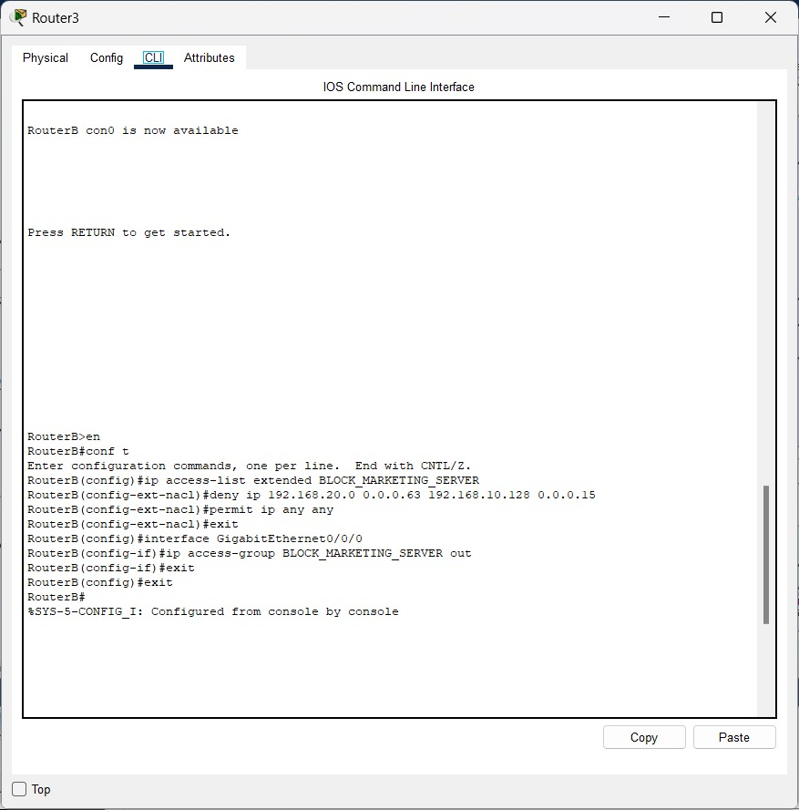
*Penjelasan: Screenshot ini menampilkan konfigurasi CLI pada Router Gedung B. Fokusnya adalah implementasi ACL untuk memblokir akses dari VLAN Marketing (subnet 192.168.20.0/26) ke VLAN Server Farm (subnet 192.168.10.128/28 di Gedung A). ACL diterapkan pada interface keluar di Router Gedung B yang mengarah ke jaringan WAN/Router Utama.*

Router Utama dengan ACL untuk blokir Marketing ke Server Farm:
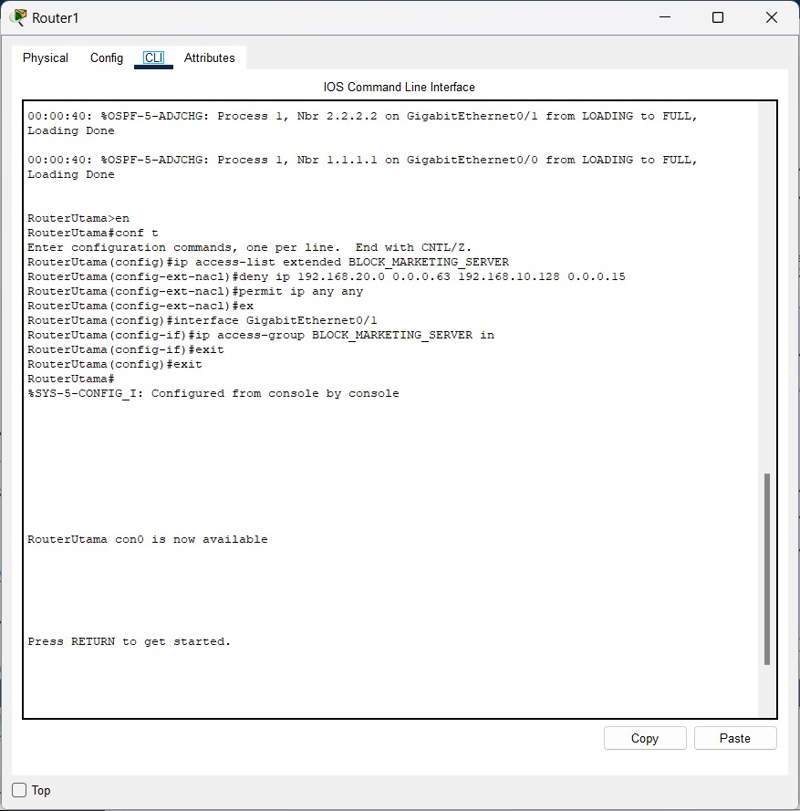
*Penjelasan: Screenshot ini menampilkan konfigurasi CLI di Router Utama sebagai alternatif atau tambahan skenario pemblokiran Marketing ke Server Farm. ACL dibuat untuk menolak trafik dari VLAN Marketing menuju VLAN Server Farm dan diterapkan pada interface yang relevan di Router Utama (misalnya, interface inbound dari RouterB atau outbound ke RouterA).*


#### Screenshot Hasil Pengujian ACL

Uji ping SDM memblokir keuangan:

*Penjelasan: Screenshot ini menampilkan hasil dari perintah `ping` yang dijalankan dari PC di VLAN SDM ke PC di VLAN Keuangan. Hasil "Request timed out" (atau sejenisnya) menunjukkan bahwa ping gagal, memvalidasi bahwa ACL yang memblokir akses SDM ke Keuangan berfungsi dengan benar.*

Uji ping Marketing memblokir server farm:

*Penjelasan: Screenshot ini menampilkan hasil perintah `ping` dari PC di VLAN Marketing ke server di VLAN Server Farm. Hasil "Request timed out" (atau sejenisnya) menunjukkan kegagalan koneksi, yang memvalidasi bahwa ACL untuk memblokir akses Marketing ke Server Farm telah berhasil diimplementasikan.*


### Matriks Pengujian Fitur Jaringan

Berikut adalah matriks pengujian untuk fitur-fitur jaringan yang telah diimplementasikan, dimulai dengan verifikasi konfigurasi dasar perangkat:

| No. | Fitur yang Diuji                                  | Perangkat & Interface/VLAN Terkait                                   | Hasil yang Diharapkan                                     | Hasil Aktual (Screenshot & Penjelasan)                                                                                                                                                                                                                                                           | Status   | Catatan Tambahan                                      |
|-----|---------------------------------------------------|----------------------------------------------------------------------|-----------------------------------------------------------|-----------------------------------------------------------------------------------------------------------------------------------------------------------------------------------------------------------------------------------------------------------------------------------|----------|-------------------------------------------------------|
| 1.  | Konfigurasi Dasar & Konektivitas Interface Router | Router A                                                             | Interface up, IP address terkonfigurasi, konektivitas OK  | 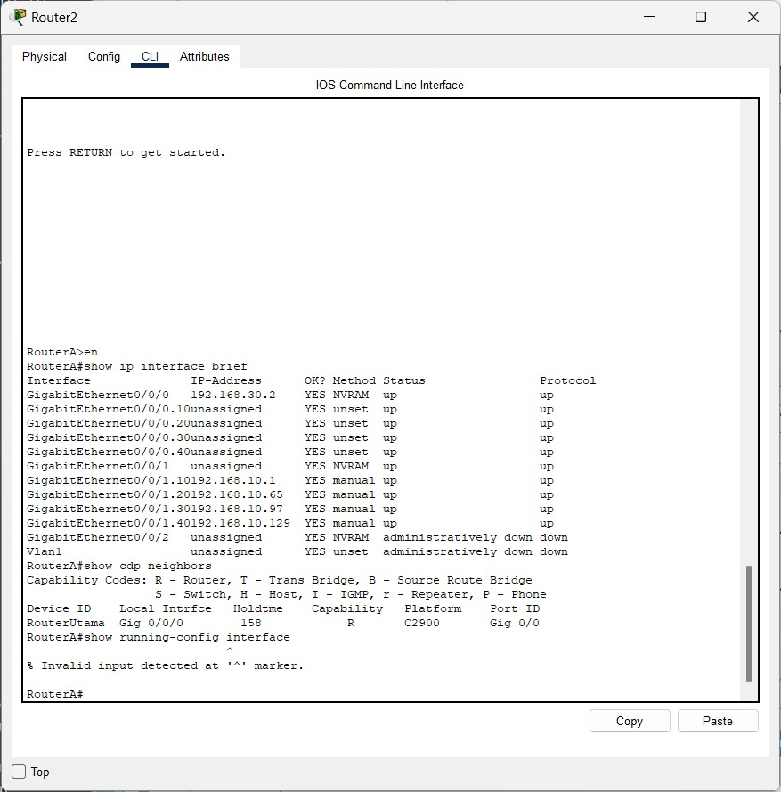 <br> *Penjelasan: Screenshot ini menunjukkan hasil pengujian konfigurasi dasar dan konektivitas interface pada Router A. Ini mencakup verifikasi status interface, alamat IP, dan konektivitas dasar ke jaringan terhubung.* | Berhasil | -                                                     |
| 2.  | Konfigurasi Dasar & Konektivitas Interface MLS    | Multilayer Switch A - Bagian 1                                       | Interface up, SVI terkonfigurasi, konektivitas antar VLAN | .jpeg) <br> *Penjelasan: Screenshot pertama ini menampilkan hasil pengujian konfigurasi dasar dan konektivitas interface pada Multilayer Switch A. Ini bisa meliputi pengecekan status interface fisik, SVI, dan konfigurasi dasar switch.* | Berhasil | -                                                     |
| 3.  | Konfigurasi Dasar & Konektivitas Interface MLS    | Multilayer Switch A - Bagian 2                                       | Interface up, SVI terkonfigurasi, konektivitas antar VLAN | .jpeg) <br> *Penjelasan: Screenshot kedua ini menampilkan hasil pengujian konfigurasi dasar dan konektivitas interface pada Multilayer Switch A. Ini mungkin fokus pada aspek berbeda dari screenshot pertama, seperti verifikasi interface trunk atau konfigurasi routing.* | Berhasil | -                                                     |
| 4.  | Konfigurasi Dasar & Konektivitas Interface MLS    | Multilayer Switch A - Bagian 3                                       | Interface up, SVI terkonfigurasi, konektivitas antar VLAN | .jpeg) <br> *Penjelasan: Screenshot ketiga ini menunjukkan hasil pengujian lebih lanjut atau aspek lain dari konfigurasi dasar dan konektivitas interface pada Multilayer Switch A. Ini bisa mencakup verifikasi routing antar VLAN, status SVI, atau tabel routing.* | Berhasil | -                                                     |
| 5.  | Konfigurasi Dasar & Konektivitas Interface Switch | Switch IT - VLAN 10 - Bagian 1                                     | Interface up, VLAN assignment benar, konektivitas OK    | .jpeg) <br> *Penjelasan: Screenshot pertama ini menampilkan hasil pengujian konfigurasi dasar dan konektivitas interface pada Switch IT untuk VLAN 10. Ini termasuk pengecekan status interface, konfigurasi SVI (jika relevan), dan pengujian konektivitas.* | Berhasil | -                                                     |
| 6.  | Konfigurasi Dasar & Konektivitas Interface Switch | Switch IT - VLAN 10 - Bagian 2                                     | Interface up, VLAN assignment benar, konektivitas OK    | .jpeg) <br> *Penjelasan: Screenshot kedua ini menampilkan hasil pengujian lebih lanjut atau aspek lain dari konfigurasi dasar dan konektivitas interface pada Switch IT untuk VLAN 10.* | Berhasil | -                                                     |
| 7.  | Konfigurasi Dasar & Konektivitas Interface Switch | Switch Keuangan - VLAN 20                                            | Interface up, VLAN assignment benar, konektivitas OK    |  <br> *Penjelasan: Screenshot ini menunjukkan verifikasi konfigurasi dasar dan konektivitas interface pada Switch Keuangan untuk VLAN 20. Ini melibatkan pengecekan status port, konfigurasi SVI (jika ada), dan uji konektivitas dasar.* | Berhasil | -                                                     |
| 8.  | Konfigurasi Dasar & Konektivitas Interface Switch | Switch SDM - VLAN 30                                                 | Interface up, VLAN assignment benar, konektivitas OK    |  <br> *Penjelasan: Screenshot ini menampilkan hasil pengujian konfigurasi dasar dan konektivitas interface pada Switch SDM untuk VLAN 30. Ini termasuk pemeriksaan status interface, konfigurasi IP pada SVI (jika ada), dan pengujian konektivitas dasar.* | Berhasil | -                                                     |
| 9.  | Konfigurasi Dasar & Konektivitas Interface Switch | Switch Server - VLAN 40                                              | Interface up, VLAN assignment benar, konektivitas OK    |  <br> *Penjelasan: Screenshot ini menunjukkan verifikasi konfigurasi dasar dan konektivitas interface pada Switch Server untuk VLAN 40. Ini meliputi pemeriksaan status port, konfigurasi SVI (jika relevan), dan uji konektivitas dasar.* | Berhasil | -                                                     |
| 10. | Konfigurasi Dasar & Konektivitas Interface Switch | Switch Marketing - VLAN 50                                           | Interface up, VLAN assignment benar, konektivitas OK    |  <br> *Penjelasan: Screenshot ini menampilkan hasil pengujian konfigurasi dasar dan konektivitas interface pada Switch Marketing untuk VLAN 50. Ini mencakup pengecekan status interface, konfigurasi IP (jika ada pada SVI), dan pengujian konektivitas.* | Berhasil | -                                                     |
| 11. | Konfigurasi Dasar & Konektivitas Interface Switch | Switch Operasional - VLAN 60                                         | Interface up, VLAN assignment benar, konektivitas OK    |  <br> *Penjelasan: Screenshot ini menunjukkan hasil pengujian konfigurasi dasar dan konektivitas interface pada Switch Operasional untuk VLAN 60. Ini termasuk verifikasi status interface, konfigurasi IP (jika ada pada SVI), dan konektivitas dasar.* | Berhasil | -                                                     |
| 12. | VLAN dan Trunking                                 | Multilayer Switch A                                                  | Interface trunk up, VLAN diizinkan, port akses OK         | 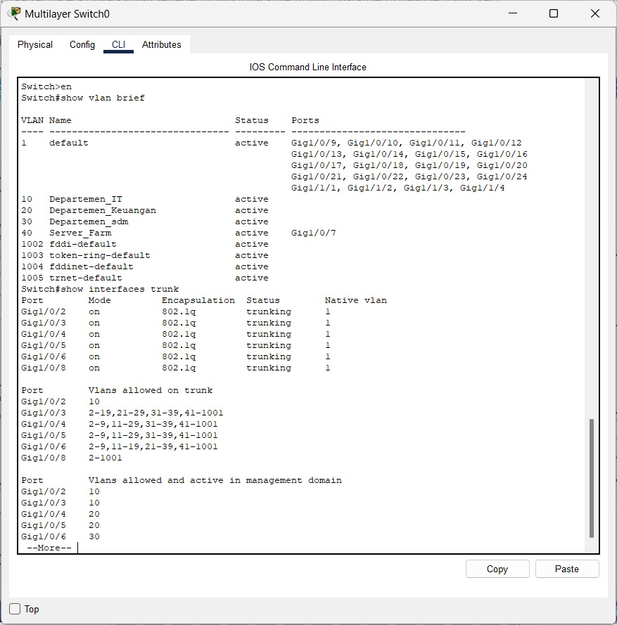 <br> *Penjelasan: Screenshot ini menampilkan verifikasi konfigurasi VLAN dan trunking pada Multilayer Switch A. Ini melibatkan pemeriksaan status port trunk, VLAN yang diizinkan pada trunk, dan konfigurasi port akses VLAN.* | Berhasil | -                                                     |
| 13. | VLAN dan Trunking                                 | Multilayer Switch B                                                  | Interface trunk up, VLAN diizinkan, port akses OK         | 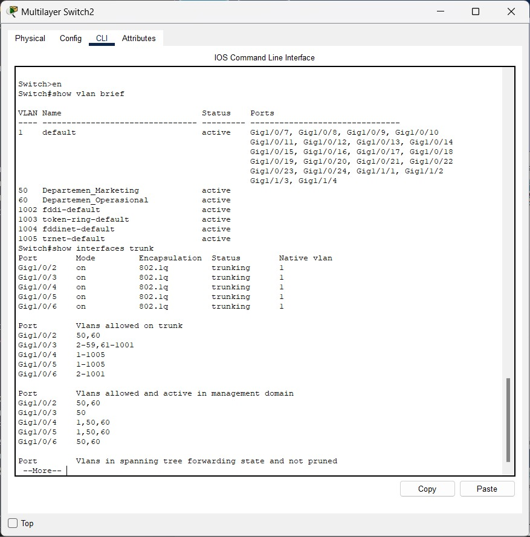 <br> *Penjelasan: Screenshot ini menunjukkan verifikasi konfigurasi VLAN dan trunking pada Multilayer Switch B. Ini termasuk pengecekan status interface trunk, VLAN yang diizinkan, dan keanggotaan VLAN pada port akses.* | Berhasil | -                                                     |
| 14. | Inter-VLAN Routing                                | Router A                                                             | Perangkat antar VLAN dapat berkomunikasi via Router A    | 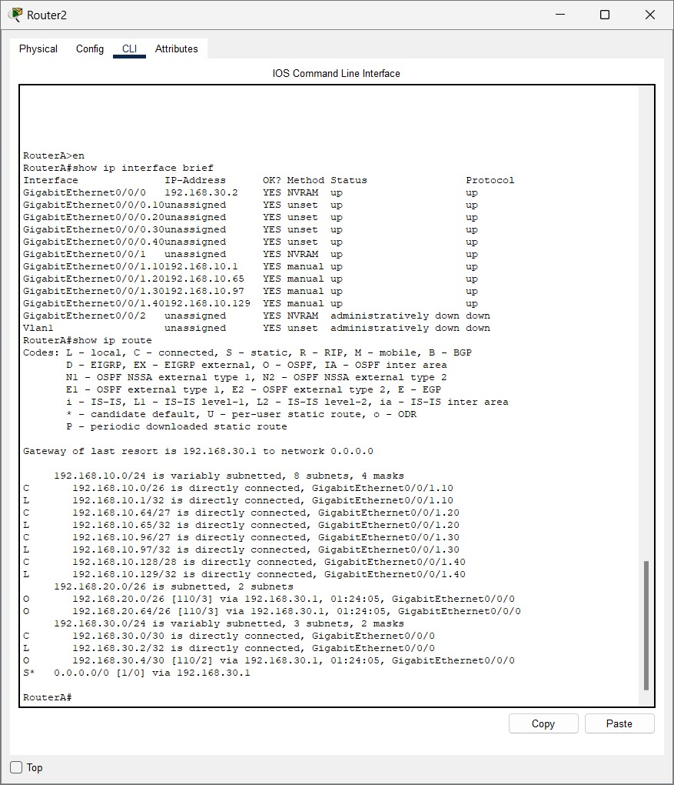 <br> *Penjelasan: Screenshot ini menampilkan hasil pengujian Inter-VLAN routing pada Router A. Ini memastikan bahwa trafik antar VLAN yang dikelola oleh Router A dapat dirutekan dengan benar.* | Berhasil | -                                                     |
| 15. | Inter-VLAN Routing                                | Router B                                                             | Perangkat antar VLAN dapat berkomunikasi via Router B    | 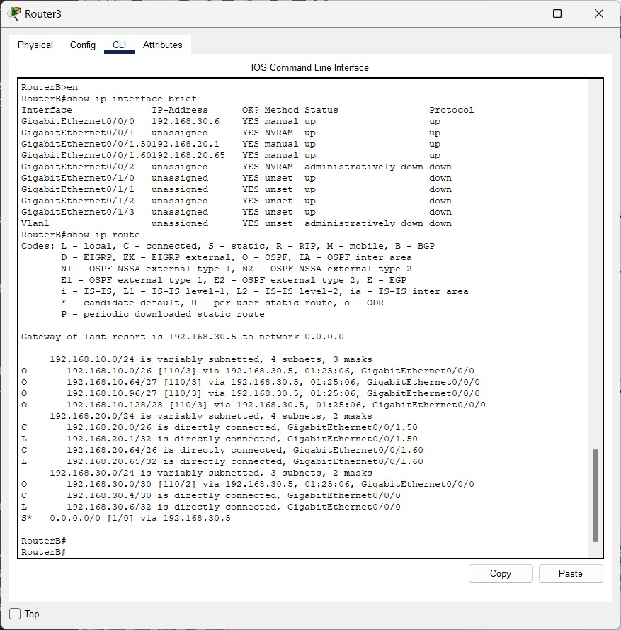 <br> *Penjelasan: Screenshot ini menunjukkan hasil pengujian fungsionalitas Inter-VLAN routing pada Router B. Ini memverifikasi bahwa perangkat di VLAN yang berbeda yang terhubung ke Router B dapat berkomunikasi satu sama lain sesuai dengan konfigurasi routing.* | Berhasil | -                                                     |
| 16. | Layanan DHCP                                      | VLAN 10 (IT)                                                         | Klien mendapatkan IP otomatis dari DHCP Server            | 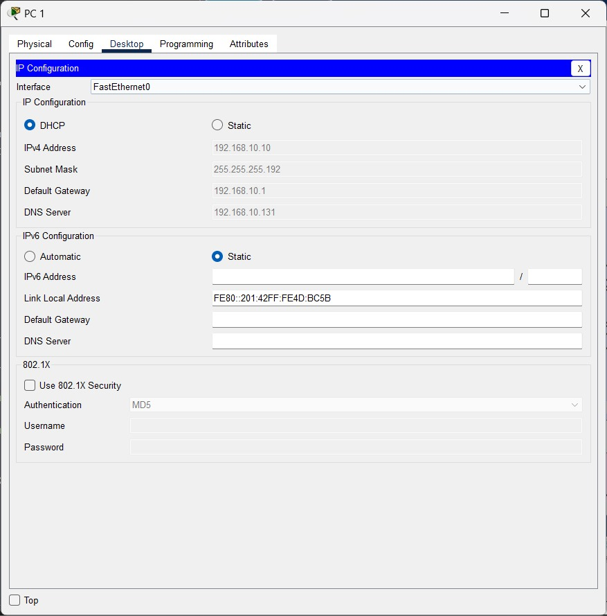 <br> *Penjelasan: Screenshot ini menampilkan hasil pengujian layanan DHCP untuk VLAN 10 (IT). Ini memastikan bahwa klien di VLAN IT menerima alamat IP secara otomatis dari server DHCP.* | Berhasil | -                                                     |
| 17. | Layanan DHCP                                      | VLAN 20 (Keuangan)                                                   | Klien mendapatkan IP otomatis dari DHCP Server            | 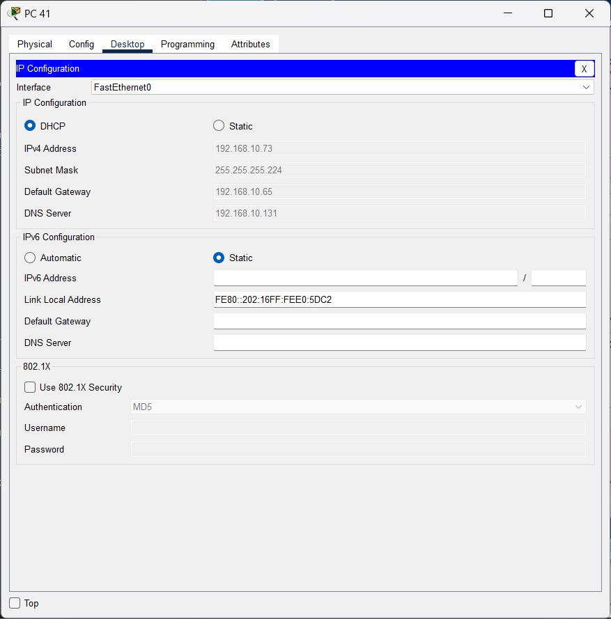 <br> *Penjelasan: Screenshot ini menunjukkan hasil pengujian layanan DHCP pada VLAN 20 (Keuangan). Ini memverifikasi bahwa perangkat pada VLAN Keuangan berhasil mendapatkan konfigurasi IP secara dinamis.* | Berhasil | -                                                     |
| 18. | Layanan DHCP                                      | VLAN 30 (SDM)                                                        | Klien mendapatkan IP otomatis dari DHCP Server            |  <br> *Penjelasan: Screenshot ini menampilkan hasil pengujian layanan DHCP untuk VLAN 30 (SDM). Ini mengkonfirmasi bahwa klien di VLAN SDM dapat memperoleh alamat IP secara otomatis melalui DHCP.* | Berhasil | -                                                     |
| 19. | Layanan DHCP                                      | VLAN 50 (Marketing)                                                  | Klien mendapatkan IP otomatis dari DHCP Server            |  <br> *Penjelasan: Screenshot ini menunjukkan hasil pengujian layanan DHCP pada VLAN 50 (Marketing). Ini memvalidasi bahwa perangkat klien di VLAN Marketing menerima alokasi alamat IP dinamis dengan benar.* | Berhasil | -                                                     |
| 20. | Layanan DHCP                                      | VLAN 60 (Operasional)                                                | Klien mendapatkan IP otomatis dari DHCP Server            | 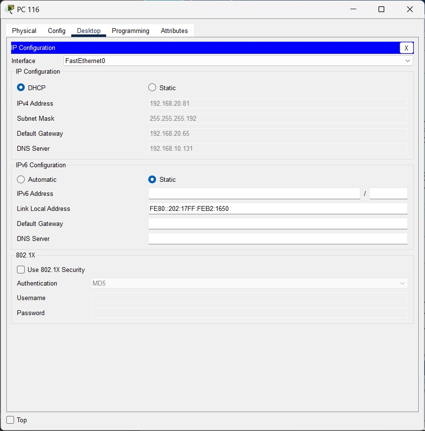 <br> *Penjelasan: Screenshot ini menampilkan hasil pengujian layanan DHCP pada VLAN 60. Ini memverifikasi bahwa klien pada VLAN 60 berhasil mendapatkan konfigurasi IP secara otomatis dari server DHCP.* | Berhasil | -                                                     |
| 21. | Dynamic Routing (OSPF)                            | Router A                                                             | Adjacency OSPF terbentuk, tabel routing terisi via OSPF   | -Router-A.jpeg) <br> *Penjelasan: Screenshot ini menampilkan hasil pengujian routing dinamik OSPF pada Router A. Ini mengkonfirmasi bahwa OSPF berjalan dengan baik, router dapat menemukan tetangga OSPF, dan tabel routing terisi melalui OSPF.* | Berhasil | -                                                     |
| 22. | Dynamic Routing (OSPF)                            | Router B                                                             | Adjacency OSPF terbentuk, tabel routing terisi via OSPF   |  <br> *Penjelasan: Screenshot ini menampilkan hasil pengujian routing dinamik OSPF pada Router B. Ini memverifikasi bahwa Router B telah membentuk adjacency dengan neighbor OSPF lainnya dan menerima/mengirimkan update routing dengan benar.* | Berhasil | -                                                     |
| 23. | Dynamic Routing (OSPF)                            | Router Utama                                                         | Adjacency OSPF terbentuk, tabel routing terisi via OSPF   | 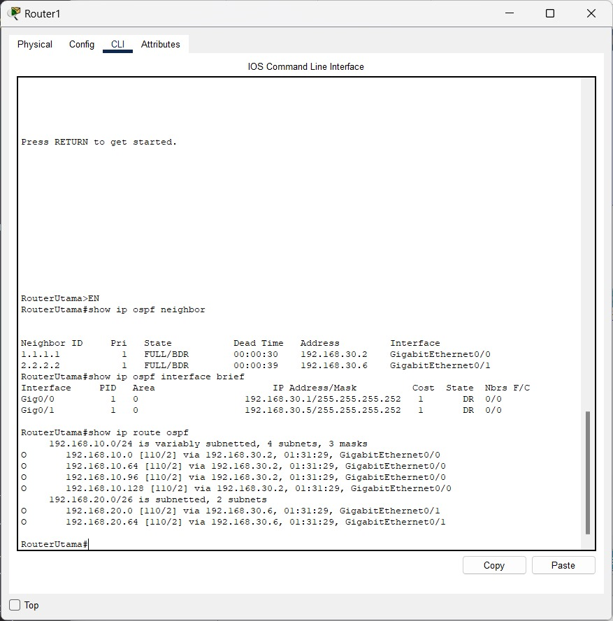 <br> *Penjelasan: Screenshot ini menunjukkan hasil pengujian routing dinamik OSPF pada Router Utama. Ini memvalidasi pembentukan neighbor OSPF dan pertukaran informasi routing pada router sentral ini.* | Berhasil | -                                                     |
| 24. | Network Address Translation (NAT)                 | Router Utama (atau router edge yang relevan) - Bagian 1            | Host internal dapat mengakses internet, translasi IP terlihat | 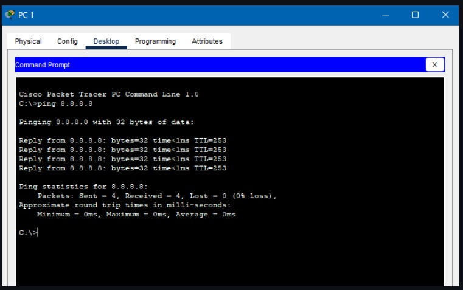 <br> *Penjelasan: Screenshot ini menampilkan hasil pengujian Network Address Translation (NAT) bagian 1. Ini kemungkinan menunjukkan konfigurasi NAT pada router atau hasil ping dari jaringan internal ke alamat IP publik, memverifikasi bahwa translasi alamat terjadi.* | Berhasil | -                                                     |
| 25. | Network Address Translation (NAT)                 | Router Utama (atau router edge yang relevan) - Bagian 2            | Verifikasi tabel NAT (`show ip nat translations`)        | 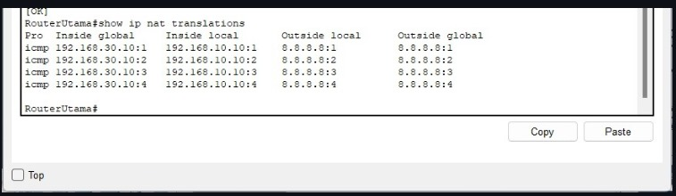 <br> *Penjelasan: Screenshot ini menampilkan hasil pengujian Network Address Translation (NAT) bagian 2. Ini bisa jadi kelanjutan dari pengujian NAT, seperti verifikasi translasi pada tabel NAT (`show ip nat translations`) atau pengujian konektivitas ke internet dari host di LAN.* | Berhasil | -                                                     |
|     | `[Fitur Berikutnya]`                              | `[Detail Perangkat/VLAN]`                                            | `[Harapan]`                                               | `[Hasil Aktual & Screenshot]`                                                                                                                                                                                                                                                            | `[Status]` | `[Catatan]`                                           |


### Hasil Troubleshooting
| No. | Masalah yang Ditemui                                                                                                | Analisis Penyebab Masalah                                                                                                         | Langkah-langkah Troubleshooting & Solusi yang Diterapkan                                                                                                                                                                                                                            | Screenshot (Jika Perlu) |
|-----|---------------------------------------------------------------------------------------------------------------------|-----------------------------------------------------------------------------------------------------------------------------------|-----------------------------------------------------------------------------------------------------------------------------------------------------------------------------------------------------------------------------------------------------------------------------------|-------------------------|
| 1.  | Kesulitan menentukan titik penempatan ACL yang paling efektif antara RouterA, RouterB, atau RouterUtama untuk aturan antar gedung. | Pemilihan titik penempatan ACL kurang optimal mempengaruhi efektivitas filter dan potensi beban pada perangkat.                  | Menganalisis aliran trafik secara mendalam dan memilih titik yang paling logis untuk memfilter sedini mungkin atau sedekat mungkin dengan sumber daya yang dilindungi. Pertimbangkan dampak performa pada router yang dipilih.                                                      | -                       |
| 2.  | Lupa menambahkan 'permit ip any any' pada ACL yang bertujuan hanya memblokir trafik tertentu.                         | Pernyataan `permit ip any any` yang hilang menyebabkan semua trafik lain yang tidak secara eksplisit diizinkan menjadi terblokir. | Meninjau kembali setiap ACL secara teliti. Memastikan ada pernyataan `permit ip any any` eksplisit di akhir ACL jika default deny implisit tidak diinginkan untuk semua trafik lain yang tidak cocok dengan rule sebelumnya.                                                      | -                       |
| 3.  | OSPF adjacency tidak terbentuk antar router.                                                                        | Terlewatnya konfigurasi IP address pada interface WAN di Router Utama.                                                            | Memastikan semua interface WAN antar router memiliki IP address /30 yang benar dan status `no shutdown`.                                                                                                                                                                          | -                       |
| 4.  | Error `overlaps` saat konfigurasi IP WAN di Router Gedung A dan B.                                                    | Adanya konfigurasi subinterface sisa dari percobaan sebelumnya atau implementasi yang salah.                                      | Menghapus konfigurasi subinterface yang tidak diperlukan (`no interface GigabitEthernet0/0/0.xx`) dari router edge.                                                                                                                                                               | -                       |
| 5.  | Perintah `no switchport` gagal dengan error `incomplete command` pada interface fisik di Router Utama.                | Kemungkinan keterbatasan simulasi Packet Tracer pada model router ISR 4331.                                                       | Workaround: Membiarkan port fisik sebagai switchport di VLAN 1, membuat SVI `interface Vlan1` di Router Utama, dan memberikan IP address WAN (`192.168.30.5/30`) pada SVI tersebut.                                                                                             | -                       |
| 6.  | Ping antar gedung gagal meskipun OSPF antar router sudah `FULL`; `show ip route` kosong di Switch L3.                 | Fitur routing global (`ip routing`) belum diaktifkan pada Switch L3, konfigurasi IP SVI hilang, atau default route belum ada.      | Mengaktifkan `ip routing`, mengkonfigurasi ulang/memastikan IP address SVI sudah benar, dan menambahkan default route pada kedua Switch L3 yang menunjuk ke router edge gedung masing-masing.                                                                                   | -                       |
| 7.  | Klien DHCP di Gedung B tidak mendapatkan alamat IP.                                                                   | `ip helper-address` pada sub-interface Router Gedung B salah atau OSPF belum converge.                                          | Memastikan `ip helper-address` menunjuk ke IP Router Utama yang benar dan verifikasi routing OSPF (`show ip route`).                                                                                                                                                             | -                       |
| 8.  | Resolusi nama domain eksternal gagal dari klien, meskipun DNS internal berfungsi.                                     | Keterbatasan Packet Tracer dalam simulasi DNS forwarding yang kompleks.                                                           | Memastikan klien mendapatkan DNS server publik (misal `8.8.8.8`) sebagai DNS sekunder melalui DHCP. Fokus pengujian internal pada domain `.nusantara.local`.                                                                                                                  | -                       |
| 9.  | NAT tidak berfungsi, ping ke server eksternal gagal.                                                                  | Kesalahan pada ACL yang digunakan untuk NAT atau interface `inside`/`outside` belum didefinisikan dengan benar.                 | Memperbaiki ACL NAT (nomor ACL atau network yang di-permit) dan memverifikasi definisi interface `inside`/`outside`. Perintah `debug ip nat` dapat membantu.                                                                                                                     | -                       |

### Analisis Keamanan Jaringan
Setelah implementasi ACL, berikut adalah analisis singkat mengenai tingkat keamanan jaringan PT. Nusantara Network:
1.  **Segmentasi VLAN:** Telah memisahkan domain broadcast, mengurangi risiko penyebaran ancaman.
2.  **Kontrol Akses ACL:**
    *   SDM terisolasi dari Keuangan.
        *   **Rasional:** Data keuangan bersifat sensitif dan rahasia. Pembatasan akses dari departemen SDM diperlukan untuk mencegah akses tidak sah atau tidak sengaja ke informasi keuangan, gaji, dan anggaran perusahaan, sesuai dengan prinsip *least privilege*.
    *   Marketing terisolasi dari Server Farm.
        *   **Rasional:** Server Farm berisi data dan layanan kritikal perusahaan. Departemen Marketing umumnya tidak memerlukan akses langsung ke infrastruktur server inti. Pemblokan ini mengurangi *attack surface* ke server dan melindungi integritas data serta layanan dari potensi ancaman yang mungkin berasal dari segmen jaringan Marketing yang lebih sering berinteraksi dengan pihak eksternal.
    *   Keuangan memiliki akses terkontrol ke Server Farm.
        *   **Rasional:** Departemen Keuangan mungkin memerlukan akses ke server tertentu di Server Farm untuk aplikasi akuntansi, database keuangan, atau sistem ERP. Akses ini diberikan secara spesifik dan terkontrol untuk memastikan mereka hanya dapat mengakses sumber daya yang relevan dengan pekerjaan mereka.
    *   IT memiliki akses luas (perlu diawasi keamanannya).
        *   **Rasional:** Departemen IT bertanggung jawab atas pengelolaan, pemeliharaan, dan troubleshooting seluruh infrastruktur jaringan dan sistem. Akses luas diperlukan agar tim IT dapat menjalankan tugasnya secara efektif. Meskipun demikian, aktivitas akun IT harus diaudit dan dipantau secara ketat karena hak aksesnya yang tinggi.
    *   Mendukung prinsip *least privilege*.
3.  **Potensi Peningkatan Keamanan:**
    *   *Stateful Firewall* untuk inspeksi koneksi lebih mendalam.
    *   IDS/IPS untuk deteksi/prevensi intrusi.
    *   Keamanan fisik Server Farm.
    *   Logging pada rule ACL (`log` keyword) untuk audit.
    *   Audit keamanan berkala.
    *   Keamanan *endpoint* (antivirus, patch).
4.  **Keterbatasan ACL:** Tidak menginspeksi *payload* aplikasi (Layer 7), rentan terhadap serangan tingkat aplikasi jika trafik diizinkan.

Implementasi ACL telah meningkatkan keamanan, namun keamanan adalah proses berkelanjutan.

## Kesimpulan
Pekan ke-14 difokuskan pada implementasi kebijakan keamanan menggunakan Access Control Lists (ACL) dan pengujian menyeluruh layanan jaringan. Konfigurasi ACL berhasil diterapkan sesuai kebijakan blokir dan izin akses antar VLAN. Pengujian melalui matriks pengujian telah memvalidasi fungsionalitas ACL serta layanan DHCP, DNS, dan NAT dari pekan sebelumnya. Proses *troubleshooting* telah disiapkan untuk didokumentasikan. Analisis keamanan menunjukkan peningkatan postur keamanan jaringan PT. Nusantara Network, dengan beberapa rekomendasi untuk peningkatan lebih lanjut. Jaringan kini lebih aman dan siap untuk tahap finalisasi. 

# Link Repository Github

https://github.com/adtyabtrs22/FinalProjectDMJK_Kelompok5

--- 