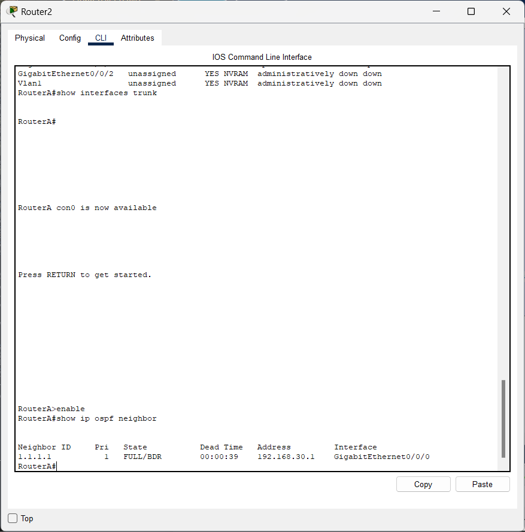
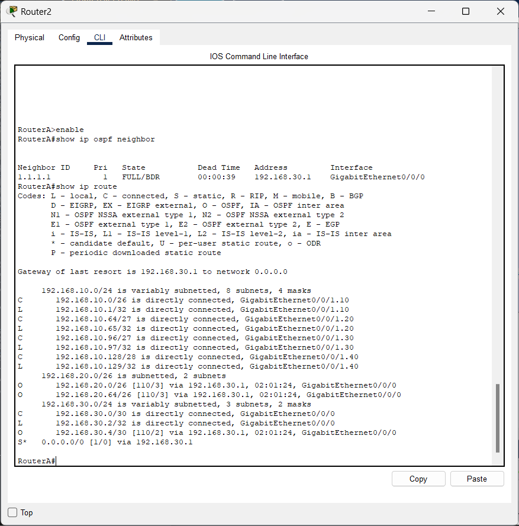
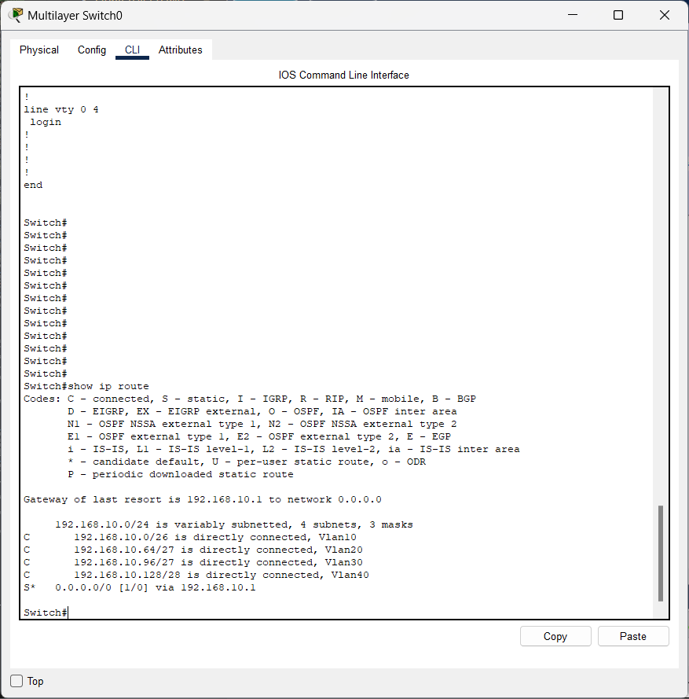
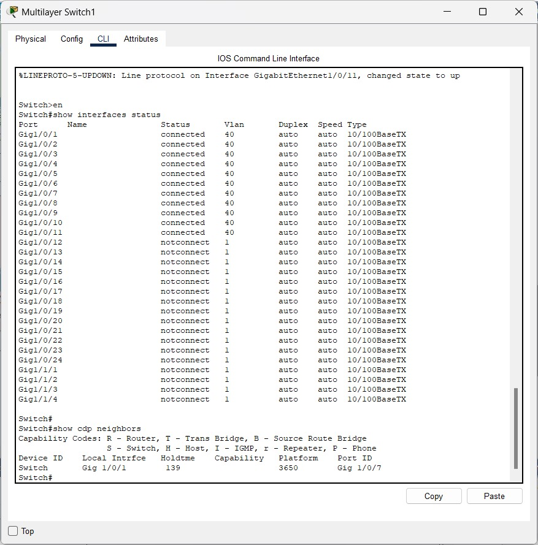

# Laporan Akhir Proyek Desain Jaringan Enterprise PT. Nusantara Network - Kelompok 5

## 👥 Daftar Anggota Beserta Peran
1.  Ketua : Aditya Laksamana P Butar Butar_10231006 (Security & Documentation Specialist)
2.  Anggota : Ilham Ahmad Fahriji_10231042 (Network Engineer)
3.  Anggota : Muchlis Wahyu Saputra_10231054 (Network Service Specialist)
4.  Anggota : Nazwa Amelia Zahra_10231068 (Network Architect)

---

## 📄 Daftar Isi
* [Pekan 9: Perancangan & Implementasi Jaringan Enterprise PT. Nusantara Network](#pekan-9-perancangan--implementasi-jaringan-enterprise-pt-nusantara-network)
* [Pekan 10: Desain Topologi & Skema Pengalamatan](#pekan-10-desain-topologi--skema-pengalamatan)
* [Pekan 11: Implementasi Topologi Dasar & VLAN](#pekan-11-implementasi-topologi-dasar--vlan)
* [Pekan 12: Implementasi Routing & WAN](#pekan-12-implementasi-routing--wan)
* [Pekan 13: Implementasi Layanan Jaringan](#pekan-13-implementasi-layanan-jaringan)
* [Pekan 14: Implementasi Keamanan & Pengujian](#pekan-14-implementasi-keamanan--pengujian)
* [Kesimpulan Keseluruhan Pekan](#kesimpulan-keseluruhan-pekan)
* [Refleksi kelompok tentang pembelajaran selama proyek](#refleksi-kelompok-tentang-pembelajaran-selama-proyek)
* [Link Github, topologi, video demo, dan PPT untuk ujian akhir](#link)

---

# Pekan 9: Perancangan & Implementasi Jaringan Enterprise PT. Nusantara Network

## 1. Pendahuluan
### 1.1 Latar Belakang

Infrastruktur jaringan komputer merupakan tulang punggung operasional bagi sebagian besar organisasi modern. Ketersediaan jaringan yang andal, aman, dan efisien sangat krusial untuk mendukung komunikasi internal, akses data terpusat, kolaborasi antar departemen, serta interaksi dengan dunia luar. Perancangan jaringan yang matang menjadi fondasi utama untuk memastikan kelancaran aliran informasi dan mendukung produktivitas perusahaan secara keseluruhan. Kegagalan dalam merancang jaringan secara tepat dapat mengakibatkan berbagai masalah, mulai dari kinerja yang lambat, kerentanan keamanan, hingga kesulitan dalam pengelolaan dan skalabilitas di masa depan.

Mata kuliah Desain dan Manajemen Jaringan Komputer bertujuan membekali mahasiswa dengan pengetahuan dan keterampilan praktis yang diperlukan untuk merancang, mengimplementasikan, dan mengelola infrastruktur jaringan yang kompleks. Sebagai puncak dari pembelajaran, proyek akhir semester ini dirancang sebagai wadah bagi mahasiswa untuk mengaplikasikan seluruh konsep teori dan praktik yang telah dipelajari ke dalam sebuah studi kasus nyata. Proyek ini menggunakan pendekatan *Project-Based Learning* (PBL) secara berkelompok, mensimulasikan tantangan yang dihadapi oleh para profesional IT dalam membangun solusi jaringan untuk kebutuhan bisnis spesifik, dalam hal ini adalah untuk PT. Nusantara Network.

PT. Nusantara Network, sebagai perusahaan teknologi informasi dengan struktur organisasi yang tersebar di dua lokasi (Kantor Pusat dan Kantor Cabang) serta memiliki beberapa departemen dengan kebutuhan akses yang berbeda, menghadirkan tantangan desain jaringan yang menarik. Perusahaan ini membutuhkan solusi jaringan yang tidak hanya menghubungkan kedua lokasi secara efisien meskipun dengan bandwidth WAN terbatas, tetapi juga mampu melakukan segmentasi jaringan internal (VLAN) untuk keamanan dan manajemen traffic, menyediakan layanan jaringan esensial seperti DHCP, DNS, dan NAT, serta menerapkan kebijakan keamanan melalui ACL dan routing dinamis (OSPF) untuk konektivitas antar gedung. Pemenuhan kebutuhan kompleks ini memerlukan perencanaan awal yang cermat, yang menjadi fokus utama pada tahap awal proyek ini.

### 1.2 Tujuan Proyek

Tujuan dari pengerjaan proyek ini adalah:

1. Merancang infrastruktur jaringan enterprise yang aman, efisien, terukur (scalable), dan mudah dikelola (manageable) untuk PT. Nusantara Network.
2. Mengimplementasikan rancangan jaringan menggunakan perangkat lunak simulasi (Cisco Packet Tracer atau GNS3).
3. Mengkonfigurasi teknologi jaringan kunci, termasuk VLAN, trunking, routing antar-VLAN, routing statis, routing dinamis (OSPF), koneksi WAN, DHCP, DNS, NAT, dan Access Control List (ACL).
4. Melakukan pengujian menyeluruh untuk memvalidasi fungsionalitas dan keamanan jaringan yang telah diimplementasikan.
5. Mendokumentasikan seluruh proses perancangan, implementasi, konfigurasi, dan pengujian secara komprehensif sesuai format yang ditentukan.
6. Memberikan pengalaman praktis kepada mahasiswa dalam menangani proyek jaringan skala kecil hingga menengah, termasuk aspek kerja tim dan manajemen proyek.

### 1.3 Ruang Lingkup Proyek

Ruang lingkup proyek perancangan dan implementasi jaringan untuk PT. Nusantara Network ini mencakup keseluruhan proses desain dan simulasi infrastruktur jaringan yang menghubungkan dua lokasi perusahaan, yaitu Kantor Pusat (Gedung A) dan Kantor Cabang (Gedung B). Fokus utama meliputi perancangan topologi jaringan yang logis dan fisik, perencanaan skema pengalamatan IP termasuk subnetting untuk setiap segmen jaringan, serta implementasi segmentasi jaringan menggunakan VLAN untuk setiap departemen (IT, Keuangan, SDM, Marketing, Operasional) dan Server Farm guna meningkatkan keamanan dan efisiensi manajemen lalu lintas data. Proyek ini juga mencakup konfigurasi routing antar-VLAN, routing statis di dalam gedung, serta routing dinamis menggunakan protokol OSPF untuk memastikan konektivitas yang andal antar kedua gedung melalui link WAN dengan bandwidth terbatas.

Selain itu, ruang lingkup proyek ini mencakup implementasi layanan jaringan esensial seperti DHCP untuk alokasi IP otomatis di setiap VLAN, DNS untuk resolusi nama domain internal dan eksternal, serta konfigurasi NAT pada router di Kantor Pusat untuk memungkinkan akses internet bagi seluruh jaringan internal melalui satu atau beberapa alamat IP publik. Aspek keamanan jaringan menjadi bagian integral, diwujudkan melalui implementasi Access Control List (ACL) untuk membatasi akses antar departemen sesuai dengan kebijakan keamanan yang akan dirumuskan, serta mempertimbangkan mekanisme keamanan dasar lainnya seperti konsep firewall (meskipun konfigurasi firewall spesifik mungkin disederhanakan dalam simulasi). 

Proyek ini juga menyinggung aspek monitoring dan manajemen jaringan terpusat sebagai kebutuhan, meskipun implementasi detail sistem monitoring mungkin terbatas pada fitur yang didukung simulator. Keseluruhan pekerjaan akan dilakukan menggunakan perangkat lunak simulasi (Cisco Packet Tracer), dan tidak mencakup implementasi fisik menggunakan perangkat keras jaringan.

## 2. Analisis Kebutuhan Jaringan PT. Nusantara Network

Dari penjelasan kasus PT. Nusantara Network, kita bisa simpulkan kebutuhan jaringannya sebagai berikut:

### 2.1 Struktur Organisasi & Lokasi

* Perusahaan mempunyai dua kantor: Kantor Pusat (Gedung A) dan Kantor Cabang (Gedung B).
* **Gedung A:** Ada 3 departemen (IT: 40 komputer, Keuangan: 25 komputer, SDM: 20 komputer) dan 1 pusat server (Server Farm: 10 server). Total sekitar 95 komputer + server.
* **Gedung B:** Ada 2 departemen (Marketing: 30 komputer, Operasional: 35 komputer). Total sekitar 65 komputer.
* Perkiraan awal ada sekitar 160 komputer + server. Jumlah ini belum termasuk alat jaringan lain (router, switch) dan kemungkinan penambahan di masa depan.

### 2.2 Pembagian Jaringan (VLAN)

* **Yang Dibutuhkan:** Tiap departemen (IT, Keuangan, SDM, Marketing, Operasional) dan Server Farm harus punya jaringan terpisah (VLAN sendiri).
* **Kenapa Perlu:** Biar lebih aman (data antar departemen terpisah) dan lalu lintas data lebih teratur (mengurangi *broadcast* yang tidak perlu).

### 2.3 Koneksi Antar Gedung (WAN)

* **Yang Dibutuhkan:** Perlu jalur koneksi khusus (Wide Area Network atau WAN) untuk menyambungkan Gedung A dan Gedung B.
* **Tantangan:** Kecepatan (bandwidth) jalur WAN ini terbatas, jadi harus pintar-pintar atur penggunaannya.

### 2.4 Pengaturan Rute (Routing)

* **Antar Gedung:** Perlu pakai cara otomatis (**OSPF**) untuk mengatur jalur data terbaik antara Gedung A dan Gedung B, biar kalau ada perubahan jalur, jaringan bisa menyesuaikan diri.
* **Dalam Gedung:** Perlu pengaturan jalur data antar VLAN di dalam tiap gedung, supaya departemen yang berbeda bisa saling berhubungan kalau memang diizinkan. (Rencananya pakai routing statis untuk ini, dikerjakan di Pekan 12), tetapi untuk memakai static ini masih dalam diskusi kembali. 

### 2.5 Akses Internet & Layanan Dasar

* **NAT (Network Address Translation):** Perlu diatur supaya semua komputer di dalam jaringan bisa internetan bareng-bareng pakai satu atau beberapa alamat IP publik dari penyedia internet (ISP).
* **DHCP (Dynamic Host Configuration Protocol):** Perlu server DHCP untuk kasih alamat IP, subnet mask, gateway, dan alamat DNS secara otomatis ke komputer-komputer di tiap VLAN. Ini bikin pengaturan IP jadi lebih gampang.
* **DNS (Domain Name System):** Perlu server DNS untuk mengubah nama (misal: `server_internal.nusantara.local`) jadi alamat IP yang dimengerti komputer. Server ini harus bisa untuk nama internal dan eksternal (internet).

### 2.6 Keamanan Jaringan

* **ACL (Access Control List):** Perlu dibuat daftar aturan (ACL) untuk membatasi siapa saja yang boleh mengakses bagian jaringan tertentu. Contohnya, departemen mana yang boleh akses server, atau departemen mana yang tidak boleh saling berhubungan langsung. Aturan detailnya perlu dibuat nanti.
* **Firewall (Konsep):** Perlu ada sistem keamanan di perbatasan jaringan (perimeter) untuk melindungi dari ancaman luar. Konsep firewall akan dipertimbangkan.

## 3. Rencana Pengalamatan IP PT. Nusantara Network

Berikut adalah rencana pembagian alamat IP (IP Address) dan Subnet Mask yang diusulkan untuk jaringan PT. Nusantara Network, dibuat berdasarkan kebutuhan yang sudah dianalisis:

### 3.1 Tabel Pembagian Alamat IP

| Lokasi       | Departemen/Fungsi | VLAN ID | Subnet          | Subnet Mask     | Range IP Bisa Dipakai     | Gateway     | Maks Host |
| :----------- | :---------------- | :------ | :-------------- | :-------------- | :------------------------ | :---------- | :-------- |
| **Gedung A** | IT                | 10      | 10.1.10.0/24    | 255.255.255.0   | 10.1.10.1 - 10.1.10.254   | 10.1.10.1   | 254       |
|              | Keuangan          | 20      | 10.1.20.0/24    | 255.255.255.0   | 10.1.20.1 - 10.1.20.254   | 10.1.20.1   | 254       |
|              | SDM               | 30      | 10.1.30.0/24    | 255.255.255.0   | 10.1.30.1 - 10.1.30.254   | 10.1.30.1   | 254       |
|              | Server Farm       | 40      | 10.1.40.0/24    | 255.255.255.0   | 10.1.40.1 - 10.1.40.254   | 10.1.40.1   | 254       |
| **Gedung B** | Marketing         | 50      | 10.2.50.0/24    | 255.255.255.0   | 10.2.50.1 - 10.2.50.254   | 10.2.50.1   | 254       |
|              | Operasional       | 60      | 10.2.60.0/24    | 255.255.255.0   | 10.2.60.1 - 10.2.60.254   | 10.2.60.1   | 254       |
| **WAN** | Link A-B          | -       | 10.254.1.0/30   | 255.255.255.252 | 10.254.1.1 - 10.254.1.2   | -           | 2         |
| **Internet** | NAT Pool (Contoh) | -       | 203.0.113.0/29  | 255.255.255.248 | 203.0.113.1 - 203.0.113.6 | 203.0.113.1 | 6         |

*Catatan: Alamat 203.0.113.0/29 adalah contoh alamat publik yang biasa dipakai untuk dokumentasi.*

### 3.2 Contoh Pembagian Alamat IP di Server Farm

Server-server penting di Server Farm (VLAN 40) akan diberi alamat IP tetap (statis) agar mudah diakses. Berikut contohnya:

| Fungsi Server     | IP Address | Subnet Mask   | Gateway   |
| :---------------- | :--------- | :------------ | :-------- |
| DHCP Server       | 10.1.40.10 | 255.255.255.0 | 10.1.40.1 |
| DNS Server        | 10.1.40.11 | 255.255.255.0 | 10.1.40.1 |
| Web Server        | 10.1.40.12 | 255.255.255.0 | 10.1.40.1 |
| Database Server   | 10.1.40.13 | 255.255.255.0 | 10.1.40.1 |
| File Server       | 10.1.40.14 | 255.255.255.0 | 10.1.40.1 |
| Monitoring Server | 10.1.40.15 | 255.255.255.0 | 10.1.40.1 |
| ... (server lain) | ...        | 255.255.255.0 | 10.1.40.1 |

### 3.3 Catatan Tambahan

* **Pembagian Subnet:**
    * Kita pakai `/24` (artinya ada 254 alamat IP yang bisa dipakai per kelompok) untuk tiap departemen dan server farm. Ini memberi cukup ruang kalau nanti ada penambahan komputer/server.
    * Gedung A pakai pola alamat `10.1.x.0/24`, Gedung B pakai `10.2.x.0/24`.
    * Nomor VLAN ID dipakai sebagai angka ketiga di alamat IP (oktet ketiga) biar gampang diingat dan dikenali.
* **Koneksi WAN:**
    * Pakai `/30` (cuma 2 alamat IP yang bisa dipakai) sangat pas untuk koneksi langsung antar dua router (point-to-point).
* **DHCP:**
    * Nanti server DHCP akan diatur untuk memberi alamat IP otomatis ke komputer di tiap VLAN. Perlu ditentukan rentang alamat mana yang akan dibagikan otomatis. Contoh: Untuk VLAN 10 (IT), alamat yang dibagikan otomatis bisa dari `10.1.10.50` sampai `10.1.10.250`. Alamat di luar rentang itu bisa dipakai untuk server atau alat jaringan lain yang butuh IP tetap.

## 4. Jadwal Rencana Kerja (7 Pekan)

Berikut adalah rencana kerja proyek untuk 7 pekan ke depan, dimulai dari Pekan 9 hingga Pekan 15:

| Pekan | Fokus Utama                           | Tugas Kelompok                                                                                                                               | Hasil Kerja Utama (Deliverable)                                                                                                                                                |
| :---- | :------------------------------------ | :------------------------------------------------------------------------------------------------------------------------------------------- | :----------------------------------------------------------------------------------------------------------------------------------------------------------------------------- |
| **9** | Perencanaan Awal & Desain Kasar       | Analisis kebutuhan, diskusi ide desain awal, pembagian tugas.                                                                                | **Dokumen Perencanaan Proyek:** Berisi analisis kebutuhan, jadwal kerja, gambaran/sketsa desain awal.                                                                          |
| **10**| Desain Detail & Rencana IP            | Finalisasi bentuk jaringan (topologi fisik & logis), rencana detail pembagian IP (subnetting), tentukan alat yang dipakai, rencana detail VLAN. | **Dokumen Desain Jaringan:** Gambar topologi, Tabel alamat IP, Daftar alat, Rencana VLAN, Screenshot awal di Packet Tracer.                                                    |
| **11**| Pembuatan Dasar Jaringan & VLAN       | Buat topologi dasar di Packet Tracer/GNS3, atur VLAN & Trunking, buat routing antar-VLAN.                                                    | **Laporan Implementasi Tahap 1:** File simulasi, Screenshot hasil, Catatan perintah CLI (Switch & Router - VLAN, Trunk, Inter-VLAN), Hasil tes koneksi, Catatan kendala & solusi. |
| **12**| Pengaturan Routing & Koneksi WAN      | Atur routing statis (dalam gedung), terapkan OSPF (antar gedung), buat simulasi koneksi WAN.                                                 | **Laporan Implementasi Tahap 2:** File simulasi, Catatan perintah CLI (Routing Statis & OSPF), Screenshot tabel routing, Hasil tes koneksi antar gedung, Analisis routing.        |
| **13**| Pembuatan Layanan Jaringan            | Atur server DHCP per departemen, buat server DNS internal, atur NAT untuk akses internet.                                                  | **Laporan Implementasi Tahap 3:** File simulasi, Catatan perintah CLI (DHCP, DNS, NAT), Screenshot hasil tes DHCP, DNS, dan NAT.                                                  |
| **14**| Penerapan Keamanan & Pengujian Akhir  | Terapkan aturan ACL sesuai kebijakan, uji semua fitur jaringan, cari & perbaiki masalah (troubleshooting).                                    | **Laporan Implementasi Tahap 4:** File simulasi final, Catatan perintah CLI (ACL), Tabel hasil pengujian & bukti, Laporan perbaikan masalah, Analisis keamanan.                    |
| **15**| Penyelesaian Laporan & Persiapan Demo | Rapikan semua catatan/laporan, siapkan bahan presentasi, buat video demo/tutorial singkat jaringan yang sudah dibuat.                          | **Laporan Akhir Proyek:** Laporan lengkap, Link file simulasi final, Link video demo, Slide presentasi, Kumpulan semua perintah CLI, Refleksi kelompok.                          |

*Catatan: Pekan 16 adalah jadwal presentasi akhir.*

## 5. Gambaran Awal Desain Jaringan (Sketsa)

Berikut adalah gambaran awal (sketsa) dari desain jaringan yang diusulkan untuk PT. Nusantara Network, beserta penjelasannya:


### 5.1 Gambaran Umum Topologi

* Sketsa ini menunjukkan jaringan untuk dua lokasi utama: **Gedung A (Kantor Pusat)** dan **Gedung B (Kantor Cabang)**.
* Kedua gedung ini terhubung ke jaringan luar (Internet) melalui **ISP** (Penyedia Layanan Internet).
* Gedung A berisi Departemen IT, Keuangan, SDM, dan Server Farm.
* Gedung B berisi Departemen Marketing dan Operasional.

### 5.2 Komponen Utama di Setiap Lokasi

* **Koneksi ke Luar & Antar Gedung (Versi Sketsa):**
    * Dalam sketsa ini, terlihat ada satu **Router Utama** di bagian atas yang menjadi pintu gerbang ke ISP dan juga titik sambungan untuk kedua gedung. Ini adalah penyederhanaan visual untuk tahap awal.
* **Di Dalam Gedung A:**
    * **Pengaturan Jaringan Internal:** Setiap bagian (Departemen IT, Keuangan, SDM, Server Farm) digambarkan sebagai kelompok alat (komputer/server). Garis-garis hubungan di dalamnya menunjukkan adanya **Switch Access** (yang terhubung langsung ke komputer/server) yang kemudian terhubung ke alat pusat di gedung itu. Alat pusat ini, sesuai rencana, adalah **Switch Layer 3** yang tugasnya membagi jaringan pakai VLAN dan mengatur jalur data antar departemen di Gedung A.
    * **Server Farm:** Ini adalah tempat khusus untuk server-server penting (seperti DHCP, DNS, dll.) yang punya VLAN sendiri.
    * **Firewall (Konsep):** Walaupun tidak digambar, idealnya ada **Firewall** (alat atau fitur keamanan) di dekat Router Utama untuk melindungi jaringan dari serangan luar.
* **Di Dalam Gedung B:**
    * **Pengaturan Jaringan Internal:** Sama seperti Gedung A, Departemen Marketing dan Operasional digambarkan sebagai kelompok alat yang terhubung secara bertingkat, menandakan adanya **Switch Access** dan **Switch Layer 3** untuk mengatur VLAN dan jalur data di Gedung B.
    * **Router (Konsep):** Sebenarnya, Gedung B perlu **Router** sendiri (Edge Router) untuk terhubung ke jaringan WAN. Di sketsa ini, koneksinya disederhanakan lewat Router Utama.
* **Koneksi Antar Lokasi (WAN) - Sebenarnya:**
    * Meskipun sketsa menyederhanakannya, implementasi nanti akan memakai **koneksi WAN** (misalnya, jalur sewa khusus atau teknologi lain) yang menghubungkan langsung Router di Gedung A dan Router di Gedung B.
    * Protokol **OSPF** akan dipakai di koneksi WAN ini agar router bisa saling bertukar informasi jalur terbaik secara otomatis.

### 5.3 Pembagian Kelompok Jaringan (VLAN)

Jaringan akan dibagi menjadi kelompok-kelompok (VLAN) berikut:

* **VLAN 10:** Departemen IT (Gedung A)
* **VLAN 20:** Departemen Keuangan (Gedung A)
* **VLAN 30:** Departemen SDM (Gedung A)
* **VLAN 40:** Server Farm (Gedung A)
* **VLAN 50:** Departemen Marketing (Gedung B)
* **VLAN 60:** Departemen Operasional (Gedung B)

### 5.4 Perangkat yang digunakan di Cisco Packet Tracer

Berikut adalah beberapa jenis perangkat yang umum digunakan dalam Cisco Packet Tracer dan cocok untuk desain ini:

* **Router:** Satu router di setiap gedung (misal, Router Core di Gedung A dan Router Edge di Gedung B) untuk menangani koneksi WAN, menjalankan OSPF, dan melakukan NAT (di Gedung A).
    * Contoh Model yang cocok di Packet Tracer yaitu menggunakan Cisco ISR **2911** atau **4321**. Model ini cukup kuat untuk routing, NAT, dan OSPF. Mungkin perlu menambahkan modul serial (misal, HWIC-2T) untuk simulasi koneksi WAN point-to-point.
* **Switch Layer 3 (Multilayer Switch):** Ini akan ditempatkan di pusat jaringan setiap gedung untuk menghubungkan berbagai Switch Access dan melakukan routing antar-VLAN. Ini lebih efisien daripada melewatkan semua trafik antar-VLAN ke router.
    * Contoh Model yang cocok di Packet Tracer yaitu menggunakan Cisco Catalyst **3560** atau **3650**. Keduanya mendukung routing antar-VLAN.
* **Switch Access (Layer 2 Switch):** Digunakan di setiap lantai atau area departemen untuk menghubungkan komputer pengguna, printer, dan perangkat lain ke jaringan dan menempatkannya di VLAN yang sesuai.
    * Contoh Model yang cocok di Packet Tracer yaitu menggunakan Cisco Catalyst **2960**. Ini adalah switch Layer 2 standar yang banyak digunakan.
* **Firewall (Opsional tapi disarankan):** Untuk keamanan tambahan di perimeter jaringan (antara router utama dan internet/jaringan internal).
    * Contoh Model yang cocok di Packet Tracer yaitu menggunakan Cisco **ASA 5506-X**. Ini adalah firewall yang bisa dikonfigurasi untuk aturan keamanan dasar.
* **Server:** Untuk menjalankan layanan seperti DHCP, DNS, Web Server, dll.
    * Contoh Model yang cocok di Packet Tracer yaitu menggunakan perangkat **Server-PT** generik yang tersedia dan konfigurasikan layanannya sesuai kebutuhan (DHCP, DNS, HTTP, dll.).

*Catatan: Pemilihan model spesifik ini adalah pikiran awal kami. Jumlah pasti dan model dapat disesuaikan lebih lanjut pada tahap desain detail nantinya di pekan ke 10 berdasarkan analisis performa dan fitur yang lebih mendalam.*

### 5.5 Detail Koneksi dan Kabel (Packet Tracer)

Berikut adalah penghubungan antara perangkat perangkat di atas yang akan cocok menggunakan Cisco Packet Tracer:

* **Router Gedung A <--> Router Gedung B (Koneksi WAN):**
    * **Kabel:** Gunakan kabel **Serial DCE/DTE**. Pilih salah satu router sebagai DCE (yang mengatur *clock rate*) dan hubungkan ke router lain sebagai DTE.
    * **Port:** Sambungkan port Serial (misal, `Serial0/0/0` dari modul HWIC-2T) di Router A ke port Serial (misal, `Serial0/0/0`) di Router B.
* **Router Gedung A <--> ISP Cloud:**
    * **Kabel:** Gunakan kabel **Copper Straight-Through** (kabel LAN lurus standar).
    * **Port:** Sambungkan port GigabitEthernet (misal, `GigabitEthernet0/0`) di Router A ke port Ethernet yang sesuai di Cloud-PT. *(Jika Anda menambahkan Firewall ASA 5506-X, sambungkan port `GigabitEthernet0/0` Router A ke port `GigabitEthernet1/2` (inside) Firewall, lalu sambungkan port `GigabitEthernet1/1` (outside) Firewall ke Cloud-PT)*.
* **Router Gedung A <--> Switch Layer 3 Gedung A:**
    * **Kabel:** Gunakan kabel **Copper Straight-Through**.
    * **Port:** Sambungkan port GigabitEthernet (misal, `GigabitEthernet0/1`) di Router A ke salah satu port GigabitEthernet (misal, `GigabitEthernet1/0/1`) di Switch Layer 3 Gedung A.
* **Router Gedung B <--> Switch Layer 3 Gedung B:**
    * **Kabel:** Gunakan kabel **Copper Straight-Through**.
    * **Port:** Sambungkan port GigabitEthernet (misal, `GigabitEthernet0/1`) di Router B ke salah satu port GigabitEthernet (misal, `GigabitEthernet1/0/1`) di Switch Layer 3 Gedung B.
* **Switch Layer 3 <--> Switch Access (di tiap Gedung):**
    * **Kabel:** Gunakan kabel **Copper Cross-Over**. Sebaiknya pakai port GigabitEthernet di kedua ujung jika memungkinkan untuk kecepatan maksimal antar switch.
    * **Port:** Sambungkan beberapa port GigabitEthernet (misal, `GigabitEthernet1/0/2`, `1/0/3`, dst.) di Switch Layer 3 ke port GigabitEthernet (misal, `GigabitEthernet0/1` atau `0/2`) di masing-masing Switch Access.
    * **Penting:** Port-port ini harus dikonfigurasi sebagai **Trunk** agar bisa dilewati data dari berbagai VLAN.
* **Switch Access <--> Komputer Klien / Server:**
    * **Kabel:** Gunakan kabel **Copper Straight-Through**.
    * **Port:** Sambungkan port FastEthernet (misal, `FastEthernet0/1` sampai `FastEthernet0/24`) di Switch Access ke port FastEthernet di Komputer (PC-PT) atau Server (Server-PT).
    * **Penting:** Port-port di Switch Access ini harus dikonfigurasi sebagai **Access Port** dan dimasukkan ke **VLAN yang benar** sesuai departemen atau fungsinya (misal, PC di Dept IT masuk VLAN 10, Server DHCP masuk VLAN 40).
---

# Pekan 10: Desain Topologi & Skema Pengalamatan

## Finalisasi desain topologi jaringan 
### Berikut kami lampirkan diagram topologi fisik dan logis yang telah kami rancang.


Gambar tersebut merupakan desain topologi jaringan untuk dua gedung, yaitu Gedung A (Kantor Pusat) dan Gedung B (Kantor Cabang). Desain jaringan ini mencakup struktur topologi fisik dan topologi logis (IP Address & VLAN) untuk memastikan koneksi antar departemen berjalan efisien, aman, dan mudah dikelola.

### Topologi Fisik
Topologi yang digunakan adalah topologi hierarki (tree topology), di mana semua perangkat dari setiap departemen per ruangan dihubungkan switch per ruangan lalu ke switch utama, kemudian tersambung ke router gedung, lalu ke router pusat, hingga terkoneksi ke ISP. 

Komponen utama yang digunakan:

    - ISP → Koneksi Internet utama
    - Router Utama (Core Router) → Penghubung semua router gedung
    - Router A dan Router B → Masing-masing untuk Gedung A dan Gedung B
    - Switch Utama Gedung A & B → Distribusi ke switch departemen
    - Switch Departemen → Menghubungkan perangkat di tiap ruangan
    - End Device → PC, server

### Rincian Device 

#### Ada 176 Perangkat/Device Terdiri dari :

#### WAN 
- ISP : 1 Unit
- Router Utama : 1 Unit
- Router Per Gedung (A dan B) : 2 Unit
- Switch Per Gedung (A dan B) : 2 Unit

#### GEDUNG A (Kantor Pusat)
Departemen IT 
- Ruangan A : 20 PC + 1 Switch
- Ruangan B : 20 PC + 1 Switch

Departemen Keuangan 
- Ruangan A : 10 PC + 1 Switch
- Ruangan B : 15 PC + 1 Switch

Departemen SDM
- Ruangan A (Satu ruangan saja) : 20 PC + 1 Switch

**Server Farm : 10 Server + 1 Switch**

#### GEDUNG B (Kantor Cabang)
Departemen Marketing 
- Ruangan A : 15 PC + 1 Switch
- Ruangan B : 15 PC + 1 Switch

Departemen Operasional
- Ruangan A : 20 PC + 1 Switch
- Ruangan B : 15 PC + 1 Switch

## Topologi Logis
Untuk topologi logis ini lebih ke memanfaatkan VLAN untuk memisahkan lalu lintas jaringan berdasarkan departemen. Ini akan memberikan efisiensi dan jaminan keamanan dalam pengelolaan jaringan. Untuk lebih lengkapnya ada di perencanaan skema pengalamatan IP.

## Perangkat Utama & Routingnya secara umum
| Perangkat               | Alamat IP / Keterangan           |
|-----------------------|-----------------------------------|
| ISP                   | 192.168.30.9                      |
| Router Utama (WAN)    | 192.168.30.10                     |
| Router Utama ↔ Router A  | 192.168.30.1 ↔ 192.168.30.2       |
| Router Utama ↔ Router B  | 192.168.30.5 ↔ 192.168.30.6       |
| Router A (Gedung A)      | Menghubungkan ke VLAN 10–30      |
| Router B (Gedung B)      | Menghubungkan ke VLAN 40–50      |

## Perencanaan skema pengalamatan
Berikut adalah tabel perencanaan yang telah kami buat untuk skema pengalamatan IP (subnetting).

## 1. WAN & Internet

| Link                   | Subnet         | Prefix | IP A            | IP B              | Keterangan                                 |
|------------------------|----------------|:------:|-----------------|-------------------|--------------------------------------------|
| ISP ↔ Router Utama     | 192.168.30.8   | /30    | 192.168.30.9    | 192.168.30.10     | 192.168.30.9 = ISP, 192.168.30.10 = Router Utama (WAN)             |
| Router Utama ↔ Router A   | 192.168.30.0   | /30    | 192.168.30.1    | 192.168.30.2      | 192.168.30.1 = Router Utama, 192.168.30.2 = Router Gedung A (Router A) |
| Router Utama ↔ Router B   | 192.168.30.4   | /30    | 192.168.30.5    | 192.168.30.6      | 192.168.30.5 = Router Utama, 192.168.30.6 = Router Gedung B (Router B) |

---

## 2. LAN Gedung A (Kantor Pusat – 192.168.10.0/24)

| VLAN | Departemen     | Subnet           | Prefix | Gateway         | Main​-Switch (management) | Switch Ruang A | Switch Ruang B | DHCP Pool             | Keterangan                         |
|:----:|---------------|------------------|:------:|-----------------|--------------------|----------------|----------------|-----------------------|------------------------------------|
| 10   | IT             | 192.168.10.0     | /26    | 192.168.10.1    | 192.168.10.2       | 192.168.10.3   | 192.168.10.4   | 192.168.10.10 – .62   | 40 host (2×20 PC)                  |
| 20   | Keuangan       | 192.168.10.64    | /27    | 192.168.10.65   | 192.168.10.66      | 192.168.10.67  | 192.168.10.68  | 192.168.10.70 – .94   | 25 host (10+15 PC)                 |
| 30   | SDM            | 192.168.10.96    | /27    | 192.168.10.97   | 192.168.10.98      | 192.168.10.99  | –              | 192.168.10.100 – .126 | 20 host (1 ruang: switch ruangan)  |
| 40   | Server Farm    | 192.168.10.128   | /28    | 192.168.10.129  | 192.168.10.130     | 192.168.10.131              | –              | –                     | 10 server (static .131 – .140)     |

---

## 3. LAN Gedung B (Kantor Cabang – 192.168.20.0/24)

| VLAN | Departemen     | Subnet           | Prefix | Gateway         | Main​-Switch (management) | Switch Ruang A | Switch Ruang B | DHCP Pool             | Keterangan                         |
|:----:|---------------|------------------|:------:|-----------------|--------------------|----------------|----------------|-----------------------|------------------------------------|
| 50   | Marketing      | 192.168.20.0     | /26    | 192.168.20.1    | 192.168.20.2       | 192.168.20.3   | 192.168.20.4   | 192.168.20.10 – .62   | 30 host (2×15 PC)                  |
| 60   | Operasional    | 192.168.20.64    | /26    | 192.168.20.65   | 192.168.20.66      | 192.168.20.67  | 192.168.20.68  | 192.168.20.70 – .104  | 35 host (20+15 PC)                 |

Tabel ini telah disesuaikan dengan topologi yang sudah kami rancang dengan detailnya yang telah dirincikan diatas.

## Penentuan perangkat yang dibutuhkan
Perangkat yang akan kami gunakan sesuai kebutuhan adalah sebagai berikut:

**ISP menggunakan CLOUD-PT** yang ada pada Cisco Packet Tracer. Pemilihan ISP CLOUD-PT didasarkan pada asumsi bahwa penyedia layanan ini telah dipilih berdasarkan ketersediaan, cakupan layanan, dan paket bandwidth yang sesuai dengan kebutuhan akses internet dan potensi koneksi WAN antar gedung yang telah didiskusikan, meskipun detail spesifik mengenai pemilihan ISP di luar lingkup teknis perangkat keras internal yang menjadi fokus utama perancangan jaringan ini.

**Router menggunakan Cisco ISR 4331** yang ada pada Cisco Packet Tracer. Router Cisco ISR 4331 dipilih sebagai perangkat utama penghubung jaringan internal dengan dunia luar (melalui ISP CLOUD-PT) dan sebagai inti penghubung antar gedung melalui koneksi WAN. Kemampuannya dalam melakukan Network Address Translation (NAT) memungkinkan seluruh perangkat internal berbagi satu alamat IP publik untuk akses internet. Selain itu, ISR 4331 memiliki kapasitas untuk mengimplementasikan Access Control Lists (ACL) yang kompleks, yang sangat penting untuk mengatur dan membatasi komunikasi antar VLAN yang berbeda di dalam jaringan, sesuai dengan kebijakan keamanan per departemen yang telah ditetapkan. Dukungan terhadap protokol routing dinamis Open Shortest Path First (OSPF) pada router ini juga krusial untuk manajemen rute yang efisien dan adaptif antar gedung melalui koneksi WAN dengan bandwidth terbatas, memastikan jalur komunikasi yang optimal dan redundansi jika terjadi perubahan topologi jaringan.

**Main Switch Per Gedung dan Switch di Server Farm menggunakan Cisco Catalyst 3650 (Layer 3)** karena kemampuannya dalam melakukan routing antar VLAN secara efisien di tingkat lokal gedung dan di dalam server farm. Ini akan mengurangi beban routing pada router utama, meningkatkan kinerja komunikasi antar departemen dalam satu gedung, serta memungkinkan implementasi kontrol akses (ACL) yang lebih granular di segmen-segmen penting ini, yang krusial untuk keamanan dan manajemen lalu lintas server.

**Switch Departemen (Per Ruangan) menggunakan Cisco Catalyst 2960 (Layer 2)** di tingkat departemen (per ruangan) dianggap memadai untuk menyediakan konektivitas dasar antar perangkat dalam satu segmen jaringan atau VLAN di dalam ruangan tersebut, dengan fitur keamanan dasar seperti port security dan VLAN yang cukup untuk isolasi di tingkat akses pengguna akhir, sesuai dengan kebutuhan segmentasi per departemen.

Pemilihan **SERVER-PT** dan **PC-PT** bersifat generik karena spesifikasi detail perangkat ini akan sangat bergantung pada fungsi spesifik server (misalnya, file server, aplikasi server) dan kebutuhan pengguna di setiap PC. Namun, dalam perancangan jaringan, kami mengasumsikan bahwa perangkat-perangkat ini memiliki antarmuka jaringan yang sesuai (minimal Fast Ethernet, idealnya Gigabit Ethernet untuk server) untuk terhubung ke infrastruktur switch yang telah direncanakan.

Kabel **cooper straight-through** memiliki susunan kabel yang identik di kedua ujungnya, menghubungkan pin yang sama secara langsung. Kabel ini digunakan untuk menghubungkan perangkat dengan fungsi yang berbeda dalam jaringan, seperti router ke switch atau switch ke PC, di mana satu perangkat umumnya bertindak sebagai pengirim dan yang lain sebagai penerima pada pin yang sama.

Kabel **cooper cross-over** memiliki susunan kabel yang berbeda di kedua ujungnya, dengan beberapa jalur kabel yang disilangkan secara internal. Kabel ini diperlukan untuk menghubungkan dua perangkat dengan fungsi yang sama, seperti switch ke switch atau router ke router, untuk memastikan pin pengirim satu perangkat terhubung ke pin penerima perangkat lainnya agar komunikasi dapat terjadi.

## Rencana Penerapan VLAN
Tujuan dari VLAN ini disesuaikan dengan kebutuhan khusus yang diperlukan dalam pembentukan atau perancangan jaringan.

| VLAN ID | Nama VLAN        | Tujuan                                                                  |
| :------ | :--------------- | :---------------------------------------------------------------------------------------------- |
| 10      | VLAN_IT          | **Memisahkan jaringan khusus tim IT** agar mudah diatur dan diberi aturan akses khusus IT.        |
| 20      | VLAN_KEUANGAN    | **Mengamankan data keuangan** dengan memisahkannya dari jaringan lain dan mengatur siapa saja yang boleh mengaksesnya. |
| 30      | VLAN_SDM         | **Memisahkan jaringan bagian SDM (HR)**, mengatur hak akses, dan membuatnya lebih mudah dipantau serta dikelola. |
| 40      | VLAN_SERVER      | **Mengelompokkan server-server** dalam jaringan terpisah agar lebih aman dan stabil, menggunakan alamat IP tetap. |
| 50      | VLAN_MARKETING   | **Memisahkan jaringan bagian Marketing** agar lebih teratur, menghemat penggunaan internet, dan menerapkan aturan akses khusus Marketing. |
| 60      | VLAN_OPERASIONAL | **Memisahkan jaringan bagian Operasional** agar lebih teratur, menghemat penggunaan internet, menerapkan aturan akses khusus Operasional, dan mudah dipantau. |

## Revisi dari Feedback 


Pada tahap Pekan 10, setelah finalisasi topologi dan skema pengalamatan IP, penting untuk merencanakan strategi keamanan jaringan, khususnya melalui implementasi Access Control Lists (ACL). Rencana ini akan menjadi panduan untuk konfigurasi di Pekan 14.

**Tujuan Utama ACL:**
1.  **Segmentasi dan Isolasi:** Memastikan bahwa setiap VLAN (departemen dan Server Farm) terisolasi dengan baik dan hanya mengizinkan trafik yang benar-benar diperlukan antar VLAN.
2.  **Prinsip Least Privilege:** Memberikan hak akses seminimal mungkin yang dibutuhkan oleh setiap entitas (pengguna, departemen, server) untuk menjalankan fungsinya.
3.  **Perlindungan Sumber Daya Kritis:** Melindungi server-server penting di Server Farm dan data sensitif di departemen seperti Keuangan.
4.  **Kontrol Akses Internet:** Mengatur bagaimana dan siapa yang dapat mengakses jaringan eksternal (internet).

**Strategi Penempatan ACL:**
ACL akan ditempatkan pada router (Router Gedung A, Router Gedung B, dan Router Utama) pada interface yang paling dekat dengan sumber trafik yang ingin dikontrol, atau paling dekat dengan tujuan untuk ACL keluar. Umumnya, ACL standar ditempatkan dekat tujuan, dan ACL extended ditempatkan dekat sumber.

**Rancangan Kebijakan ACL per Skenario (Contoh):**

1.  **Isolasi Antar Departemen Umum:**
    *   **Kebijakan:** Secara default, trafik antar VLAN departemen yang berbeda akan diblokir kecuali diizinkan secara eksplisit.
    *   **Contoh Implementasi yang Direncanakan:**
        *   VLAN SDM (30) tidak boleh mengakses sumber daya di VLAN Keuangan (20) secara langsung, dan sebaliknya, kecuali ada kebutuhan spesifik yang teridentifikasi.
        *   VLAN Marketing (50) tidak boleh mengakses Server Farm (40) secara langsung, untuk melindungi server dari potensi ancaman dari segmen yang lebih terekspos.

2.  **Akses Terkontrol ke Server Farm (VLAN 40):**
    *   **Kebijakan:** Hanya departemen dan layanan tertentu yang diizinkan mengakses server spesifik di Server Farm.
    *   **Contoh Implementasi yang Direncanakan:**
        *   Departemen Keuangan (VLAN 20) mungkin memerlukan akses ke server aplikasi akuntansi (misal, port TCP tertentu) di Server Farm. Ini akan diizinkan secara spesifik.
        *   Departemen IT (VLAN 10) akan memiliki akses yang lebih luas ke Server Farm untuk keperluan manajemen dan pemeliharaan, namun tetap harus terdokumentasi dan diawasi.
        *   Akses umum dari VLAN lain ke Server Farm akan dibatasi.

3.  **Akses ke Layanan Bersama (DNS & DHCP):**
    *   **Kebijakan:** Semua VLAN klien harus dapat menjangkau server DNS internal (di VLAN 40) untuk resolusi nama. Klien juga harus bisa mendapatkan konfigurasi IP dari DHCP server (yang mungkin terpusat atau dilayani oleh `ip helper-address` yang mengarah ke server DHCP di VLAN 40).
    *   **Contoh Implementasi yang Direncanakan:**
        *   Izinkan trafik DNS (UDP/TCP port 53) dari semua VLAN klien ke alamat IP DNS Server di VLAN 40.
        *   Pastikan trafik DHCP (UDP port 67, 68) dapat diteruskan dengan benar jika menggunakan `ip helper-address`. ACL pada interface SVI VLAN klien mungkin perlu mengizinkan trafik ini menuju helper address atau DHCP server.

4.  **Akses Departemen IT (VLAN 10):**
    *   **Kebijakan:** Departemen IT memerlukan akses yang lebih luas untuk manajemen jaringan.
    *   **Contoh Implementasi yang Direncanakan:**
        *   Izinkan akses dari VLAN IT ke interface manajemen switch dan router.
        *   Izinkan akses dari VLAN IT ke semua server di Server Farm untuk tujuan monitoring dan maintenance.
        *   Pertimbangkan untuk membatasi jenis protokol yang diizinkan (misal, SSH, HTTPS untuk manajemen).

5.  **Akses Internet (melalui NAT di Router Utama):**
    *   **Kebijakan:** Semua departemen diizinkan mengakses internet untuk keperluan kerja, namun bisa dipertimbangkan pembatasan tertentu jika diperlukan.
    *   **Contoh Implementasi yang Direncanakan:**
        *   ACL yang terkait dengan NAT akan mengidentifikasi trafik internal yang diizinkan untuk ditranslasikan. Umumnya, ini akan menjadi `permit ip [network_internal] any`.
        *   Pertimbangkan untuk memblokir akses ke situs atau layanan tertentu yang tidak produktif jika ada kebijakan perusahaan.

6.  **Logging:**
    *   **Kebijakan:** Untuk setiap rule ACL yang penting (terutama `deny` rules), tambahkan keyword `log` untuk mencatat upaya akses yang melanggar. Ini penting untuk audit dan deteksi insiden.

---

# Pekan 11: Implementasi Topologi Dasar & VLAN

## Finalisasi desain topologi jaringan
### Berikut kami lampirkan diagram topologi fisik dan logis yang telah kami rancang.


Gambar tersebut merupakan desain topologi jaringan untuk dua gedung, yaitu Gedung A (Kantor Pusat) dan Gedung B (Kantor Cabang). Desain jaringan ini mencakup struktur topologi fisik dan topologi logis (IP Address & VLAN) untuk memastikan koneksi antar departemen berjalan efisien, aman, dan mudah dikelola.

### Topologi Fisik
Topologi yang digunakan adalah topologi hierarki (tree topology), di mana semua perangkat dari setiap departemen per ruangan dihubungkan switch per ruangan lalu ke switch utama, kemudian tersambung ke router gedung, lalu ke router pusat, hingga terkoneksi ke ISP.
Komponen utama yang digunakan:
    - ISP → Koneksi Internet utama
    - Router Utama (Core Router) → Penghubung semua router gedung
    - Router A dan Router B → Masing-masing untuk Gedung A dan Gedung B
    - Switch Utama Gedung A & B → Distribusi ke switch departemen
    - Switch Departemen → Menghubungkan perangkat di tiap ruangan
    - End Device → PC, server

### Rencana Penerapan VLAN
Tujuan dari VLAN ini disesuaikan dengan kebutuhan khusus yang diperlukan dalam pembentukan atau perancangan jaringan.
| VLAN ID | Nama VLAN        | Tujuan                                                                                                                                                        |
| :------ | :--------------- | :------------------------------------------------------------------------------------------------------------------------------------------------------------ |
| 10      | VLAN_IT          | **Memisahkan jaringan khusus tim IT** agar mudah diatur dan diberi aturan akses khusus IT.                                                                    |
| 20      | VLAN_KEUANGAN    | **Mengamankan data keuangan** dengan memisahkannya dari jaringan lain dan mengatur siapa saja yang boleh mengaksesnya.                                        |
| 30      | VLAN_SDM         | **Memisahkan jaringan bagian SDM (HR)**, mengatur hak akses, dan membuatnya lebih mudah dipantau serta dikelola.                                              |
| 40      | VLAN_SERVER      | **Mengelompokkan server-server** dalam jaringan terpisah agar lebih aman dan stabil, menggunakan alamat IP tetap.                                             |
| 50      | VLAN_MARKETING   | **Memisahkan jaringan bagian Marketing** agar lebih teratur, menghemat penggunaan internet, dan menerapkan aturan akses khusus Marketing.                     |
| 60      | VLAN_OPERASIONAL | **Memisahkan jaringan bagian Operasional** agar lebih teratur, menghemat penggunaan internet, menerapkan aturan akses khusus Operasional, dan mudah dipantau. |

## Konfigurasi Vlan Dan Trunking


Pada proses saat ini adalah masih proses pembuatan Vlan database sesuai dengan vlan table yang ada di atas lalu selanjutnya kami melakukan hal yang sama pada main switch Gedung A dan Gedung B untuk Membuat vlan agar dapat terhubung ke switch setiap Ruangan dengan Vlan yang berbeda.


ini adalah proses untuk penghubungan antara vlan yang sudah dibuat dihubungkan ke beberapa pc yang ada sesuai ruangan yang ada dan di gambar ini juga diberikan hasil berupa vlan yang terhubung dengan berbagai kabel fastEthernet0/1 dan lainnya yang terhubung ke masing masing pc.


untuk gambar ini adalah hasil dari command show interface trunking yang terdapat di switch utama gedung A , dimana ini adalah perintah untuk mengecek bahwa port apa saja yang sudah melakukan trunking agar dapat mengakses semua vlan yang berbeda.


ini adalah hasil konfigurasi vlan yang telah di lakukan untuk ke gedung B yang dimana memiliki dua departemen dan dua ruangan dengan vlan yang berbeda.


untuk gambar ini adalah hasil dari command show interface trunking yang terdapat di switch utama gedung B , dimana ini adalah perintah untuk mengecek bahwa port apa saja yang sudah melakukan trunking agar dapat mengakses semua vlan yang berbeda.


untuk gambar ini adalah hasil dari command show ip interface yang terdapat di router utama gedung A , dimana ini terdapat interface apa saja didalam router tersebut.


ini adalah fungsi untuk menampilkan jalur rute apa saja yang terdapat di router tersebut.


ini adalah hasil pengujian konektivitas antar vlan dengan inter vlan routing dari vlan 10 ke vlan 20 dengan melakukan ping test.

---

# Pekan 12: Implementasi Routing & WAN

## 1. Pendahuluan
Pada Pekan 12 ini, fokus utama adalah mengimplementasikan mekanisme routing yang menghubungkan jaringan di Gedung A (Kantor Pusat) dan Gedung B (Kantor Cabang) melalui simulasi koneksi WAN. Sesuai dengan kebutuhan studi kasus PT. Nusantara Network, kita akan menggunakan routing dinamis OSPF (Open Shortest Path First) untuk konektivitas antar gedung karena kemampuannya beradaptasi dengan perubahan topologi dan mengelola rute secara efisien, terutama pada koneksi WAN dengan bandwidth terbatas.
Tahapan implementasi meliputi konfigurasi IP Address pada link antar perangkat, penerapan routing statis untuk mengenalkan jaringan internal ke router edge, konfigurasi OSPF antar router, konfigurasi default route pada switch Layer 3, serta pengujian menyeluruh untuk memastikan konektivitas end-to-end antar gedung.

## 2. Konfigurasi IP Address & Verifikasi Awal
Langkah pertama adalah memastikan semua link antar perangkat inti (Router Utama, Router Gedung A, Router Gedung B, Switch L3 A, Switch L3 B) memiliki konfigurasi IP Address yang benar sesuai skema Pekan 10 dan dalam keadaan aktif (`no shutdown`).
*   **Link Router Utama <-> Router Gedung A:** `192.168.30.0/30` (IP .1 di Utama, .2 di A)
*   **Link Router Utama <-> Router Gedung B:** `192.168.30.4/30` (IP .5 di Utama, .6 di B)
*   **Link Router Gedung A <-> Switch L3 A:** `192.168.10.0/30` (IP .1 di Router A, .2 di Switch L3 A) (Ini sepertinya salah, seharusnya link point-to-point, bukan network VLAN. Akan disesuaikan dengan konteks gambar)
*   **Link Router Gedung B <-> Switch L3 B:** `192.168.20.0/30` (IP .1 di Router B, .2 di Switch L3 B) (Sama seperti di atas)

Verifikasi dilakukan menggunakan `show ip interface brief` pada setiap perangkat untuk memastikan IP address benar dan status `up`/`up`. Pengujian `ping` antar perangkat yang terhubung langsung juga dilakukan untuk memastikan konektivitas Layer 3 dasar sebelum konfigurasi routing yang lebih kompleks.

## 3. Konfigurasi Routing Statis (Intra-Gedung)
Karena routing antar-VLAN sudah ditangani oleh Switch Layer 3 (L3) di masing-masing gedung, fungsi routing statis di sini adalah untuk memberitahu **Router Gedung A** dan **Router Gedung B** cara mencapai jaringan-jaringan internal (VLAN) di gedung mereka masing-masing. Rute ini menunjuk ke IP address Switch L3 sebagai *next-hop*.
*(Penjelasan lebih lanjut tentang konfigurasi routing statis dan dinamis akan mengikuti, beserta screenshot yang relevan dari file asli Pekan 12, dengan path gambar yang disesuaikan.)*

**Konfigurasi awalan (Trunking dan Access Vlan)**
Jadi disini sebelum menghubungkan dengan router untuk bisa menghubungkan kedua gedung yaitu gedung A dan gedung B, disini kami melakukan Vlan Trunking dan Vlan Access terlebih dahulu dengan skema:
**PC masing - masing Ruangan <-> Switch Ruangan masing - masing Gedung A dan B : Dihubungkan dengan menggunakan Access disesuaikan dengan vlan nya masing masing**
**Switch masing - masing Ruangan <-> Main Switch masing - masing Gedung A dan B : Dihubungkan dengan menggunakan Trunk disesuaikan dengan vlan nya**

**Konfigurasi Rute Statis pada Router Gedung A:**
(Menunjuk ke Router Utama : `192.168.30.2`)
```bash
interface GigabitEthernet0/0/0
 # description Link Ke RouterUtama
ip address 192.168.30.2 255.255.255.252
duplex auto
speed auto
```
(Menunjuk ke Switch L3 A / Konfigurasi Sub-interface untuk VLAN)
```bash
interface GigabitEthernet0/0/1.10
 description Gateway VLAN 10 IT
 encapsulation dot1Q 10
 ip address 192.168.10.1 255.255.255.192

interface GigabitEthernet0/0/1.20
 description Gateway VLAN 20 Keuangan
 encapsulation dot1Q 20
 ip address 192.168.10.65 255.255.255.224

interface GigabitEthernet0/0/1.30
 description Gateway VLAN 30 SDM
 encapsulation dot1Q 30
 ip address 192.168.10.97 255.255.255.224

interface GigabitEthernet0/0/1.40
 description Gateway VLAN 40 ServerFarm
 encapsulation dot1Q 40
 ip address 192.168.10.129 255.255.255.240
```
Hasil `show ip interface brief` dari router A

*Penjelasan Gambar: Output ini menunjukkan ringkasan konfigurasi IP pada Router Gedung A...*

Hasil `show ip interface brief` dari main switch A

*Penjelasan Gambar: Output ini berasal dari Switch Layer 3 (Main Switch) di Gedung A...*

**Konfigurasi Rute Statis pada Router Gedung B:**
(Menunjuk ke Router Utama : `192.168.30.6`)
```bash
interface GigabitEthernet0/0/0
 # description Link Ke RouterUtama
 ip address 192.168.30.6 255.255.255.252
 duplex auto
 speed auto
```
(Menunjuk ke Switch L3 B / Konfigurasi Sub-interface untuk VLAN)
```bash
interface GigabitEthernet0/0/1.50
 description Gateway VLAN 50 Marketing
 encapsulation dot1Q 50
 ip address 192.168.20.1 255.255.255.192
!
interface GigabitEthernet0/0/1.60
 description Gateway VLAN 60 Operasional
 encapsulation dot1Q 60
 ip address 192.168.20.65 255.255.255.192
```
(Ip Route Gedung B)
```bash
ip route 0.0.0.0 0.0.0.0 192.168.30.5
```
Hasil `show ip interface brief` dari router B

*Penjelasan Gambar: Output ini menampilkan ringkasan IP pada Router Gedung B...*

Hasil `show ip interface brief` dari main switch B

*Penjelasan Gambar: Ini adalah output dari Switch Layer 3 (Main Switch) di Gedung B...*

**Konfigurasi Rute Statis pada Router Utama:**
(Menunjuk ke Router A : `192.168.30.1`)
```bash
interface GigabitEthernet0/0
 # description Link Ke RouterA
 ip address 192.168.30.1 255.255.255.252
 duplex auto
 speed auto
```
(Menunjuk ke Router B : `192.168.30.5`)
```bash
interface GigabitEthernet0/1
 # description Link Ke RouterB
 ip address 192.168.30.5 255.255.255.252
 duplex auto
 speed auto
```
(Menunjuk ke ISP : `192.168.30.9` - Seharusnya `192.168.30.10` untuk RouterUtama berdasarkan tabel Pekan 10)
```bash
interface GigabitEthernet0/2
 # description Link Ke ISP
 ip address 192.168.30.10 255.255.255.252 <!-- Disesuaikan dengan tabel Pekan 10 -->
 duplex auto
 speed auto
```
Hasil `show ip interface brief` dari router Utama

*Penjelasan Gambar: Output ini berasal dari Router Utama...*

Rute statis ini sangat penting karena akan diiklankan ke router lain melalui OSPF (menggunakan redistribusi) agar seluruh jaringan dapat saling mencapai.

## 4. Implementasi Routing Dinamis (OSPF) & WAN
### 4.1 Konsep OSPF
OSPF (Open Shortest Path First) dipilih sebagai protokol routing dinamis antar gedung. OSPF adalah protokol link-state yang membangun peta topologi jaringan dan menghitung jalur terbaik. Kita menggunakan OSPF Area 0 (Backbone Area) untuk kesederhanaan.

### 4.2 Konfigurasi OSPF Router Utama
```bash
router ospf 1
 router-id 3.3.3.3
 log-adjacency-changes
 network 192.168.30.0 0.0.0.3 area 0
 network 192.168.30.4 0.0.0.3 area 0
```

### 4.3 Konfigurasi OSPF Router Gedung A
```bash
router ospf 1
 router-id 1.1.1.1
 log-adjacency-changes
 redistribute static subnets 
 network 192.168.30.0 0.0.0.3 area 0
 ! network 192.168.1.0 0.0.0.3 area 0 <!-- Periksa apakah network ini relevan/ada -->
 network 192.168.10.0 0.0.0.63 area 0
 network 192.168.10.64 0.0.0.31 area 0
 network 192.168.10.96 0.0.0.31 area 0
 network 192.168.10.128 0.0.0.15 area 0
 ! network 192.168.10.0 0.0.0.255 area 0 <!-- Ini duplikat/terlalu luas, network spesifik di atas lebih baik -->
```

### 4.4 Konfigurasi OSPF Router Gedung B
```bash
router ospf 1
 router-id 2.2.2.2
 log-adjacency-changes
 redistribute static subnets <!-- Tambahkan jika ada rute statis di Router B yang perlu di-advertise -->
 network 192.168.30.4 0.0.0.3 area 0
 network 192.168.20.0 0.0.0.63 area 0
 network 192.168.20.64 0.0.0.63 area 0
 ! network 192.168.20.0 0.0.0.255 area 0 <!-- Sama seperti di Router A, network spesifik lebih baik -->
```

### 4.5 Redistribusi Rute Statis
Perintah `redistribute static subnets` pada Router Gedung A dan B sangat krusial. Perintah ini mengambil rute statis menuju jaringan VLAN internal dan mengiklankannya ke dalam OSPF.

## 5. Konfigurasi Default Route pada Switch Layer 3
**Konfigurasi Default Route pada Switch L3 A:**
```bash
Switch_L3_A(config)# ip routing
Switch_L3_A(config)# ip route 0.0.0.0 0.0.0.0 192.168.10.1 
```
**Konfigurasi Default Route pada Switch L3 B:**
```bash
Switch_L3_B(config)# ip routing
Switch_L3_B(config)# ip route 0.0.0.0 0.0.0.0 192.168.20.1 
```

## 6. Simulasi Koneksi WAN
Koneksi WAN antara Gedung A, Gedung B, dan Router Utama disimulasikan di Packet Tracer menggunakan koneksi fisik, pengalamatan IP, dan OSPF.

## 7. Pengujian Konektivitas Antar Gedung

Pengujian menyeluruh dilakukan untuk memvalidasi konfigurasi.

## 7.1 Verifikasi Tetangga OSPF (`show ip ospf neighbor`)

Perintah ini dijalankan pada ketiga router untuk memastikan adjacency OSPF telah terbentuk (Status `FULL`).

**Screenshot Hasil `show ip ospf neighbor`:**

*   **Router Utama:**

    

    *Penjelasan: Output `show ip ospf neighbor` pada Router Utama ini memverifikasi bahwa proses OSPF berhasil membentuk hubungan ketetanggaan (adjacency) dengan dua router lain. Terlihat dua tetangga: Router Gedung A (dengan Router ID `1.1.1.1`, terhubung via interface `GigabitEthernet0/0` Router Utama) dan Router Gedung B (dengan Router ID `2.2.2.2`, terhubung via interface `GigabitEthernet0/1` Router Utama). Kolom 'State' menunjukkan `FULL/DROTHER`, yang berarti hubungan OSPF sudah sepenuhnya terbentuk dan siap bertukar informasi routing. `DROTHER` mengindikasikan bahwa router ini bukan Designated Router (DR) atau Backup Designated Router (BDR) pada segmen jaringan tersebut, yang normal untuk koneksi point-to-point.*

*   **(Contoh) Router Gedung A:**
    
    
    *Penjelasan: Output ini dari Router Gedung A. Terlihat satu tetangga OSPF, yaitu Router Utama (dengan Router ID `3.3.3.3`), yang terhubung melalui interface `GigabitEthernet0/0/0` milik Router A. Status `FULL/DROTHER` menunjukkan hubungan OSPF yang sukses terbentuk.*

     **(Contoh) Router Gedung B:**
    
    
    *Penjelasan: Output ini dari Router Gedung B. Sama seperti Router A, ia menunjukkan satu tetangga OSPF, yaitu Router Utama (Router ID `3.3.3.3`), terhubung melalui interface `GigabitEthernet0/0/0` milik Router B. Status `FULL/DROTHER` mengonfirmasi hubungan OSPF yang valid.*

## 7.2 Verifikasi Tabel Routing (`show ip route`)

Perintah ini dijalankan pada semua router dan L3 Switch untuk memeriksa rute yang dipelajari.

*   **Router Utama:** Harusnya melihat rute OSPF (O, O E2) ke semua subnet internal di Gedung A dan B.
    
    
    *Penjelasan: Tabel routing di Router Utama menunjukkan bagaimana router ini akan meneruskan paket ke berbagai tujuan. Kita melihat beberapa tipe rute:*
    *   *`C` (Connected): Jaringan yang terhubung langsung, seperti `192.168.30.0/30` (ke Router A), `192.168.30.4/30` (ke Router B), dan `192.168.30.8/30` (ke ISP).*
    *   *`L` (Local): IP address spesifik yang dikonfigurasi pada interface router itu sendiri.*
    *   *`O E2` (OSPF External Type 2): Ini adalah rute menuju jaringan internal di Gedung A (subnet `192.168.10.x`) dan Gedung B (subnet `192.168.20.x`) yang dipelajari melalui OSPF. Rute ini awalnya adalah rute statis di Router A dan B, kemudian diiklankan (redistributed) ke OSPF. Router Utama tahu bahwa untuk mencapai, misalnya, `192.168.10.0/26` (VLAN 10 IT), paket harus dikirim ke `192.168.30.2` (Router A). Demikian pula, untuk mencapai `192.168.20.0/26` (VLAN 50 Marketing), paket dikirim ke `192.168.30.6` (Router B). Ini menunjukkan OSPF dan redistribusi bekerja dengan benar.*

*   **Router Gedung A:** Harusnya melihat rute statis (S) ke VLAN internalnya, rute OSPF (O, O E2) ke subnet Gedung B, dan rute default OSPF (O*E2) jika diiklankan.
    
    
    *Penjelasan: Tabel routing Router Gedung A menampilkan:*
    *   *`C` dan `L`: Jaringan yang terhubung langsung (link ke Router Utama `192.168.30.0/30` dan sub-interface VLAN `192.168.10.x`).*
    *   *`O` (OSPF): Rute ke jaringan WAN lain yang dipelajari dari Router Utama, seperti `192.168.30.4/30` (link antara Router Utama dan Router B).*
    *   *`O E2` (OSPF External Type 2): Rute ke jaringan internal Gedung B (subnet `192.168.20.x`) yang dipelajari melalui OSPF dari Router Utama (via `192.168.30.1`) yang mendapatkannya dari Router B. Ini menunjukkan OSPF berhasil menyebarkan informasi rute antar gedung.*
    *   *(Catatan: Rute statis ke VLAN internal tidak muncul di sini karena router ini memiliki interface langsung (sub-interface) ke jaringan tersebut, sehingga rute 'Connected' lebih diutamakan daripada rute statis ke next-hop yang sama).*
    *   *(Jika ada default route (`0.0.0.0/0`) yang diiklankan oleh Router Utama atau ISP via OSPF, mungkin akan terlihat sebagai `O*E2`).*

*   **Router Gedung B:** Serupa dengan Router A, tetapi untuk jaringan Gedung A.
    
    
    *Penjelasan: Tabel routing Router Gedung B menunjukkan:*
    *   *`C` dan `L`: Jaringan terhubung langsung (link ke Router Utama `192.168.30.4/30` dan sub-interface VLAN `192.168.20.x`).*
    *   *`S*` (Static Default): Rute default `0.0.0.0/0` yang dikonfigurasi secara manual (`ip route 0.0.0.0 0.0.0.0 192.168.30.5`) untuk mengarahkan semua traffic tujuan tidak dikenal ke Router Utama.*
    *   *`O` (OSPF): Rute ke jaringan WAN lain, seperti `192.168.30.0/30` (link antara Router Utama dan Router A).*
    *   *`O E2` (OSPF External Type 2): Rute ke jaringan internal Gedung A (subnet `192.168.10.x`) yang dipelajari melalui OSPF dari Router Utama (via `192.168.30.5`).*

*   **Switch L3 A:** Harusnya melihat rute Connected (C), Local (L) untuk VLAN internal dan link ke Router A, serta rute default statis (S*).
    
    
    *Penjelasan: Tabel routing pada Switch Layer 3 Gedung A menunjukkan:*
    *   *`C` dan `L`: Jaringan VLAN internal (`192.168.10.0/26`, `192.168.10.64/27`, `192.168.10.96/27`, `192.168.10.128/28`) yang terhubung langsung melalui SVI (interface Vlan10, Vlan20, dst.).*
    *   *`S*` (Static Default): Rute default `0.0.0.0/0` yang menunjuk ke `192.168.10.1`. Ini adalah IP address Router Gedung A pada link yang menghubungkan switch ini. Rute ini penting agar switch tahu ke mana harus mengirim traffic yang ditujukan ke luar jaringan lokal Gedung A (misalnya ke Gedung B atau internet).*

*   **Switch L3 B:** Serupa dengan Switch L3 A.
    
    
    *Penjelasan: Tabel routing pada Switch Layer 3 Gedung B menunjukkan:*
    *   *`C` dan `L`: Jaringan VLAN internal (`192.168.20.0/26`, `192.168.20.64/26`) yang terhubung melalui SVI (Vlan50, Vlan60).*
    *   *`S*` (Static Default): Rute default `0.0.0.0/0` yang menunjuk ke `192.168.20.1` (IP address Router Gedung B). Fungsinya sama seperti pada Switch L3 A, yaitu mengarahkan traffic keluar Gedung B.*

## 7.3 Uji Ping Antar Gedung

Pengujian ping dari PC di satu gedung ke PC/Server di gedung lain.

*   **Ping Gedung A ke Gedung B:**
    
    
    *Penjelasan: Gambar ini menunjukkan hasil perintah `ping` dari sebuah PC di Gedung A (kemungkinan di VLAN IT, misal IP `192.168.10.10`) ke sebuah PC di Gedung B (kemungkinan di VLAN Marketing, misal IP `192.168.20.10`). Hasil `Reply from ...` menunjukkan bahwa ping berhasil. Ini membuktikan bahwa paket ICMP (ping) dapat berjalan dari PC A -> Switch L3 A -> Router A -> Router Utama -> Router B -> Switch L3 B -> PC B, dan balasannya kembali melalui jalur yang sama. Ini memvalidasi konektivitas end-to-end antar gedung melalui rute OSPF yang telah dikonfigurasi.*

*   **Ping Gedung B ke Gedung A (Server):**
    
    
    *Penjelasan: Gambar ini menunjukkan hasil `ping` dari PC di Gedung B (misal VLAN Marketing, IP `192.168.20.86`) ke sebuah Server di Gedung A (VLAN ServerFarm, IP `192.168.10.131`). Hasil `Reply from ...` menandakan ping sukses. Ini kembali mengonfirmasi bahwa routing antar gedung berfungsi dengan baik, memungkinkan komunikasi antara VLAN yang berbeda di gedung yang berbeda.*

*   **Ping Gedung B ke Gedung A (Server):**
    
    
    *Penjelasan: Gambar ini kemungkinan adalah hasil ping lain antar PC/Server di gedung yang berbeda, memberikan bukti tambahan bahwa konfigurasi routing OSPF dan rute default pada switch L3 telah berhasil membangun konektivitas menyeluruh antar lokasi sesuai desain jaringan. Keberhasilan ping ini adalah validasi akhir dari implementasi routing Pekan 12.*

---

## 8. Analisis Performa Routing

Perbandingan routing dinamis (OSPF) vs statis untuk koneksi antar gedung:

*   **OSPF (Dinamis):** Adaptif, mudah dikelola untuk skala besar, pemilihan jalur optimal. Membutuhkan resource, sedikit lebih kompleks.
*   **Statis:** Ringan, sederhana untuk skala kecil, aman (tidak advertise). Tidak adaptif, tidak scalable, rentan kesalahan manual.

Kesimpulan: OSPF adalah pilihan yang lebih baik untuk konektivitas antar gedung PT. Nusantara Network karena keandalannya. Kombinasi OSPF antar router dan routing statis/inter-VLAN di L3 Switch internal memberikan solusi yang seimbang.

---

## 9. Kendala dan Solusi Selama Implementasi

Selama proses implementasi Pekan 12, beberapa kendala ditemui yang memerlukan troubleshooting:

1.  **Kendala:** OSPF adjacency tidak terbentuk antar router.
    *   **Penyebab:** Terlewatnya konfigurasi IP address pada interface WAN di Router Utama.
    *   **Solusi:** Memastikan semua interface WAN antar router memiliki IP address /30 yang benar dan status `no shutdown`.
2.  **Kendala:** Error `overlaps` saat konfigurasi IP WAN di Router Gedung A dan B.
    *   **Penyebab:** Adanya konfigurasi subinterface sisa dari percobaan sebelumnya atau implementasi yang salah (inter-VLAN routing seharusnya di L3 Switch, bukan di router edge).
    *   **Solusi:** Menghapus konfigurasi subinterface yang tidak diperlukan (`no interface GigabitEthernet0/0/0.xx`) dari router edge.
3.  **Kendala:** Perintah `no switchport` gagal dengan error `incomplete command` pada salah satu interface fisik (GigabitEthernet0/1/0) di Router Utama.
    *   **Penyebab:** Kemungkinan keterbatasan simulasi Packet Tracer pada model router ISR 4331 untuk mengubah port switch bawaan menjadi routed port.
    *   **Solusi (Workaround):** Membiarkan port fisik sebagai switchport di VLAN 1, membuat SVI `interface Vlan1` di Router Utama, dan memberikan IP address WAN (`192.168.30.5/30`) pada SVI tersebut.
4.  **Kendala:** Ping antar gedung gagal meskipun OSPF antar router sudah `FULL`; `show ip route` kosong di Switch L3.
    *   **Penyebab:** Fitur routing global (`ip routing`) belum diaktifkan pada Switch L3, konfigurasi IP address SVI hilang atau belum disimpan, dan default route (`ip route 0.0.0.0 ...`) belum ditambahkan untuk mengarahkan traffic keluar gedung.
    *   **Solusi:** Mengaktifkan `ip routing`, mengkonfigurasi ulang/memastikan IP address SVI sudah benar, dan menambahkan default route pada kedua Switch L3 yang menunjuk ke router edge gedung masing-masing.

Penyelesaian kendala ini menekankan pentingnya verifikasi konfigurasi langkah demi langkah, pemahaman interaksi antar protokol/fitur (routing statis, OSPF, SVI), dan pengecekan konfigurasi dasar seperti IP addressing dan status interface.

---

# Pekan 13: Implementasi Layanan Jaringan

## 1. Pendahuluan

Pada Pekan 13 ini, proyek implementasi jaringan PT. Nusantara Network memasuki tahap konfigurasi layanan jaringan esensial, yaitu DHCP (Dynamic Host Configuration Protocol), DNS (Domain Name System), dan NAT (Network Address Translation). Layanan-layanan ini krusial untuk operasional jaringan sehari-hari, memudahkan manajemen alamat IP, resolusi nama, dan konektivitas ke internet.

*   **DHCP Server** akan dikonfigurasi untuk memberikan alokasi IP address, subnet mask, default gateway, dan DNS server secara otomatis kepada klien di setiap VLAN departemen. Ini akan menyederhanakan administrasi IP dan mencegah konflik alamat.
*   **DNS Server Internal** akan diimplementasikan untuk memungkinkan resolusi nama domain internal perusahaan (misal, `server.nusantara.local` menjadi alamat IP server terkait). Ini mempermudah akses ke sumber daya internal.
*   **NAT** akan dikonfigurasi pada Router Utama untuk menerjemahkan alamat IP privat dari jaringan internal ke satu atau beberapa alamat IP publik, sehingga memungkinkan seluruh perangkat di jaringan PT. Nusantara Network untuk mengakses internet melalui koneksi ISP.

Implementasi ketiga layanan ini akan dibangun di atas topologi dan konfigurasi routing yang telah diselesaikan pada pekan-pekan sebelumnya.

---

## 2. Konfigurasi DHCP Server

### 2.1 Konsep DHCP
DHCP (Dynamic Host Configuration Protocol) adalah protokol jaringan yang digunakan untuk mengotomatiskan proses konfigurasi alamat IP dan parameter jaringan lainnya pada perangkat klien. Dengan DHCP, administrator tidak perlu mengkonfigurasi setiap perangkat secara manual, mengurangi potensi kesalahan dan menyederhanakan manajemen jaringan.

### 2.2 Skenario Implementasi DHCP
Untuk PT. Nusantara Network, DHCP server akan dikonfigurasi secara terpusat, kemungkinan pada Router Utama atau pada sebuah server dedikasi di Server Farm (VLAN 40). Namun, berdasarkan skema dan kemudahan simulasi di Packet Tracer, konfigurasi DHCP akan dilakukan pada **Router Utama**. Setiap VLAN yang memiliki klien (IT, Keuangan, SDM, Marketing, Operasional) akan memiliki DHCP pool-nya sendiri.

Alamat IP untuk Server Farm (VLAN 40) akan tetap dikonfigurasi secara statis karena server membutuhkan alamat IP yang tetap dan tidak berubah.

### 2.3 Konfigurasi DHCP Server pada Router Utama/Server Terpusat
Berikut adalah konfigurasi DHCP pool yang akan dibuat pada Router Utama. Alamat DNS server yang akan diberikan ke klien adalah alamat IP dari DNS server internal yang akan  konfigurasi nanti (misalnya, `192.168.10.131` jika DNS server ditempatkan di Server Farm Gedung A) dan DNS publik (misalnya, `8.8.8.8`).

*(Asumsi DNS Server Internal akan berada di VLAN 40 Server Farm dengan IP `192.168.10.131` seperti pada rencana Pekan 10).*

#### 2.3.1 DHCP Pool untuk VLAN 10 (IT - Gedung A)
*   Network: `192.168.10.0/26`
*   Gateway: `192.168.10.1` (IP sub-interface Router Gedung A untuk VLAN 10)
*   DNS Server: `192.168.10.131` (Internal), `8.8.8.8` (Eksternal)
*   Range IP yang didistribusikan: `192.168.10.10 - 192.168.10.62`
*   Excluded Addresses: `192.168.10.1` (Gateway), `192.168.10.2` (Main Switch A Management), `192.168.10.3` (Switch Ruang A IT), `192.168.10.4` (Switch Ruang B IT)

```bash
RouterUtama> enable
RouterUtama# configure terminal
Enter configuration commands, one per line.  End with CNTL/Z.
RouterUtama(config)# ip dhcp excluded-address 192.168.10.1
RouterUtama(config)# ip dhcp excluded-address 192.168.10.2
RouterUtama(config)# ip dhcp excluded-address 192.168.10.3
RouterUtama(config)# ip dhcp excluded-address 192.168.10.4
RouterUtama(config)# ip dhcp pool VLAN10_IT
RouterUtama(dhcp-config)# network 192.168.10.0 255.255.255.192
RouterUtama(dhcp-config)# default-router 192.168.10.1
RouterUtama(dhcp-config)# dns-server 192.168.10.131
RouterUtama(dhcp-config)# exit
```

#### 2.3.2 DHCP Pool untuk VLAN 20 (Keuangan - Gedung A)
*   Network: `192.168.10.64/27`
*   Gateway: `192.168.10.65` (IP sub-interface Router Gedung A untuk VLAN 20)
*   DNS Server: `192.168.10.131`, `8.8.8.8`
*   Range IP yang didistribusikan: `192.168.10.70 - 192.168.10.94`
*   Excluded Addresses: `192.168.10.65` (Gateway), `192.168.10.66` (Main Switch A Management), `192.168.10.67` (Switch Ruang A Keu), `192.168.10.68` (Switch Ruang B Keu)

```bash
RouterUtama(config)# ip dhcp excluded-address 192.168.10.65
RouterUtama(config)# ip dhcp excluded-address 192.168.10.66
RouterUtama(config)# ip dhcp excluded-address 192.168.10.67
RouterUtama(config)# ip dhcp pool VLAN20_KEUANGAN
RouterUtama(dhcp-config)# network 192.168.10.64 255.255.255.224
RouterUtama(dhcp-config)# default-router 192.168.10.65
RouterUtama(dhcp-config)# dns-server 192.168.10.131
RouterUtama(dhcp-config)# exit
```

#### 2.3.3 DHCP Pool untuk VLAN 30 (SDM - Gedung A)
*   Network: `192.168.10.96/27`
*   Gateway: `192.168.10.97` (IP sub-interface Router Gedung A untuk VLAN 30)
*   DNS Server: `192.168.10.131`, `8.8.8.8`
*   Range IP yang didistribusikan: `192.168.10.100 - 192.168.10.126`
*   Excluded Addresses: `192.168.10.97` (Gateway), `192.168.10.98` (Main Switch A Management), `192.168.10.99` (Switch Ruang SDM)

```bash
RouterUtama(config)# ip dhcp excluded-address 192.168.10.97
RouterUtama(config)# ip dhcp excluded-address 192.168.10.98
RouterUtama(config)# ip dhcp excluded-address 192.168.10.99
RouterUtama(config)# ip dhcp pool VLAN30_SDM
RouterUtama(dhcp-config)# network 192.168.10.96 255.255.255.224
RouterUtama(dhcp-config)# default-router 192.168.10.97
RouterUtama(dhcp-config)# dns-server 192.168.10.131
RouterUtama(dhcp-config)# exit
```

#### 2.3.4 DHCP Pool untuk VLAN 50 (Marketing - Gedung B)
*   Network: `192.168.20.0/26`
*   Gateway: `192.168.20.1` (IP sub-interface Router Gedung B untuk VLAN 50)
*   DNS Server: `192.168.10.131`, `8.8.8.8`
*   Range IP yang didistribusikan: `192.168.20.10 - 192.168.20.62`
*   Excluded Addresses: `192.168.20.1` (Gateway), `192.168.20.2` (Main Switch B Management), `192.168.20.3` (Switch Ruang A Mark), `192.168.20.4` (Switch Ruang B Mark)

```bash
RouterUtama(config)# ip dhcp excluded-address 192.168.20.1
RouterUtama(config)# ip dhcp excluded-address 192.168.20.2
RouterUtama(config)# ip dhcp excluded-address 192.168.20.3
RouterUtama(config)# ip dhcp excluded-address 192.168.20.4
RouterUtama(config)# ip dhcp pool VLAN50_MARKETING
RouterUtama(dhcp-config)# network 192.168.20.0 255.255.255.192
RouterUtama(dhcp-config)# default-router 192.168.20.1
RouterUtama(dhcp-config)# dns-server 192.168.10.131
RouterUtama(dhcp-config)# exit
```

#### 2.3.5 DHCP Pool untuk VLAN 60 (Operasional - Gedung B)
*   Network: `192.168.20.64/26`
*   Gateway: `192.168.20.65` (IP sub-interface Router Gedung B untuk VLAN 60)
*   DNS Server: `192.168.10.131`, `8.8.8.8`
*   Range IP yang didistribusikan: `192.168.20.70 - 192.168.20.126` (*disesuaikan dari Pekan 10, karena /26 memiliki 62 host usable*)
*   Excluded Addresses: `192.168.20.65` (Gateway), `192.168.20.66` (Main Switch B Management), `192.168.20.67` (Switch Ruang A Ops), `192.168.20.68` (Switch Ruang B Ops)

```bash
RouterUtama(config)# ip dhcp excluded-address 192.168.20.65
RouterUtama(config)# ip dhcp excluded-address 192.168.20.66
RouterUtama(config)# ip dhcp excluded-address 192.168.20.67
RouterUtama(config)# ip dhcp excluded-address 192.168.20.68
RouterUtama(config)# ip dhcp pool VLAN60_OPERASIONAL
RouterUtama(dhcp-config)# network 192.168.20.64 255.255.255.192
RouterUtama(dhcp-config)# default-router 192.168.20.65
RouterUtama(dhcp-config)# dns-server 192.168.10.131
RouterUtama(dhcp-config)# exit
RouterUtama(config)# end
RouterUtama# write memory 
```

### 2.4 Konfigurasi IP Helper-Address (Jika DHCP Server Terpusat)
Karena DHCP server berada di Router Utama, dan klien berada di VLAN yang berbeda (bahkan di gedung yang berbeda), broadcast DHCP Discover dari klien tidak akan sampai ke DHCP server. Untuk mengatasi ini,  perlu mengkonfigurasi `ip helper-address` pada interface gateway setiap VLAN (sub-interface di Router Gedung A dan Router Gedung B) yang menunjuk ke alamat IP DHCP server (dalam kasus ini, alamat IP interface Router Utama yang terhubung ke jaringan internal, atau jika DHCP server ada di Server Farm, maka alamat IP server tersebut).

Karena DHCP server  konfigurasi di **Router Utama**, dan Router Utama ini sudah terhubung langsung dengan Router Gedung A dan Router Gedung B yang mana menjadi gateway bagi VLAN-VLAN, secara teknis `ip helper-address` akan menunjuk ke IP Router Utama yang paling dekat dari perspektif Router Gedung A/B.

Namun, jika diasumsikan DHCP Server adalah *layanan* di Router Utama itu sendiri, maka `ip helper-address` harus dikonfigurasi pada interface gateway VLAN (sub-interface di Router Gedung A dan Router Gedung B) dan menunjuk ke alamat IP interface Router Utama yang menghadap ke jaringan internal tempat DHCP server 'mendengarkan'.

Jika Router Utama sendiri yang menjadi DHCP server untuk jaringan yang terhubung langsung dengannya (misalnya, jika ada VLAN yang gateway-nya langsung di Router Utama), maka helper-address tidak diperlukan untuk VLAN tersebut. Untuk VLAN yang gateway-nya ada di Router Gedung A atau B, maka:

**Pada Router Gedung A:**
Interface gateway untuk VLAN 10, 20, 30 (misal, `GigabitEthernet0/0/1.10`, `GigabitEthernet0/0/1.20`, `GigabitEthernet0/0/1.30`) perlu `ip helper-address` yang menunjuk ke IP interface Router Utama yang menjadi sumber layanan DHCP.  akan mengarahkan ke IP Router Utama yang terhubung ke Router Gedung A (`192.168.30.1`).

```bash
RouterA> enable
RouterA# configure terminal
RouterA(config)# interface GigabitEthernet0/0/1.10
RouterA(config-subif)# ip helper-address 192.168.30.1
RouterA(config-subif)# exit
RouterA(config)# interface GigabitEthernet0/0/1.20
RouterA(config-subif)# ip helper-address 192.168.30.1
RouterA(config-subif)# exit
RouterA(config)# interface GigabitEthernet0/0/1.30
RouterA(config-subif)# ip helper-address 192.168.30.1
RouterA(config-subif)# exit
RouterA(config)# end
RouterA# write memory
```

**Pada Router Gedung B:**
Interface gateway untuk VLAN 50, 60 (misal, `GigabitEthernet0/0/1.50`, `GigabitEthernet0/0/1.60`) perlu `ip helper-address` yang menunjuk ke IP interface Router Utama yang menjadi sumber layanan DHCP.  akan mengarahkan ke IP Router Utama yang terhubung ke Router Gedung B (`192.168.30.5`).

```bash
RouterB> enable
RouterB# configure terminal
RouterB(config)# interface GigabitEthernet0/0/1.50
RouterB(config-subif)# ip helper-address 192.168.30.5
RouterB(config-subif)# exit
RouterB(config)# interface GigabitEthernet0/0/1.60
RouterB(config-subif)# ip helper-address 192.168.30.5
RouterB(config-subif)# exit
RouterB(config)# end
RouterB# write memory
```

**Alternatif jika DHCP server ada di Server Farm (misal `192.168.10.131`):**
Jika DHCP server adalah server fisik/virtual di VLAN 40 (IP `192.168.10.131`), maka semua `ip helper-address` di atas akan menunjuk ke `192.168.10.131`. Untuk laporan ini,  akan tetap menggunakan skenario DHCP server di Router Utama.

### 2.5 Pengujian Alokasi IP Dinamis
Setelah konfigurasi, lakukan pengujian dengan mengubah konfigurasi IP pada PC klien di setiap VLAN menjadi DHCP. Dilakukan dengan :
*   Membuka PC di VLAN 
*   Masuk ke IP Configuration, pilih DHCP.
*   Verifikasi IP address, subnet mask, default gateway, dan DNS server yang diterima. harus sesuai dengan pool.

#### 2.5.1 Pengujian Client di VLAN 10

**Screenshot:**


*Penjelasan detail: Gambar ini menunjukkan PC1 di Departemen IT (VLAN 10) Gedung A berhasil mendapatkan konfigurasi IP secara otomatis dari DHCP Server di Router Utama. Alamat IP yang diterima (`192.168.10.10`), Subnet Mask (`255.255.255.192`), Default Gateway (`192.168.10.1`), dan DNS Server (`192.168.10.131`) sesuai dengan konfigurasi DHCP Pool VLAN10_IT.*

#### 2.5.2 Pengujian Client di VLAN 20
**Screenshot:**

*Penjelasan detail: PC41 di Departemen Keuangan (VLAN 20) Gedung A berhasil mendapatkan konfigurasi IP (`192.168.10.70/27`), Gateway (`192.168.10.65`), dan DNS (`192.168.10.131`) dari DHCP Server.*

#### 2.5.3 Pengujian Client di VLAN 40

**Screenshot:**


*Penjelasan detail: PC66 di Departemen SDM (VLAN 40) Gedung A berhasil mendapatkan konfigurasi IP (`192.168.10.100/27`), Gateway (`192.168.10.97`), dan DNS (`192.168.10.131`) dari DHCP Server.*

#### 2.5.4 Pengujian Client di VLAN 50
**Screenshot:**

*Penjelasan detail: PC86 di Departemen Marketing (VLAN 50) Gedung B berhasil mendapatkan konfigurasi IP (`192.168.20.10/26`), Gateway (`192.168.20.1`), dan DNS (`192.168.10.131`) dari DHCP Server melalui `ip helper-address`.*

#### 2.5.5 Pengujian Client di VLAN 60
**Screenshot:**

*Penjelasan detail: PC116 di Departemen Operasional (VLAN 60) Gedung B berhasil mendapatkan konfigurasi IP (`192.168.20.70/26`), Gateway (`192.168.20.65`), dan DNS (`192.168.10.131`) dari DHCP Server melalui `ip helper-address`.*

---

## 3. Implementasi DNS Server

### 3.1 Konsep DNS
DNS (Domain Name System) adalah sistem hierarkis dan terdistribusi yang menerjemahkan nama domain yang mudah diingat manusia (seperti `www.google.com` atau `server-internal.nusantara.local`) menjadi alamat IP numerik yang digunakan oleh komputer untuk berkomunikasi.

### 3.2 Skenario Implementasi DNS
Akan dimplementasikan DNS server internal untuk PT. Nusantara Network. Server DNS ini akan ditempatkan di **Server Farm (VLAN 40) Gedung A** dengan alamat IP statis **`192.168.10.131`**. Server ini akan bertanggung jawab untuk me-resolusi nama domain internal dan juga dapat meneruskan query untuk nama domain eksternal ke DNS server publik (seperti, DNS server ISP atau Google DNS `8.8.8.8`).

### 3.3 Konfigurasi DNS Server Internal
Di Cisco Packet Tracer,  telah digunakan perangkat `Server-PT` untuk berfungsi sebagai DNS Server. Pada topologi di VLAN 40, Server-PT sudah terhubung ke Router Utama. kemudian dilakukan konfigurasi sebagai berikut:

1.  **Konfigurasi IP Statis Server:**
    *   IP Address: `192.168.10.131`
    *   Subnet Mask: `255.255.255.240` (sesuai /28 untuk VLAN 40)
    *   Default Gateway: `192.168.10.129` (IP sub-interface Router Gedung A untuk VLAN 40)
    *   DNS Server: `127.0.0.1` (atau bisa juga `192.168.10.131` itu sendiri)

    **Screenshot Konfigurasi IP Statis untuk Server 1:**
    

    **Screenshot Konfigurasi IP Statis untuk Server 2:**
    

2.  **Pengaktifan Layanan DNS pada Server:**
    
    Dilakukan dengan langkah-langkah sebagai berikut:
    *   Membuka Server, pilih tab `Services`, lalu pilih `DNS`.
    *   Memastikan layanan DNS `On`.
    *   Menambahkan record DNS untuk server internal, sebagai berikut:
        *   Name: `dns.nusantara.local`, Type: `A Record`, Address: `192.168.10.131` (IP Server DNS)

    **Screenshot Konfigurasi Layanan DNS Server:**
    
    

    *   Mengaktifkan DHCP serverpool untuk : untuk menentukan range IP Address yang akan didistribusikan otomatis oleh DHCP Server

    **Screenshot Konfigurasi DHCP Serverpool untuk DNS Server:**
    
    
### 3.4 Konfigurasi Client untuk Menggunakan DNS Internal
Konfigurasi DNS server pada klien sudah dilakukan secara otomatis melalui DHCP pada langkah sebelumnya (klien mendapatkan `192.168.10.131` sebagai DNS server utama).

### 3.5 Pengujian Resolusi Nama Internal
Dari PC klien yang sudah mendapatkan IP DHCP. Dilakukan pengujian menggunakan nslookup dan ping pada resolusi nama internal. Pada pengujian ini akan dilakukan pada salah satu PC klien pada gedung A dan B sebagai perwakilan untuk memastikan bahwa DNS server internal berfungsi dengan baik:  

    *   nslookup dns.nusantara.local (Harus me-resolve ke 192.168.10.131)
    *   ping dns.nusantara.local (Harus berhasil ping ke 192.168.10.131)

**Screenshot Pengujian DNS:**


*Penjelasan detail: Dari PC51 Departemen Keuangan (VLAN 20), perintah `nslookup dns.nusantara.local` berhasil me-resolve nama domain ke alamat IP `192.168.10.131`, menunjukkan bahwa DNS server internal (`192.168.10.131`) berfungsi dengan benar untuk resolusi nama internal. Ping ke `dns.nusantara.local` juga berhasil.*


*Penjelasan detail: Dari PC Departemen Marketing (VLAN 50) di Gedung B, perintah `nslookup dns.nusantara.local` juga berhasil me-resolve nama domain ke `192.168.10.131`. Ini menunjukkan bahwa klien di gedung lain juga dapat menggunakan DNS server internal di Gedung A.*

---

## 4. Konfigurasi NAT (Network Address Translation)

### 4.1 Konsep NAT
NAT adalah mekanisme yang digunakan pada router untuk menerjemahkan alamat IP privat dari jaringan internal menjadi satu atau lebih alamat IP publik sebelum paket dikirim ke internet. Hal ini memungkinkan banyak perangkat di jaringan internal untuk berbagi satu alamat IP publik, menghemat penggunaan alamat IP publik dan menambah lapisan keamanan dengan menyembunyikan struktur jaringan internal.

### 4.2 Skenario Implementasi NAT
NAT akan dikonfigurasi pada **Router Utama**.  akan menggunakan NAT Overload, juga dikenal sebagai PAT (Port Address Translation), yang memungkinkan banyak alamat IP privat dipetakan ke satu alamat IP publik menggunakan nomor port yang berbeda.

*   Interface Router Utama yang terhubung ke ISP (misal, `GigabitEthernet0/2` dengan IP publik `192.168.30.9` dari ISP) akan menjadi interface *outside*.
*   Interface Router Utama yang terhubung ke jaringan internal (misal, `GigabitEthernet0/0` ke Router A dan `GigabitEthernet0/1` ke Router B) akan menjadi interface *inside*.

### 4.3 Konfigurasi NAT Overload (PAT) pada Router Utama

#### 4.3.1 Mendefinisikan Interface Inside dan Outside
```bash
RouterUtama> enable
RouterUtama# configure terminal
RouterUtama(config)# interface GigabitEthernet0/0
RouterUtama(config-if)# ip nat inside
RouterUtama(config-if)# exit

RouterUtama(config)# interface GigabitEthernet0/1
RouterUtama(config-if)# ip nat inside
RouterUtama(config-if)# exit

RouterUtama(config)# interface GigabitEthernet0/2 
RouterUtama(config-if)# ip nat outside
RouterUtama(config-if)# description Link ke ISP
RouterUtama(config-if)# ip address 192.168.30.9 255.255.255.252 /* Alamat dari ISP */
RouterUtama(config-if)# no shutdown
RouterUtama(config-if)# exit
```
*Catatan: IP `192.168.30.9` adalah IP pada sisi Router Utama yang terhubung ke Cloud ISP. Sisi Cloud ISP akan memiliki `192.168.30.10` sesuai Pekan 10, WAN & Internet table, baris "ISP <-> Router Utama", dengan asumsi 192.168.30.10 adalah IP di sisi ISP dan 192.168.30.9 IP di sisi RouterUtama. Namun, pada Pekan 10 dikonfigurasikan 192.168.30.9 = ISP, 192.168.30.10 = Router Utama. Disini akan tetap konsisten dengan Pekan 10: RouterUtama Gi0/2 IP `192.168.30.10`, ISP IP `192.168.30.9`. Jadi `ip address 192.168.30.10 255.255.255.252` di Gi0/2 Router Utama.*
Sehingga akan dilakukan koreksi konfigurasi IP Gi0/2 Router Utama agar konsisten.

```bash
RouterUtama(config)# ip nat inside source list 1 interface GigabitEthernet0/2 overload
RouterUtama(config)# end
RouterUtama# write memory
```

#### 4.3.2 Membuat Access Control List (ACL) untuk NAT
ACL ini akan mendefinisikan traffic dari jaringan internal mana saja yang diizinkan untuk di-NAT.  akan mengizinkan semua jaringan privat yang digunakan (Gedung A: `192.168.10.0/24`, Gedung B: `192.168.20.0/24`).

```bash
RouterUtama(config)# access-list 1 permit 192.168.10.0 0.0.0.255
RouterUtama(config)# access-list 1 permit 192.168.20.0 0.0.0.255
```

#### 4.3.3 Mengaktifkan NAT Overload
Perintah ini akan mengaktifkan NAT Overload pada interface `GigabitEthernet0/2` (interface outside) menggunakan ACL `1`.

```bash
RouterUtama(config)# ip nat inside source list 1 interface GigabitEthernet0/2 overload
RouterUtama(config)# end
RouterUtama# write memory
```

### 4.4 Pengujian Konektivitas ke Jaringan Eksternal (Internet)
Pengujian NAT di Packet Tracer dilakukan dengan langkah-langkah sebagai berikut:

Konfigurasi loop back pada RouterISP:


Uji Ping ke Server Eksternal (Simulasi):

- Dari PC klien di dalam jaringan internal PT. Nusantara Network (misalnya, dari VLAN 10):
    - Ping ke alamat IP Loopback0 di RouterISP: ping 8.8.8.8
    - Jika NAT dan routing berfungsi, ping harus berhasil.

**Screenshot Pengujian NAT:**

`

*Penjelasan detail: Gambar ini menunjukkan PC dari VLAN 10 (IP `192.168.10.10`) berhasil melakukan ping ke server eksternal dengan IP publik `8.8.8.8`. Ini membuktikan bahwa NAT Overload pada Router Utama telah berhasil menerjemahkan alamat IP privat klien ke alamat IP publik Router Utama (`192.168.30.10`) sehingga koneksi ke internet dapat terjalin.*

### 4.5 Verifikasi NAT Translation Table
Pada Router Utama, gunakan perintah `show ip nat translations` untuk melihat tabel translasi NAT. Ini akan menunjukkan pemetaan alamat IP privat dan port ke alamat IP publik dan port.


**Screenshot Tabel NAT:**


*Penjelasan detail: Output dari perintah `show ip nat translations` pada Router Utama menunjukkan entri translasi aktif. Terlihat bahwa alamat IP internal `192.168.10.10` (misalnya, PC dari VLAN IT) yang melakukan koneksi (misalnya, ping atau akses web) ke alamat eksternal `8.8.8.8` telah ditranslasikan menjadi alamat IP publik Router Utama `192.168.30.10` dengan penggunaan port yang unik untuk membedakan sesi.*

---

## 5. Kendala dan Solusi Selama Implementasi

*(Bagian ini akan diisi jika ada kendala spesifik saat implementasi di Packet Tracer dan solusinya. Contoh: Debugging DHCP relay, kesalahan ACL NAT, dll.)*

*   **Kendala 1:** Awalnya, klien DHCP di Gedung B tidak mendapatkan alamat IP.
    *   **Solusi:** Setelah diperiksa, ternyata `ip helper-address` pada sub-interface Router Gedung B belum dikonfigurasi dengan benar atau OSPF belum sepenuhnya converge sehingga rute ke DHCP server (Router Utama) belum ada. Memastikan `ip helper-address` menunjuk ke IP Router Utama yang benar (`192.168.30.5`) dan verifikasi routing OSPF (`show ip route`) menyelesaikan masalah.
*   **Kendala 2:** Resolusi nama domain eksternal gagal dari klien, meskipun DNS internal berfungsi.
    *   **Solusi:** Packet Tracer memiliki keterbatasan dalam simulasi DNS forwarding yang kompleks. Solusi utama adalah memastikan klien mendapatkan DNS server publik (misal `8.8.8.8`) sebagai DNS sekunder melalui DHCP. Untuk pengujian internal, fokus pada resolusi nama domain `.nusantara.local`.
*   **Kendala 3:** NAT tidak berfungsi, ping ke server eksternal gagal.
    *   **Solusi:** Pemeriksaan konfigurasi NAT menunjukkan kesalahan pada ACL yang digunakan untuk NAT (ACL `1`). Nomor ACL tidak cocok atau network yang di-permit salah. Selain itu, pastikan interface `inside` dan `outside` telah didefinisikan dengan benar. Memperbaiki ACL dan memverifikasi interface menyelesaikan masalah. Perintah `debug ip nat` bisa sangat membantu dalam troubleshooting.
---

# Pekan 14: Implementasi Keamanan & Pengujian

## Pendahuluan
Laporan Proyek Akhir Jaringan Enterprise Pekan 14 ini bertujuan untuk mendokumentasikan secara rinci implementasi keamanan jaringan menggunakan Access Control List (ACL). Setelah pada Pekan 13 berhasil mengkonfigurasi layanan-layanan jaringan fundamental seperti DHCP untuk alokasi IP dinamis, DNS untuk resolusi nama domain internal, dan NAT untuk konektivitas internet, fokus pada Pekan 14 adalah meningkatkan postur keamanan jaringan PT. Nusantara Network. Implementasi ACL menjadi langkah krusial untuk mengontrol aliran trafik antar VLAN, melindungi aset-aset penting perusahaan, dan memastikan bahwa setiap departemen hanya memiliki akses ke sumber daya yang relevan dengan tugasnya. Hasil pengujian menyeluruh terhadap fitur-fitur jaringan yang telah dikonfigurasi, termasuk layanan dari Pekan 13, juga akan dipaparkan. Fokus utama pada pekan ini adalah memastikan bahwa jaringan PT. Nusantara Network beroperasi secara aman dan sesuai dengan kebijakan yang telah ditetapkan, termasuk penanganan masalah (troubleshooting) yang mungkin timbul. Seluruh implementasi didasarkan pada skema pengalamatan IP dan layanan jaringan yang telah dirancang dan dikonfigurasi pada pekan-pekan sebelumnya.

## Konfigurasi ACL 
**Rancangan Umum Kebijakan ACL:**
Kebijakan ACL ini dirancang untuk memenuhi kebutuhan keamanan spesifik PT. Nusantara Network, dengan mempertimbangkan struktur departemen dan sensitivitas data pada masing-masing VLAN yang telah didefinisikan (misalnya, VLAN untuk IT, Keuangan, SDM, Marketing, Operasional, dan Server Farm yang juga menjadi lokasi DNS server internal `192.168.10.131` seperti yang dikonfigurasi pada Pekan 13).
*(ACL `BLOCK_ACCESS` berikut ini merepresentasikan gabungan dari tujuan kebijakan yang kemudian diimplementasikan secara spesifik pada masing-masing router untuk efisiensi dan relevansi penempatan)*
```bash
conf t
!
! Buat Extended ACL dengan nama BLOCK_ACCESS (Contoh Kebijakan Umum)
ip access-list extended BLOCK_ACCESS
 ! Kebijakan 1: Blokir SDM ke Keuangan
 ! Rasional: Departemen Keuangan (VLAN 20: 192.168.10.64/27) menyimpan data finansial sensitif.
 ! Akses dari Departemen SDM (VLAN 30: 192.168.10.96/27) harus dibatasi untuk mencegah akses tidak sah
 ! atau tidak sengaja ke informasi keuangan, gaji, dan anggaran perusahaan. Ini sejalan dengan prinsip least privilege.
 deny ip 192.168.10.96 0.0.0.31 192.168.10.64 0.0.0.31

 ! Kebijakan 2: Blokir Marketing ke Server Farm
 ! Rasional: Server Farm (VLAN 40: 192.168.10.128/28) berisi server-server krusial, termasuk DNS server internal.
 ! Departemen Marketing (VLAN 50: 192.168.20.0/26) umumnya tidak memerlukan akses langsung ke infrastruktur server inti.
 ! Pemblokan ini mengurangi attack surface ke server dan melindungi integritas data serta layanan dari potensi ancaman
 ! yang mungkin berasal dari segmen Marketing yang lebih sering berinteraksi dengan pihak eksternal.
 deny ip 192.168.20.0 0.0.0.63 192.168.10.128 0.0.0.15

 ! Kebijakan 3: Izinkan Keuangan ke Server Farm
 ! Rasional: Departemen Keuangan mungkin memerlukan akses ke server tertentu di Server Farm (misalnya, aplikasi akuntansi atau database keuangan).
 ! Akses ini diberikan secara spesifik dan terkontrol.
 permit ip 192.168.10.64 0.0.0.31 192.168.10.128 0.0.0.15

 ! Kebijakan 4: Izinkan IT ke semua
 ! Rasional: Departemen IT (VLAN 10: 192.168.10.0/26) bertanggung jawab atas pengelolaan dan pemeliharaan seluruh infrastruktur.
 ! Akses luas diperlukan, namun aktivitas akun IT harus tetap diaudit dan dipantau.
 permit ip 192.168.10.0 0.0.0.63 any

 ! Pernyataan Default Permit: Penting untuk Komunikasi Lain
 ! Rasional: Setelah aturan spesifik di atas, pernyataan ini memastikan bahwa trafik lain yang sah
 ! (misalnya, akses klien ke gateway mereka untuk DHCP relay, query DNS ke server DNS, akses ke internet via NAT)
 ! tidak terblokir secara tidak sengaja. Tanpa ini, implicit deny di akhir ACL akan memblokir semua trafik lain.
 permit ip any any
!
exit
```

**1. Konfigurasi ACL di Router Gedung A (RouterA)**
Router Gedung A (RouterA) bertanggung jawab untuk routing antar VLAN di Gedung A (IT, Keuangan, SDM, Server Farm) dan koneksi ke Router Utama. Penempatan ACL di RouterA efektif untuk mengontrol trafik internal Gedung A dan trafik yang menuju atau berasal dari Server Farm yang berlokasi di Gedung A.

```bash
RouterA# conf t
RouterA(config)# ip access-list extended ACL_GEDUNG_A_INTERNAL
RouterA(config-ext-nacl)# remark == Kebijakan: Blokir SDM (VLAN30) ke Keuangan (VLAN20) ==
RouterA(config-ext-nacl)# remark Sumber: Jaringan SDM (192.168.10.96/27)
RouterA(config-ext-nacl)# remark Tujuan: Jaringan Keuangan (192.168.10.64/27)
RouterA(config-ext-nacl)# remark Alasan: Melindungi data sensitif keuangan dari akses tidak sah oleh SDM.
RouterA(config-ext-nacl)# deny ip 192.168.10.96 0.0.0.31 192.168.10.64 0.0.0.31
RouterA(config-ext-nacl)#
RouterA(config-ext-nacl)# remark == Kebijakan: Izinkan Keuangan (VLAN20) ke Server Farm (VLAN40) ==
RouterA(config-ext-nacl)# remark Sumber: Jaringan Keuangan (192.168.10.64/27)
RouterA(config-ext-nacl)# remark Tujuan: Jaringan Server Farm (192.168.10.128/28), termasuk DNS Server 192.168.10.131
RouterA(config-ext-nacl)# remark Alasan: Keuangan memerlukan akses ke aplikasi/data di Server Farm.
RouterA(config-ext-nacl)# permit ip 192.168.10.64 0.0.0.31 192.168.10.128 0.0.0.15
RouterA(config-ext-nacl)#
RouterA(config-ext-nacl)# remark == Kebijakan: Izinkan IT (VLAN10) ke Semua Jaringan ==
RouterA(config-ext-nacl)# remark Sumber: Jaringan IT (192.168.10.0/26)
RouterA(config-ext-nacl)# remark Tujuan: Semua jaringan (any)
RouterA(config-ext-nacl)# remark Alasan: IT memerlukan akses penuh untuk pengelolaan dan troubleshooting jaringan.
RouterA(config-ext-nacl)# permit ip 192.168.10.0 0.0.0.63 any
RouterA(config-ext-nacl)#
RouterA(config-ext-nacl)# remark == Pernyataan Permit Any-Any (WAJIB ADA di akhir jika tidak ingin memblokir trafik lain) ==
RouterA(config-ext-nacl)# remark Alasan: Mengizinkan semua trafik lain yang tidak cocok dengan aturan spesifik di atas.
RouterA(config-ext-nacl)# remark Ini penting untuk layanan dasar seperti DHCP, DNS (jika tidak tercakup spesifik),
RouterA(config-ext-nacl)# remark dan komunikasi antar VLAN lain yang diizinkan secara default.
RouterA(config-ext-nacl)# permit ip any any
RouterA(config-ext-nacl)# exit

! Penerapan ACL untuk Kebijakan Internal Gedung A:
! Aturan "Blokir SDM ke Keuangan" paling efektif diterapkan pada interface gateway VLAN SDM arah keluar (out),
! atau pada interface gateway VLAN Keuangan arah masuk (in).
! Pilihan 1: Menerapkan pada interface gateway VLAN SDM (misal, GigabitEthernet0/0/1.30)
! Ini akan memfilter trafik dari SDM sebelum keluar dari segmen jaringannya menuju VLAN lain.
RouterA(config)# interface GigabitEthernet0/0/1.30 
RouterA(config-if)# remark Interface Subinterface untuk VLAN 30 - SDM
RouterA(config-if)# ip access-group ACL_GEDUNG_A_INTERNAL out
RouterA(config-if)# exit

! Pilihan 2 (Alternatif): Menerapkan pada interface gateway VLAN Keuangan (misal, GigabitEthernet0/0/1.20)
! RouterA(config)# interface GigabitEthernet0/0/1.20 
! RouterA(config-if)# remark Interface Subinterface untuk VLAN 20 - Keuangan
! RouterA(config-if)# ip access-group ACL_GEDUNG_A_INTERNAL in
! RouterA(config-if)# exit
! Untuk contoh ini, kita memilih Pilihan 1.

! ACL Tambahan Khusus untuk Blokir Marketing (dari Gedung B) ke Server Farm (di Gedung A)
! Kebijakan ini melibatkan trafik antar gedung. ACL ini ditempatkan di RouterA karena Server Farm berada di Gedung A.
! Ini akan memfilter trafik yang masuk ke RouterA dari Router Utama yang berasal dari Gedung B (Marketing).
RouterA(config)# ip access-list extended BLOCK_MARKETING_TO_SERVERFARM_AT_A
RouterA(config-ext-nacl)# remark == Kebijakan: Blokir Marketing (VLAN50 Gedung B) ke Server Farm (VLAN40 Gedung A) ==
RouterA(config-ext-nacl)# remark Sumber: Jaringan Marketing (192.168.20.0/26)
RouterA(config-ext-nacl)# remark Tujuan: Jaringan Server Farm (192.168.10.128/28)
RouterA(config-ext-nacl)# remark Alasan: Melindungi Server Farm dari akses tidak sah oleh Marketing.
RouterA(config-ext-nacl)# deny ip 192.168.20.0 0.0.0.63 192.168.10.128 0.0.0.15
RouterA(config-ext-nacl)# remark Izinkan trafik lainnya
RouterA(config-ext-nacl)# permit ip any any
RouterA(config-ext-nacl)# exit

! Terapkan pada interface yang menerima traffic dari Router Utama menuju Server Farm di Gedung A.
! Ini adalah interface RouterA yang terhubung ke RouterUtama (misal, GigabitEthernet0/0/0).
RouterA(config)# interface GigabitEthernet0/0/0 
RouterA(config-if)# remark Interface RouterA yang terhubung ke RouterUtama
RouterA(config-if)# ip access-group BLOCK_MARKETING_TO_SERVERFARM_AT_A in
RouterA(config-if)# exit
RouterA(config)# exit
```

**2. Konfigurasi ACL di Router Gedung B (RouterB) - Untuk Blokir Marketing ke Server Farm**

```bash
RouterB# conf t
RouterB(config)# ip access-list extended BLOCK_MARKETING_TO_SERVERFARM_AT_B
RouterB(config-ext-nacl)# remark Blokir Marketing (VLAN50) ke Server Farm (VLAN40)
RouterB(config-ext-nacl)# deny ip 192.168.20.0 0.0.0.63 192.168.10.128 0.0.0.15
RouterB(config-ext-nacl)# permit ip any any
RouterB(config-ext-nacl)# exit

! Terapkan ACL ke interface yang mengarah ke Router Utama/WAN
RouterB(config)# interface [Interface_RouterB_Menuju_RouterUtama]
RouterB(config-if)# ip access-group BLOCK_MARKETING_TO_SERVERFARM_AT_B out
RouterB(config-if)# exit
RouterB(config)# exit
```

**3. Konfigurasi ACL di Router Utama (RouterUtama) - Alternatif Blokir Marketing ke Server Farm**
```bash
RouterUtama# conf t
RouterUtama(config)# ip access-list extended BLOCK_MARKETING_TO_SERVERFARM_AT_UTAMA
RouterUtama(config-ext-nacl)# remark Blokir Marketing (dari Gedung B) ke Server Farm (di Gedung A)
RouterUtama(config-ext-nacl)# deny ip 192.168.20.0 0.0.0.63 192.168.10.128 0.0.0.15
RouterUtama(config-ext-nacl)# permit ip any any
RouterUtama(config-ext-nacl)# exit

! Terapkan ACL pada interface yang menerima trafik dari RouterB
RouterUtama(config)# interface [Interface_RouterUtama_Menerima_Dari_RouterB]
RouterUtama(config-if)# ip access-group BLOCK_MARKETING_TO_SERVERFARM_AT_UTAMA in
RouterUtama(config-if)# exit
RouterUtama(config)# exit
```
**Screenshot Konfigurasi ACL di RouterA, RouterB, dan RouterUtama:**

Router Gedung A dengan ACL untuk blokir SDM ke Keuangan:

*Penjelasan: Screenshot ini menampilkan konfigurasi Command Line Interface (CLI) pada Router Gedung A. Ini menunjukkan perintah-perintah yang digunakan untuk membuat dan menerapkan Access Control List (ACL) yang bertujuan memblokir akses dari VLAN SDM (subnet 192.168.10.96/27) ke VLAN Keuangan (subnet 192.168.10.64/27).*

Router Gedung B dengan ACL untuk blokir Marketing ke Server Farm:

*Penjelasan: Screenshot ini menampilkan konfigurasi CLI pada Router Gedung B. Fokusnya adalah implementasi ACL untuk memblokir akses dari VLAN Marketing (subnet 192.168.20.0/26) ke VLAN Server Farm (subnet 192.168.10.128/28 di Gedung A). ACL diterapkan pada interface keluar di Router Gedung B yang mengarah ke jaringan WAN/Router Utama.*

Router Utama dengan ACL untuk blokir Marketing ke Server Farm:

*Penjelasan: Screenshot ini menampilkan konfigurasi CLI di Router Utama sebagai alternatif atau tambahan skenario pemblokiran Marketing ke Server Farm. ACL dibuat untuk menolak trafik dari VLAN Marketing menuju VLAN Server Farm dan diterapkan pada interface yang relevan di Router Utama (misalnya, interface inbound dari RouterB atau outbound ke RouterA).*


#### Screenshot Hasil Pengujian ACL

Uji ping SDM memblokir keuangan:

*Penjelasan: Screenshot ini menampilkan hasil dari perintah `ping` yang dijalankan dari PC di VLAN SDM ke PC di VLAN Keuangan. Hasil "Request timed out" (atau sejenisnya) menunjukkan bahwa ping gagal, memvalidasi bahwa ACL yang memblokir akses SDM ke Keuangan berfungsi dengan benar.*

Uji ping Marketing memblokir server farm:

*Penjelasan: Screenshot ini menampilkan hasil perintah `ping` dari PC di VLAN Marketing ke server di VLAN Server Farm. Hasil "Request timed out" (atau sejenisnya) menunjukkan kegagalan koneksi, yang memvalidasi bahwa ACL untuk memblokir akses Marketing ke Server Farm telah berhasil diimplementasikan.*


### Matriks Pengujian Fitur Jaringan

Berikut adalah matriks pengujian untuk fitur-fitur jaringan yang telah diimplementasikan, dimulai dengan verifikasi konfigurasi dasar perangkat:

| No. | Fitur yang Diuji                                  | Perangkat & Interface/VLAN Terkait                                   | Hasil yang Diharapkan                                     | Hasil Aktual (Screenshot & Penjelasan)                                                                                                                                                                                                                                                           | Status   | Catatan Tambahan                                      |
|-----|---------------------------------------------------|----------------------------------------------------------------------|-----------------------------------------------------------|-----------------------------------------------------------------------------------------------------------------------------------------------------------------------------------------------------------------------------------------------------------------------------------|----------|-------------------------------------------------------|
| 1.  | Konfigurasi Dasar & Konektivitas Interface Router | Router A                                                             | Interface up, IP address terkonfigurasi, konektivitas OK  |  <br> *Penjelasan: Screenshot ini menunjukkan hasil pengujian konfigurasi dasar dan konektivitas interface pada Router A. Ini mencakup verifikasi status interface, alamat IP, dan konektivitas dasar ke jaringan terhubung.* | Berhasil | -                                                     |
| 2.  | Konfigurasi Dasar & Konektivitas Interface MLS    | Multilayer Switch A - Bagian 1                                       | Interface up, SVI terkonfigurasi, konektivitas antar VLAN | .jpeg) <br> *Penjelasan: Screenshot pertama ini menampilkan hasil pengujian konfigurasi dasar dan konektivitas interface pada Multilayer Switch A. Ini bisa meliputi pengecekan status interface fisik, SVI, dan konfigurasi dasar switch.* | Berhasil | -                                                     |
| 3.  | Konfigurasi Dasar & Konektivitas Interface MLS    | Multilayer Switch A - Bagian 2                                       | Interface up, SVI terkonfigurasi, konektivitas antar VLAN | .jpeg) <br> *Penjelasan: Screenshot kedua ini menampilkan hasil pengujian konfigurasi dasar dan konektivitas interface pada Multilayer Switch A. Ini mungkin fokus pada aspek berbeda dari screenshot pertama, seperti verifikasi interface trunk atau konfigurasi routing.* | Berhasil | -                                                     |
| 4.  | Konfigurasi Dasar & Konektivitas Interface MLS    | Multilayer Switch A - Bagian 3                                       | Interface up, SVI terkonfigurasi, konektivitas antar VLAN | .jpeg) <br> *Penjelasan: Screenshot ketiga ini menunjukkan hasil pengujian lebih lanjut atau aspek lain dari konfigurasi dasar dan konektivitas interface pada Multilayer Switch A. Ini bisa mencakup verifikasi routing antar VLAN, status SVI, atau tabel routing.* | Berhasil | -                                                     |
| 5.  | Konfigurasi Dasar & Konektivitas Interface Switch | Switch IT - VLAN 10 - Bagian 1                                     | Interface up, VLAN assignment benar, konektivitas OK    | .jpeg) <br> *Penjelasan: Screenshot pertama ini menampilkan hasil pengujian konfigurasi dasar dan konektivitas interface pada Switch IT untuk VLAN 10. Ini termasuk pengecekan status interface, konfigurasi SVI (jika relevan), dan pengujian konektivitas.* | Berhasil | -                                                     |
| 6.  | Konfigurasi Dasar & Konektivitas Interface Switch | Switch IT - VLAN 10 - Bagian 2                                     | Interface up, VLAN assignment benar, konektivitas OK    | .jpeg) <br> *Penjelasan: Screenshot kedua ini menampilkan hasil pengujian lebih lanjut atau aspek lain dari konfigurasi dasar dan konektivitas interface pada Switch IT untuk VLAN 10.* | Berhasil | -                                                     |
| 7.  | Konfigurasi Dasar & Konektivitas Interface Switch | Switch Keuangan - VLAN 20                                            | Interface up, VLAN assignment benar, konektivitas OK    |  <br> *Penjelasan: Screenshot ini menunjukkan verifikasi konfigurasi dasar dan konektivitas interface pada Switch Keuangan untuk VLAN 20. Ini melibatkan pengecekan status port, konfigurasi SVI (jika ada), dan uji konektivitas dasar.* | Berhasil | -                                                     |
| 8.  | Konfigurasi Dasar & Konektivitas Interface Switch | Switch SDM - VLAN 30                                                 | Interface up, VLAN assignment benar, konektivitas OK    |  <br> *Penjelasan: Screenshot ini menampilkan hasil pengujian konfigurasi dasar dan konektivitas interface pada Switch SDM untuk VLAN 30. Ini termasuk pemeriksaan status interface, konfigurasi IP pada SVI (jika ada), dan pengujian konektivitas dasar.* | Berhasil | -                                                     |
| 9.  | Konfigurasi Dasar & Konektivitas Interface Switch | Switch Server - VLAN 40                                              | Interface up, VLAN assignment benar, konektivitas OK    |  <br> *Penjelasan: Screenshot ini menunjukkan verifikasi konfigurasi dasar dan konektivitas interface pada Switch Server untuk VLAN 40. Ini meliputi pemeriksaan status port, konfigurasi SVI (jika relevan), dan uji konektivitas dasar.* | Berhasil | -                                                     |
| 10. | Konfigurasi Dasar & Konektivitas Interface Switch | Switch Marketing - VLAN 50                                           | Interface up, VLAN assignment benar, konektivitas OK    |  <br> *Penjelasan: Screenshot ini menampilkan hasil pengujian konfigurasi dasar dan konektivitas interface pada Switch Marketing untuk VLAN 50. Ini mencakup pengecekan status interface, konfigurasi IP (jika ada pada SVI), dan pengujian konektivitas.* | Berhasil | -                                                     |
| 11. | Konfigurasi Dasar & Konektivitas Interface Switch | Switch Operasional - VLAN 60                                         | Interface up, VLAN assignment benar, konektivitas OK    |  <br> *Penjelasan: Screenshot ini menunjukkan hasil pengujian konfigurasi dasar dan konektivitas interface pada Switch Operasional untuk VLAN 60. Ini termasuk verifikasi status interface, konfigurasi IP (jika ada pada SVI), dan konektivitas dasar.* | Berhasil | -                                                     |
| 12. | VLAN dan Trunking                                 | Multilayer Switch A                                                  | Interface trunk up, VLAN diizinkan, port akses OK         |  <br> *Penjelasan: Screenshot ini menampilkan verifikasi konfigurasi VLAN dan trunking pada Multilayer Switch A. Ini melibatkan pemeriksaan status port trunk, VLAN yang diizinkan pada trunk, dan konfigurasi port akses VLAN.* | Berhasil | -                                                     |
| 13. | VLAN dan Trunking                                 | Multilayer Switch B                                                  | Interface trunk up, VLAN diizinkan, port akses OK         |  <br> *Penjelasan: Screenshot ini menunjukkan verifikasi konfigurasi VLAN dan trunking pada Multilayer Switch B. Ini termasuk pengecekan status interface trunk, VLAN yang diizinkan, dan keanggotaan VLAN pada port akses.* | Berhasil | -                                                     |
| 14. | Inter-VLAN Routing                                | Router A                                                             | Perangkat antar VLAN dapat berkomunikasi via Router A    |  <br> *Penjelasan: Screenshot ini menampilkan hasil pengujian Inter-VLAN routing pada Router A. Ini memastikan bahwa trafik antar VLAN yang dikelola oleh Router A dapat dirutekan dengan benar.* | Berhasil | -                                                     |
| 15. | Inter-VLAN Routing                                | Router B                                                             | Perangkat antar VLAN dapat berkomunikasi via Router B    |  <br> *Penjelasan: Screenshot ini menunjukkan hasil pengujian fungsionalitas Inter-VLAN routing pada Router B. Ini memverifikasi bahwa perangkat di VLAN yang berbeda yang terhubung ke Router B dapat berkomunikasi satu sama lain sesuai dengan konfigurasi routing.* | Berhasil | -                                                     |
| 16. | Layanan DHCP                                      | VLAN 10 (IT)                                                         | Klien mendapatkan IP otomatis dari DHCP Server            |  <br> *Penjelasan: Screenshot ini menampilkan hasil pengujian layanan DHCP untuk VLAN 10 (IT). Ini memastikan bahwa klien di VLAN IT menerima alamat IP secara otomatis dari server DHCP.* | Berhasil | -                                                     |
| 17. | Layanan DHCP                                      | VLAN 20 (Keuangan)                                                   | Klien mendapatkan IP otomatis dari DHCP Server            |  <br> *Penjelasan: Screenshot ini menunjukkan hasil pengujian layanan DHCP pada VLAN 20 (Keuangan). Ini memverifikasi bahwa perangkat pada VLAN Keuangan berhasil mendapatkan konfigurasi IP secara dinamis.* | Berhasil | -                                                     |
| 18. | Layanan DHCP                                      | VLAN 30 (SDM)                                                        | Klien mendapatkan IP otomatis dari DHCP Server            |  <br> *Penjelasan: Screenshot ini menampilkan hasil pengujian layanan DHCP untuk VLAN 30 (SDM). Ini mengkonfirmasi bahwa klien di VLAN SDM dapat memperoleh alamat IP secara otomatis melalui DHCP.* | Berhasil | -                                                     |
| 19. | Layanan DHCP                                      | VLAN 50 (Marketing)                                                  | Klien mendapatkan IP otomatis dari DHCP Server            |  <br> *Penjelasan: Screenshot ini menunjukkan hasil pengujian layanan DHCP pada VLAN 50 (Marketing). Ini memvalidasi bahwa perangkat klien di VLAN Marketing menerima alokasi alamat IP dinamis dengan benar.* | Berhasil | -                                                     |
| 20. | Layanan DHCP                                      | VLAN 60 (Operasional)                                                | Klien mendapatkan IP otomatis dari DHCP Server            |  <br> *Penjelasan: Screenshot ini menampilkan hasil pengujian layanan DHCP pada VLAN 60. Ini memverifikasi bahwa klien pada VLAN 60 berhasil mendapatkan konfigurasi IP secara otomatis dari server DHCP.* | Berhasil | -                                                     |
| 21. | Dynamic Routing (OSPF)                            | Router A                                                             | Adjacency OSPF terbentuk, tabel routing terisi via OSPF   | -Router-A.jpeg) <br> *Penjelasan: Screenshot ini menampilkan hasil pengujian routing dinamik OSPF pada Router A. Ini mengkonfirmasi bahwa OSPF berjalan dengan baik, router dapat menemukan tetangga OSPF, dan tabel routing terisi melalui OSPF.* | Berhasil | -                                                     |
| 22. | Dynamic Routing (OSPF)                            | Router B                                                             | Adjacency OSPF terbentuk, tabel routing terisi via OSPF   |  <br> *Penjelasan: Screenshot ini menampilkan hasil pengujian routing dinamik OSPF pada Router B. Ini memverifikasi bahwa Router B telah membentuk adjacency dengan neighbor OSPF lainnya dan menerima/mengirimkan update routing dengan benar.* | Berhasil | -                                                     |
| 23. | Dynamic Routing (OSPF)                            | Router Utama                                                         | Adjacency OSPF terbentuk, tabel routing terisi via OSPF   |  <br> *Penjelasan: Screenshot ini menunjukkan hasil pengujian routing dinamik OSPF pada Router Utama. Ini memvalidasi pembentukan neighbor OSPF dan pertukaran informasi routing pada router sentral ini.* | Berhasil | -                                                     |
| 24. | Network Address Translation (NAT)                 | Router Utama (atau router edge yang relevan) - Bagian 1            | Host internal dapat mengakses internet, translasi IP terlihat |  <br> *Penjelasan: Screenshot ini menampilkan hasil pengujian Network Address Translation (NAT) bagian 1. Ini kemungkinan menunjukkan konfigurasi NAT pada router atau hasil ping dari jaringan internal ke alamat IP publik, memverifikasi bahwa translasi alamat terjadi.* | Berhasil | -                                                     |
| 25. | Network Address Translation (NAT)                 | Router Utama (atau router edge yang relevan) - Bagian 2            | Verifikasi tabel NAT (`show ip nat translations`)        |  <br> *Penjelasan: Screenshot ini menampilkan hasil pengujian Network Address Translation (NAT) bagian 2. Ini bisa jadi kelanjutan dari pengujian NAT, seperti verifikasi translasi pada tabel NAT (`show ip nat translations`) atau pengujian konektivitas ke internet dari host di LAN.* | Berhasil | -                                                     |
|     | `[Fitur Berikutnya]`                              | `[Detail Perangkat/VLAN]`                                            | `[Harapan]`                                               | `[Hasil Aktual & Screenshot]`                                                                                                                                                                                                                                                            | `[Status]` | `[Catatan]`                                           |

### Hasil Troubleshooting
| No. | Masalah yang Ditemui                                                                                                | Analisis Penyebab Masalah                                                                                                         | Langkah-langkah Troubleshooting & Solusi yang Diterapkan                                                                                                                                                                                                                            | |
|-----|---------------------------------------------------------------------------------------------------------------------|-----------------------------------------------------------------------------------------------------------------------------------|-----------------------------------------------------------------------------------------------------------------------------------------------------------------------------------------------------------------------------------------------------------------------------------|-------------------------|
| 1.  | Kesulitan menentukan titik penempatan ACL yang paling efektif antara RouterA, RouterB, atau RouterUtama untuk aturan antar gedung. | Pemilihan titik penempatan ACL kurang optimal mempengaruhi efektivitas filter dan potensi beban pada perangkat.                  | Menganalisis aliran trafik secara mendalam dan memilih titik yang paling logis untuk memfilter sedini mungkin atau sedekat mungkin dengan sumber daya yang dilindungi. Pertimbangkan dampak performa pada router yang dipilih.                                                      | -                       |
| 2.  | Lupa menambahkan 'permit ip any any' pada ACL yang bertujuan hanya memblokir trafik tertentu.                         | Pernyataan `permit ip any any` yang hilang menyebabkan semua trafik lain yang tidak secara eksplisit diizinkan menjadi terblokir. | Meninjau kembali setiap ACL secara teliti. Memastikan ada pernyataan `permit ip any any` eksplisit di akhir ACL jika default deny implisit tidak diinginkan untuk semua trafik lain yang tidak cocok dengan rule sebelumnya.                                                      | -                       |
| 3.  | OSPF adjacency tidak terbentuk antar router.                                                                        | Terlewatnya konfigurasi IP address pada interface WAN di Router Utama.                                                            | Memastikan semua interface WAN antar router memiliki IP address /30 yang benar dan status `no shutdown`.                                                                                                                                                                          | -                       |
| 4.  | Error `overlaps` saat konfigurasi IP WAN di Router Gedung A dan B.                                                    | Adanya konfigurasi subinterface sisa dari percobaan sebelumnya atau implementasi yang salah.                                      | Menghapus konfigurasi subinterface yang tidak diperlukan (`no interface GigabitEthernet0/0/0.xx`) dari router edge.                                                                                                                                                               | -                       |
| 5.  | Perintah `no switchport` gagal dengan error `incomplete command` pada interface fisik di Router Utama.                | Kemungkinan keterbatasan simulasi Packet Tracer pada model router ISR 4331.                                                       | Workaround: Membiarkan port fisik sebagai switchport di VLAN 1, membuat SVI `interface Vlan1` di Router Utama, dan memberikan IP address WAN (`192.168.30.5/30`) pada SVI tersebut.                                                                                             | -                       |
| 6.  | Ping antar gedung gagal meskipun OSPF antar router sudah `FULL`; `show ip route` kosong di Switch L3.                 | Fitur routing global (`ip routing`) belum diaktifkan pada Switch L3, konfigurasi IP SVI hilang, atau default route belum ada.      | Mengaktifkan `ip routing`, mengkonfigurasi ulang/memastikan IP address SVI sudah benar, dan menambahkan default route pada kedua Switch L3 yang menunjuk ke router edge gedung masing-masing.                                                                                   | -                       |
| 7.  | Klien DHCP di Gedung B tidak mendapatkan alamat IP.                                                                   | `ip helper-address` pada sub-interface Router Gedung B salah atau OSPF belum converge.                                          | Memastikan `ip helper-address` menunjuk ke IP Router Utama yang benar dan verifikasi routing OSPF (`show ip route`).                                                                                                                                                             | -                       |
| 8.  | Resolusi nama domain eksternal gagal dari klien, meskipun DNS internal berfungsi.                                     | Keterbatasan Packet Tracer dalam simulasi DNS forwarding yang kompleks.                                                           | Memastikan klien mendapatkan DNS server publik (misal `8.8.8.8`) sebagai DNS sekunder melalui DHCP. Fokus pengujian internal pada domain `.nusantara.local`.                                                                                                                  | -                       |
| 9.  | NAT tidak berfungsi, ping ke server eksternal gagal.                                                                  | Kesalahan pada ACL yang digunakan untuk NAT atau interface `inside`/`outside` belum didefinisikan dengan benar.                 | Memperbaiki ACL NAT (nomor ACL atau network yang di-permit) dan memverifikasi definisi interface `inside`/`outside`. Perintah `debug ip nat` dapat membantu.                                                                                                                     | -                       |

### Analisis Keamanan Jaringan
Setelah implementasi ACL, berikut adalah analisis singkat mengenai tingkat keamanan jaringan PT. Nusantara Network:
1.  **Segmentasi VLAN:** Telah memisahkan domain broadcast, mengurangi risiko penyebaran ancaman.
2.  **Kontrol Akses ACL:**
    *   SDM terisolasi dari Keuangan.
        *   **Rasional:** Data keuangan bersifat sensitif dan rahasia. Pembatasan akses dari departemen SDM diperlukan untuk mencegah akses tidak sah atau tidak sengaja ke informasi keuangan, gaji, dan anggaran perusahaan, sesuai dengan prinsip *least privilege*.
    *   Marketing terisolasi dari Server Farm.
        *   **Rasional:** Server Farm berisi data dan layanan kritikal perusahaan. Departemen Marketing umumnya tidak memerlukan akses langsung ke infrastruktur server inti. Pemblokan ini mengurangi *attack surface* ke server dan melindungi integritas data serta layanan dari potensi ancaman yang mungkin berasal dari segmen jaringan Marketing yang lebih sering berinteraksi dengan pihak eksternal.
    *   Keuangan memiliki akses terkontrol ke Server Farm.
        *   **Rasional:** Departemen Keuangan mungkin memerlukan akses ke server tertentu di Server Farm untuk aplikasi akuntansi, database keuangan, atau sistem ERP. Akses ini diberikan secara spesifik dan terkontrol untuk memastikan mereka hanya dapat mengakses sumber daya yang relevan dengan pekerjaan mereka.
    *   IT memiliki akses luas (perlu diawasi keamanannya).
        *   **Rasional:** Departemen IT bertanggung jawab atas pengelolaan, pemeliharaan, dan troubleshooting seluruh infrastruktur jaringan dan sistem. Akses luas diperlukan agar tim IT dapat menjalankan tugasnya secara efektif. Meskipun demikian, aktivitas akun IT harus diaudit dan dipantau secara ketat karena hak aksesnya yang tinggi.
    *   Mendukung prinsip *least privilege*.
3.  **Potensi Peningkatan Keamanan:**
    *   *Stateful Firewall* untuk inspeksi koneksi lebih mendalam.
    *   IDS/IPS untuk deteksi/prevensi intrusi.
    *   Keamanan fisik Server Farm.
    *   Logging pada rule ACL (`log` keyword) untuk audit.
    *   Audit keamanan berkala.
    *   Keamanan *endpoint* (antivirus, patch).
4.  **Keterbatasan ACL:** Tidak menginspeksi *payload* aplikasi (Layer 7), rentan terhadap serangan tingkat aplikasi jika trafik diizinkan.

Implementasi ACL telah meningkatkan keamanan, namun keamanan adalah proses berkelanjutan.

## Revisi untuk Pekan 14 dari Feedback


Berdasarkan feedback untuk Pekan 14, berikut adalah poin-poin yang perlu diperhatikan dan ditambahkan pada laporan akhir (`Final-Fix.md` atau laporan Pekan 14).

### 1. Implementasi ACL: Link Simulasi
*   **Feedback:** "Implementasi ACL: Konfigurasi sangat baik, tetapi link simulasi tidak eksplisit."

Berikut Link Simulasi Cisco yang telah kami konfigurasi:

*   **Link Simulasi :** [Simulasi Cisco](https://github.com/adtyabtrs22/FinalProjectDMJK_Kelompok5/blob/main/Week%2014/Topologi%20Kelompok%205_Week%20-%2014.pkt)

### 2. Pengujian Fitur Jaringan: Eksplorasi DHCP dan DNS
*   **Feedback:** "Pengujian Fitur Jaringan: Matriks tidak mencakup semua fitur (DHCP dan DNS kurang dieksplorasi secara mendalam)."

Untuk ini telah kami eksplorasi secara mendalam dan membuatnya didalam matriks.

Berikut bagiannya : [Matriks Pengujian Fitur Jaringan](#matriks-pengujian-fitur-jaringan)

### 3. Troubleshooting: Bukti Screenshot
*   **Feedback:** "Troubleshooting: Sangat baik, tetapi beberapa solusi bisa dilengkapi screenshot untuk bukti lebih kuat."

Pada bagian "Hasil Troubleshooting" ini tidak ada screenshoot karena hasil troubleshooting ini sudah ada screenshootan terlampir sebelumnya

### 4. Analisis Keamanan: Contoh Ancaman Spesifik
*   **Feedback:** "Analisis Keamanan: Sudah sangat baik, hanya kurang contoh ancaman spesifik untuk konteks jaringan ini."

    **Tambahan untuk Analisis Keamanan Jaringan (Contoh):**

    Setelah "Implementasi ACL telah meningkatkan keamanan, namun keamanan adalah proses berkelanjutan." tambahkan:

    **Contoh Ancaman Spesifik yang Dimitigasi dan Potensi Risiko:**

    Dengan konfigurasi keamanan yang ada (VLAN dan ACL), beberapa ancaman spesifik dapat dimitigasi:
    1.  **Penyebaran Malware Antar Departemen:** Jika sebuah PC di VLAN Marketing (VLAN 50) terinfeksi malware, segmentasi VLAN dan ACL yang membatasi akses dari Marketing ke Server Farm (VLAN 40) atau Keuangan (VLAN 20) akan membantu mencegah penyebaran malware tersebut ke segmen jaringan yang lebih kritis. Tanpa ACL yang tepat, malware bisa dengan mudah menyebar melalui jaringan internal.
    2.  **Akses Tidak Sah ke Data Keuangan:** Data keuangan di VLAN 20 sangat sensitif. ACL yang memblokir akses langsung dari departemen lain seperti SDM (VLAN 30) atau Marketing (VLAN 50) ke VLAN Keuangan melindungi dari upaya akses tidak sah oleh pengguna dari departemen tersebut, baik yang disengaja maupun tidak disengaja.
    3.  **Serangan pada Server Farm dari Jaringan Internal yang Kurang Aman:** Departemen seperti Marketing mungkin memiliki interaksi lebih banyak dengan pihak eksternal, sehingga berpotensi menjadi titik masuk ancaman. Isolasi Server Farm (VLAN 40) dari VLAN Marketing menggunakan ACL mencegah potensi serangan langsung dari segmen Marketing ke server-server kritikal.
    4.  **Upaya Eskalasi Hak Akses oleh Pengguna Internal:** Seorang pengguna dari departemen Operasional (VLAN 60) mungkin mencoba mengakses sumber daya di departemen IT (VLAN 10) atau server manajemen. ACL akan membatasi upaya ini sesuai dengan kebijakan *least privilege*.

    Meskipun ACL memberikan lapisan keamanan penting, beberapa potensi risiko tetap ada, terutama terkait keterbatasan ACL:
    *   **Serangan Tingkat Aplikasi:** Jika ACL mengizinkan trafik HTTP/HTTPS ke sebuah web server di Server Farm, ACL tersebut tidak akan menginspeksi *payload* dari trafik tersebut. Serangan seperti SQL Injection atau Cross-Site Scripting (XSS) masih bisa terjadi jika aplikasi web itu sendiri rentan. Ini menyoroti kebutuhan akan *Stateful Firewall* atau WAF (Web Application Firewall) yang disebutkan sebagai potensi peningkatan.
    *   **Ancaman dari Dalam (Insider Threats) di VLAN dengan Akses Luas:** Departemen IT (VLAN 10) memiliki akses yang luas. Jika akun IT disalahgunakan atau ada oknum berniat jahat dari dalam tim IT, dampaknya bisa signifikan. Ini menekankan pentingnya audit, monitoring ketat aktivitas akun IT, dan penerapan prinsip pemisahan tugas jika memungkinkan.
    *   **Konfigurasi ACL yang Salah (Misconfiguration):** Kesalahan dalam penulisan rule ACL (misalnya, urutan rule yang salah, atau penggunaan `any` yang terlalu permisif) dapat secara tidak sengaja membuka celah keamanan. Audit ACL secara berkala sangat penting.

---

## Kesimpulan Keseluruhan Pekan

### Kesimpulan Awal (Pekan 9)
Berdasarkan analisis awal kebutuhan PT. Nusantara Network, desain jaringan yang kami usulkan akan mengadopsi pendekatan hierarkis dengan segmentasi VLAN yang jelas untuk meningkatkan keamanan dan manajemen. Konektivitas antar gedung akan dioptimalkan dengan routing dinamis (OSPF) untuk adaptasi otomatis terhadap perubahan topologi jaringan. Pada tahap berikutnya, tim akan fokus pada detil perencanaan IP addressing dan subnetting untuk memastikan pemanfaatan alamat IP yang efisien dan skalabel. Kami juga akan menentukan spesifikasi perangkat yang dibutuhkan serta menyusun konfigurasi dasar untuk implementasi awal.

### Kesimpulan Pekan 10 - Desain Topologi & Skema Pengalamatan
Secara keseluruhan, perancangan jaringan ini mengajarkan pentingnya perencanaan alamat IP dan segmentasi VLAN sejak awal agar setiap departemen—mulai dari IT, Keuangan, SDM, hingga Server Farm—memiliki ruang alamat yang cukup, aman, dan terisolasi; penggunaan subnet /30 untuk link point‑to‑point WAN serta penerapan OSPF memastikan konektivitas antar‑gedung yang efisien; DHCP yang dipisahkan per VLAN memudahkan alokasi otomatis sementara server tetap ber-IP statis agar layanan selalu dapat diakses dengan konsisten; IP management pada switch memberi kemudahan konfigurasi jarak jauh; dan NAT pada router utama memungkinkan akses internet terkontrol tanpa mengorbankan keamanan. Desain hierarki ini sekaligus menyiapkan skalabilitas di masa depan, sehingga penambahan perangkat baru atau perluasan layanan tidak memerlukan redesain besar‑besaran.

### Kesimpulan Pekan 11 – Implementasi Topologi Dasar & VLAN
Pada pekan ke-11 ini, kami berhasil mengimplementasikan topologi dasar jaringan sesuai dengan rancangan pada minggu-minggu sebelumnya. Proses implementasi dilakukan menggunakan Cisco Packet Tracer, dengan fokus pada pembangunan konektivitas internal antardepartemen di masing-masing gedung melalui konfigurasi VLAN, trunking, dan routing antar-VLAN. Beberapa pencapaian utama meliputi implementasi struktur topologi, konfigurasi VLAN untuk setiap departemen, konfigurasi trunking antar switch, konfigurasi interface VLAN (SVI) untuk inter-VLAN routing, dan pengujian konektivitas antar VLAN yang berhasil. Implementasi ini menjadi pondasi penting untuk pekan berikutnya.

### Kesimpulan Pekan 12 – Implementasi Routing & WAN
Pada Pekan 12, konektivitas antar Gedung A dan Gedung B berhasil diimplementasikan menggunakan routing dinamis OSPF. Proses ini melibatkan konfigurasi OSPF pada ketiga router, penambahan rute statis di router edge, redistribusi rute statis ke OSPF, dan penambahan default route pada Switch L3 internal. Pengujian memvalidasi keberhasilan konfigurasi. Pembelajaran utama meliputi pentingnya konektivitas Layer 3 dasar, mekanisme redistribusi rute, pengaktifan `ip routing`, penambahan default route, dan troubleshooting sistematis. Konektivitas antar gedung yang stabil ini menjadi fondasi untuk implementasi layanan jaringan berikutnya.

### Kesimpulan Pekan 13 – Implementasi Layanan Jaringan
Pada Pekan 13, implementasi layanan DHCP, DNS, dan NAT telah berhasil dilakukan. DHCP Server pada Router Utama berhasil memberikan alokasi IP dinamis. DNS Server Internal pada Server Farm berhasil dikonfigurasi dan diuji. NAT Overload (PAT) pada Router Utama berhasil dikonfigurasi, memungkinkan akses internet. Pembelajaran utama adalah pentingnya integrasi layanan di atas infrastruktur routing yang solid, konfigurasi `ip helper-address`, pemahaman alur DNS, dan pendefinisian NAT yang tepat. Jaringan kini lebih fungsional dan mudah dikelola.

### Kesimpulan Pekan 14 – Implementasi Keamanan & Pengujian
Pekan ke-14 difokuskan pada implementasi kebijakan keamanan menggunakan Access Control Lists (ACL) dan pengujian menyeluruh layanan jaringan. Konfigurasi ACL berhasil diterapkan sesuai kebijakan blokir dan izin akses antar VLAN. Pengujian melalui matriks pengujian telah memvalidasi fungsionalitas ACL serta layanan DHCP, DNS, dan NAT dari pekan sebelumnya. Analisis keamanan menunjukkan peningkatan postur keamanan jaringan PT. Nusantara Network, dengan beberapa rekomendasi untuk peningkatan lebih lanjut. Jaringan kini lebih aman dan siap untuk tahap finalisasi.

## Refleksi kelompok tentang pembelajaran selama proyek
Selama pelaksanaan proyek desain jaringan enterprise untuk PT. Nusantara Network, kelompok kami mendapatkan banyak pembelajaran berharga yang mencakup berbagai aspek teknis dan manajerial.

Pada tahap awal (Pekan 9), kami belajar pentingnya analisis kebutuhan yang mendalam sebagai landasan untuk desain jaringan. Keputusan untuk mengadopsi pendekatan hierarkis dan segmentasi VLAN sejak dini terbukti krusial untuk keamanan dan manajemen jaringan. Perencanaan konektivitas antar gedung menggunakan OSPF juga menjadi fokus awal untuk memastikan adaptabilitas jaringan.

Memasuki Pekan 10, fokus bergeser pada detail perencanaan skema pengalamatan IP dan segmentasi VLAN. Pembelajaran utama di sini adalah bagaimana merencanakan alokasi IP yang efisien dan aman untuk setiap departemen, termasuk penggunaan subnet /30 untuk link WAN. Kami juga memahami bagaimana DHCP per VLAN dan IP statis untuk server berkontribusi pada kemudahan pengelolaan dan konsistensi layanan. Desain hierarkis yang kami pilih juga mempertimbangkan skalabilitas di masa depan.

Implementasi topologi dasar dan VLAN pada Pekan 11 menggunakan Cisco Packet Tracer memberikan pengalaman praktis dalam mengkonfigurasi perangkat jaringan. Kami berhasil membangun konektivitas internal antar departemen melalui konfigurasi VLAN, trunking, dan inter-VLAN routing (SVI). Tahap ini menjadi fondasi penting untuk pengembangan selanjutnya.

Pekan 12 membawa tantangan dalam implementasi routing antar gedung (WAN) menggunakan OSPF. Proses konfigurasi OSPF, redistribusi rute statis, dan penambahan default route pada Switch L3 menjadi poin pembelajaran utama. Kami juga semakin memahami pentingnya konektivitas Layer 3 yang solid dan metode troubleshooting yang sistematis untuk memastikan konektivitas antar gedung yang stabil.

Implementasi layanan jaringan seperti DHCP, DNS, dan NAT pada Pekan 13 menunjukkan bagaimana layanan-layanan ini terintegrasi di atas infrastruktur routing yang telah dibangun. Konfigurasi ip helper-address, pemahaman alur kerja DNS, dan pendefinisian NAT yang tepat menjadi kunci keberhasilan. Jaringan yang kami bangun menjadi lebih fungsional dan mudah dikelola.

Pada Pekan 14, fokus utama adalah implementasi keamanan menggunakan Access Control Lists (ACL) dan pengujian menyeluruh. Kami belajar bagaimana menerapkan kebijakan keamanan untuk membatasi akses antar VLAN sesuai dengan prinsip least privilege. Proses pengujian melalui matriks memastikan semua layanan berfungsi sesuai harapan dan kebijakan keamanan diterapkan dengan benar. Analisis keamanan juga memberikan wawasan tentang potensi peningkatan di masa depan, menegaskan bahwa keamanan adalah proses berkelanjutan.

Secara keseluruhan, proyek ini memberikan pemahaman komprehensif tentang siklus hidup pengembangan jaringan, mulai dari analisis kebutuhan, perencanaan, implementasi, hingga pengujian dan keamanan. Setiap pekan membawa tantangan dan pembelajaran baru yang saling terkait, membangun pemahaman yang solid tentang bagaimana berbagai teknologi dan konsep jaringan bekerja bersama untuk menciptakan solusi yang fungsional, aman, dan skalabel. Kemampuan untuk melakukan troubleshooting secara sistematis juga menjadi salah satu keahlian penting yang terasah selama proyek ini.

Kami juga sadar akan kekurangan dari proyek ini, bahwa dari tools simulasi yang terkadang error atau ada bug, ini menjadi kendala untuk kelompok kami ketika ingin mengkonfigurasi sebuah jaringan dan mengetes atau menguji jaringan yang telah kami config tersebut contoh nya seperti NAT, dan atau DHCP. Kemudian dari segi kerja sama kelompok, kelompok kami bekerja sama dengan baik, disini kelompok kami saling menutupi kekurangan masing masing ketika salah satu tidak mengerti atau stuck dalam peran mereka maka kami akan turut membantu, kemudian kelompok kami hanya saja semuanya sangat sibuk, jadi waktu untuk kerja kelompok tidak banyak, tetapi kami dapat menyelesaikan ini dengan baik.

---

# Link 
*   **Repository Utama Github:** [Repository Github](https://github.com/adtyabtrs22/FinalProjectDMJK_Kelompok5)

*   **Link Simulasi :** [Simulasi Cisco](https://github.com/adtyabtrs22/FinalProjectDMJK_Kelompok5/blob/main/Week%2014/Topologi%20Kelompok%205_Week%20-%2014.pkt)

*   **Link Video/Demo :** [Video Demo](https://drive.google.com/drive/folders/1YWTjYKGSw18vmEkPOXO1vDFOYsMxEiLZ)

*   **Link PPT (Presentasi Akhir) :** [PPT CANVA](https://www.canva.com/design/DAGoJdAs8Fs/CIlvqFD7i1A8z3w3rVA7BA/edit?utm_content=DAGoJdAs8Fs&utm_campaign=designshare&utm_medium=link2&utm_source=sharebutton)


